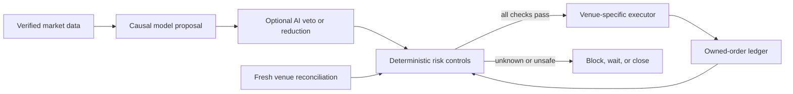

# Simple AI Trading

<!-- BEGIN GENERATED BADGES -->
[](https://github.com/strmt7/simple_ai_trading/blob/main/LICENSE)
[](https://github.com/strmt7/simple_ai_trading/actions/workflows/ci.yml)
[](https://github.com/strmt7/simple_ai_trading/actions/workflows/codeql.yml)
[](https://github.com/strmt7/simple_ai_trading/actions/workflows/super-linter.yml)
[](https://github.com/strmt7/simple_ai_trading/actions/workflows/ruff.yml)
[](https://github.com/strmt7/simple_ai_trading/actions/workflows/vulture.yml)
[](https://github.com/cocoindex-io/cocoindex-code)
[](https://github.com/multica-ai/andrej-karpathy-skills)
<!-- END GENERATED BADGES -->

Simple AI Trading is a Windows-first day-trading research platform for BTC,
ETH, and SOL. It provides one Python backend, a CLI, and a native Win32 operator
app. Both interfaces consume the same generated command contract.

> **Beta warning:** `0.1.0-beta.1` is experimental. No model currently has
> demonstrated production-grade profitability or live-money authority. Binance
> execution is limited to paper, testnet, or Demo Trading. The independent
> Polymarket boundary is disabled by default. Do not use this release to protect
> capital or assume positive returns.

## What Exists Today

| Area | Current state |
| --- | --- |
| Binance | BTC/ETH/SOL paper and testnet/Demo workflows |
| Polymarket | Independent BTC execution infrastructure; disabled and unpromoted |
| Risk | Deterministic ownership, reconciliation, loss, liquidity, and Stop gates |
| Models | Causal research pipelines with sealed evidence; no accepted trading edge |
| AI | Local multibillion-model risk overlay; veto/downsize only, never order authority |
| Interfaces | Shared CLI/backend plus native Win32 app with generated parity checks |
| Data | Source-bound SQLite/DuckDB evidence with explicit UTC cutoffs and checksums |

The system fails closed when market data, ownership, account state, execution
costs, model provenance, or API capacity cannot be verified. It never treats a
backtest, paper result, model score, or AI opinion as a guarantee.

## Install

Install [uv](https://docs.astral.sh/uv/) `0.12.1` or newer in the `0.12` line,
then sync the locked environment:

```powershell
uv sync --locked --group test
```

Add the current PyTorch accelerator stack when the host supports it:

```powershell
uv sync --locked --extra gpu --extra foundation-ai --extra polymarket-live --extra reporting --group test
```

CPU remains available for non-AI operation. The Windows `directml` extra now
packages ONNX Runtime DirectML only; it does not claim that current PyTorch
training runs through DirectML. See [Compute portability](docs/DIRECTML_GPU.md).

## First Check

```powershell
uv run simple-ai-trading doctor
uv run simple-ai-trading compute
uv run simple-ai-trading ai
uv run simple-ai-trading status --compact
uv run simple-ai-trading universe
uv run simple-ai-trading risk --paper
```

Do not start a session while any command reports a block. The default risk
profile is `conservative`, AI is requested but remains gated, and profit
reinvestment is off.

## Windows App

```powershell
powershell -ExecutionPolicy Bypass -File tools\build_native_windows.ps1
.\run-gui.cmd
```

The app groups work by operator intent: Overview, Trading, Research, Risk,
Data, System, and Settings. Start, Pause, Stop Binance, and Stop Polymarket are
separate controls. Advanced commands remain available without turning the main
screen into a command list.

The backend contract hash is checked at startup. A mismatch blocks Start and
expert workflows while preserving Pause and Stop. CPU-only mode warns and
disables AI. The footer reports cached Binance API-budget telemetry without
polling continuously.

## Day-Trading Workflow

```powershell
# Paper/testnet preflight
uv run simple-ai-trading universe
uv run simple-ai-trading reconcile
uv run simple-ai-trading risk --paper

# Research from verified local data
uv run simple-ai-trading data-health --json
uv run simple-ai-trading model-lab --market futures --quote-asset USDT --interval 1s
uv run simple-ai-trading backtest-chart --output data/backtest-performance.svg

# Autonomous paper session
uv run simple-ai-trading autonomous start --paper
uv run simple-ai-trading autonomous status
uv run simple-ai-trading autonomous pause
uv run simple-ai-trading autonomous stop
```

Run `uv run simple-ai-trading --help` for the complete command surface. The
native app exposes the same parser-generated options.

## Risk Profiles

| Profile | Futures leverage default | Behavior |
| --- | ---: | --- |
| Conservative | `5x` | Tightest drawdown, unpredictability, sizing, and cooldown controls |
| Regular | `10x` | Moderate risk budgets and cooldowns |
| Aggressive | `15x` | Wider budgets, still bounded by every hard control |

Spot remains `1x`; the application ceiling is `20x`. Leverage is a risk limit,
not a source of edge. The actual size may be reduced to zero by liquidity,
drawdown, regime, ownership, reconciliation, or model gates.

Profit reinvestment is disabled by default. Enabling it requires an explicit
warning acknowledgement because compounding increases loss exposure as well as
return exposure.

## Safety Model



Key invariants:

- Only provably bot-owned orders and positions may be changed.
- Stop is venue-specific, single-writer, and never depends on AI.
- Unknown order, fill, fee, balance, or redemption state blocks new exposure.
- Reconnect recovery reconciles first, observes fresh market state, then decides.
- API usage at or above 80% of a known limit blocks a new automatic session.
- Backtests include source-specific spread, liquidity, latency, fees, impact,
  and adverse execution assumptions; missing evidence lowers authority.
- No future label, book, fill, resolution, or PnL may enter live inference.

Full contracts: [live simulation](docs/LIVE_MARKET_SIMULATION.md),
[Binance runbook](LIVE_TESTNET_RUNBOOK.md), and
[Polymarket execution](docs/POLYMARKET_LIVE_EXECUTION.md).

## Evidence

The latest charts are generated from canonical CSV/JSON, not edited by hand:

- [Binance model status and charts](docs/model-research/action-value/latest/README.md)
- [Polymarket model status and charts](docs/model-research/polymarket/latest/README.md)
- [Local AI comparison evidence](docs/ai/risk-review/latest/comparison.json)
- [Model validation rules](docs/MODEL_AND_SIGNAL_VALIDATION.md)

The current exact-BBO research path uses Feature contract `l1-tape-causal-v8`
with a fixed 107-feature order. No v16 artifact is accepted
or claimed profitable. Round 74 and current Polymarket research likewise grant
no paper, testnet, or live trading authority.

## Documentation

Start with the [documentation map](docs/README.md). It separates operator
guides, safety contracts, architecture, model research, and machine evidence so
the README can remain short without discarding technical detail.

For a fresh development session, read the authoritative
[continuation guide](docs/CONTINUATION.md) before changing code or evidence.

## Development

```powershell
uv run --locked ruff check .
uv run --locked ruff format --check path\to\changed.py
uv run --with vulture==2.16 python tools\vulture_check.py
uv run --locked python tools\update_readme_badges.py --check
uv run --locked python -m pytest -q
```

Use only `main`. See [CONTRIBUTING.md](CONTRIBUTING.md),
[agent workflows](docs/AGENT_WORKFLOWS.md), and
[release instructions](docs/release.md). The manual `beta-release` workflow
builds and verifies the Windows prerelease package.

For broad code discovery, use the `cocoindex-code-search` procedure in the
agent workflows; use `rg` for exact text and symbol searches.
