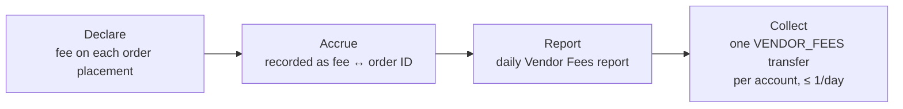

> ## Documentation Index
> Fetch the complete documentation index at: https://docs.polymarket.us/llms.txt
> Use this file to discover all available pages before exploring further.

# Vendor Fees

> How vendor fees are declared per order, accrue as a receivable, appear on the daily Vendor Fees report, and are collected with one transfer per participant account.

<Warning>
  **BETA — SUBJECT TO CHANGE.** This capability is in beta and may change without notice.
</Warning>

Your vendor fee is what you charge a Retail Participant for an order, per your agreement with them. On Polymarket US it follows a **declare → accrue → report → collect** lifecycle: the fee is *declared* when the order is placed, *recorded* against the order, *reported* to you daily, and *collected* periodically with a single [transfer](/partners/funding/transfers) per participant account. **No money moves for vendor fees at order time.**



## Declaring the fee

Every order you place through [`CreateVendorOrder`](/partners/orders/create-order) carries a `vendor_fee` — a **fixed USD amount you compute** per your agreement with the participant. Polymarket US validates that it is well-formed, non-negative, and allowed for your firm, then records the mapping *"this firm declared vendor fee \$X for order Y"*.

<Note>
  **The platform never knows your fee basis.** If your agreement is 2% of principal and the order principal is \$100, you send `"2.00"` — Polymarket US does not compute fees from a percentage or schedule, does not know whether your basis is per-order, per-fill, or flat, and does not adjust the recorded amount if the order is partially filled or cancelled. What is recorded is exactly what you declared, keyed by order ID. Applying your own fee policy (for example, waiving fees on unfilled orders) happens in **your** books and in the amount you choose to collect.
</Note>

## Accrual and your buying-power gate

Between declaration and collection, an accrued fee is a **receivable**: the cash that will pay it sits in the participant's account, indistinguishable from their tradable balance. Polymarket US does not reserve for it — its order check covers collateral and exchange fees only.

Your platform (with your funding entity) must therefore maintain a **shadow balance** per participant:

```
spendable balance = account cash − accrued, uncollected vendor fees
```

and gate order submission on the *spendable* balance, so a participant can never place an order that spends the cash earmarked for your fees.

<Warning>
  **Accrued-fee tracking is not exposed on the API.** Declared fees are recorded in the DCO reporting system only — there is no endpoint or stream that returns a participant's accrued vendor fee balance. Track accruals in your own systems (your funding entity declared every fee, so it knows the accrual in real time) and reconcile against the daily [Vendor Fees report](#the-vendor-fees-report).
</Warning>

### Accrued fees are credit exposure

Until collected, accrued fees are an unsecured receivable of your funding entity against the participant's account balance. If the participant's cash drops below the accrued amount — trading losses are the obvious path — the eventual `VENDOR_FEES` transfer will be [rejected for insufficient funds](/partners/funding/transfers#insufficient-funds). The platform does not underwrite this: **managing the exposure is your and your funding entity's responsibility.** The levers are the gate above (which prevents *spending* the earmarked cash but not *losing* it), collection frequency (daily collection minimizes the window), and your own fee policy for loss scenarios.

## The Vendor Fees report

Polymarket US produces a **daily Vendor Fees report** covering the fees declared by your firm, so your funding entity can reconcile its own accrual and drive collection without tracking every order itself.

<Warning>
  **Delivery method TBD.** The report's delivery mechanism is being finalized and will be confirmed with your integration lead during onboarding. The structure below is the planned content and may change during beta.
</Warning>

One row per declared fee, plus a per-account net summary:

| Column          | Description                                                                                                          |
| --------------- | -------------------------------------------------------------------------------------------------------------------- |
| `business_date` | Trade date the declaration belongs to (`YYYY-MM-DD`).                                                                |
| `account`       | The participant trading account the order belongs to.                                                                |
| `order_id`      | Exchange order identifier the fee was declared against.                                                              |
| `clord_id`      | The client order ID you assigned at placement (`order.clord_id`) — joins the row directly to your own order records. |
| `order_status`  | The order's state as of report time — e.g. `FILLED`, `PARTIALLY_FILLED`, `CANCELLED`.                                |
| `trade_ids`     | Trade identifiers generated by the order — one order can produce multiple trades through partial fills.              |
| `vendor_fee`    | The declared amount (decimal).                                                                                       |
| `currency`      | ISO 4217 — `USD`.                                                                                                    |

| Summary column    | Description                                                  |
| ----------------- | ------------------------------------------------------------ |
| `account`         | The participant trading account.                             |
| `net_vendor_fees` | Sum of declared fees for the account over the report period. |
| `currency`        | `USD`.                                                       |

Because rows carry your `clord_id`, the order's state, and its trades, your funding entity can apply its own policy before collecting — for example, waiving fees on cancelled or unfilled orders, or prorating by filled quantity — by joining against its own order records. The report is the **platform's record of what you declared**; the amount you collect is yours to determine, up to what the participant's cash can cover.

## Collecting the fees

Collection is a standard [transfer](/partners/funding/transfers) with reason `VENDOR_FEES` — participant account → partner funding account:

1. **Ingest the report** (or close your own books — you declared every fee, so your accrual should match).
2. **Reconcile** report totals against your funding entity's accrual; investigate any mismatch before collecting.
3. **Create one `VENDOR_FEES` transfer per participant account** for the net amount due, with your journal reference in `external_reference`.

Rules and mechanics:

* **At most once per day per participant account.** Weekly or monthly collection is fine — pick the cadence that suits your funding entity, but never collect more often than daily.
* **One transfer per account per period** — never one per order or per fee.
* **Pace scheduled runs** inside the transfer budget — an EOD collection across your whole participant base should drain through a rate-limited queue, not fire simultaneously. See [rate limits and smoothing](/partners/funding/transfers#rate-limits-and-smoothing).
* **Handle rejection**: an insufficient-funds rejection means the participant's free cash no longer covers the accrual — resolve per your participant agreement, then re-collect what is collectable.

## Related pages

<CardGroup cols={2}>
  <Card title="Create Order" icon="bolt" href="/partners/orders/create-order">
    Where the fee is declared.
  </Card>

  <Card title="Transfers" icon="right-left" href="/partners/funding/transfers">
    The API that executes collection.
  </Card>

  <Card title="Partner Funding Overview" icon="building-columns" href="/partners/funding/overview">
    The full money-flow model.
  </Card>

  <Card title="Reconciliation" icon="scale-balanced" href="/partners/reconciliation">
    Keeping your books in sync with the ledger.
  </Card>
</CardGroup>
