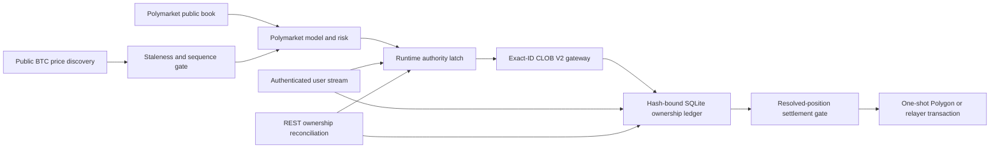

# Independent Polymarket Execution

## Status

The BTC-only Polymarket path is live-capable infrastructure, disabled by
default. It has no promoted trading model, live-money release authority,
authenticated account test, or profitability claim. Binance testnet balances,
positions, orders, credentials, and execution state are never shared with it.

Optional public Binance BTCUSDT spot and USD-M futures observations are
read-only exogenous predictor features. A promoted Polymarket model may use
them to estimate BTC direction, and a separate safety overlay may preserve,
reduce, or veto its proposal. They cannot authenticate, fund, place, cancel,
settle, or reconcile an order, grant trading authority, or increase an approved
size. Disabling the Binance predictor leaves the Polymarket market, wallet,
order, ownership, risk, stop, and settlement system intact.



## Implemented

- Official `py-clob-client-v2==1.1.0` V2 signing and exact EIP-712 order-hash
  reservation before submission.
- Official `polymarket-client==0.2.0` pinned for the typed transaction and
  redemption path.
- Environment-only, redacted credentials and a dedicated-wallet requirement.
- FAK, FOK, or bounded GTD orders only. Live Polymarket execution is BTC-only;
  every SELL must close confirmed bot-owned inventory.
- Intent TTL, tick alignment, quote-plus-fee ceiling, token inventory ceiling,
  and exact pUSD or outcome-token balance/allowance checks.
- One POST attempt. A transport ambiguity becomes `unknown`; it is never
  blindly retried.
- Exact owned-order cancellation only. Account-wide heartbeat, cancel-all, and
  market-wide cancellation are prohibited.
- Missing FAK/FOK orders are resolved through authenticated exact-ID lookup.
  Only documented V2 `LIVE`, `INVALID`, `CANCELED_MARKET_RESOLVED`,
  `CANCELED`, and `MATCHED` states are accepted. Market, token, side, original
  quantity, matched quantity, and fill evidence must reconcile.
- Hash-bound order and fill snapshots, an append-only audit chain, exact fill
  economics, cumulative-fill caps, and restart reconciliation.
- Confirmed BUY fills form parent-specific bot-owned lots. Confirmed and
  provisional child SELL fills, outstanding close reservations, and
  redemptions are reconciled per parent, preventing two closes from consuming
  the same shares.
- Stop cancels only exact bot-owned hashes, walks a fresh Polymarket bid book
  for each unreserved lot, cross-checks tick size and negative-risk mode, and
  submits bounded FAK SELLs. It succeeds only at zero bot-owned inventory and
  zero bot-owned open orders. Stale books, insufficient depth, sub-minimum
  dust, ambiguity, or timeout return a nonzero incomplete result with the exact
  remaining inventory.
- Hash-bound, numbered redemption attempts. Exact confirmed local inventory
  must equal the dedicated wallet snapshot; every account order must be closed
  and every token for the condition must be redeemable.
- Read-only settlement preflight proves market resolution, the exact standard
  or negative-risk adapter approval, and EOA gas reserve. It never creates an
  approval or deploys a wallet.
- EOA settlement broadcasts once through the pinned unified SDK. Proxy, Safe,
  and Deposit Wallet settlement uses its audited one-shot relayer primitive,
  bypassing the SDK retry wrapper. Transaction ID/hash is persisted before
  waiting; only matching Polygon or terminal relayer proof resolves ambiguity.
- Proven transaction failures create a new numbered attempt only after a fresh
  ownership and preflight check. Unknown outcomes are never retried and block
  new exposure.
- Independent user-stream and REST loops. Stream freshness is mandatory for
  opens; a fresh ownership reconciliation can still permit an owned close.
- A separate autonomous supervisor discovers the current and next BTC
  five-minute conditions, rotates authenticated user-stream subscriptions,
  isolates bounded model work from reconciliation and settlement, and submits
  only hash-bound proposals from an evidence-verified promotion. Pause blocks
  new proposals while safety loops continue. Stop blocks new proposals and
  retries exact bot-owned cancellation and closing until no owned order or
  position remains; an incomplete close is never reported as stopped.
- The optional external BTC signal is a read-only callback. It receives no
  wallet, venue, coordinator, ledger, credential, balance, position, or order
  object and can only preserve, reduce, or veto a promoted Polymarket proposal.
  Failure or timeout vetoes the proposal. The runtime imports no Binance
  execution module and reports that no Binance execution connection exists.
- Foreign orders, positions, or authenticated stream events fail closed and
  are never modified.
- The installed CLI and native Windows app consume one generated command
  contract. `polymarket-live` exposes credential-free local status,
  authenticated preflight and reconciliation, foreground user-stream and
  settlement supervision, exact owned-order cancellation, redemption recovery,
  exact owned-position Stop, and explicitly confirmed redemption.
- Local status does not create a missing ledger. Supervision opens no exposure;
  it runs only the independent authenticated safety and recovery loops.
- The current execution proposal contract is five-minute-only. Round 16
  preregisters a separate fifteen-minute comparison after July 2026 research
  reported settlement manipulation in five-minute BTC contracts. The proposal
  contract may be generalized only after the fifteen-minute prediction and
  prospective after-cost gates pass; the venue boundary itself remains
  Polymarket-only.

## Still Closed

- No Polymarket model has passed prospective, after-cost promotion gates.
- No account credentials are available for an authenticated host test.
- No autonomous Polymarket decision policy has live-order authority. The
  operator command therefore cannot open exposure.
- The autonomous runtime and promotion-gated order path are implemented, but
  no production decision provider is selected because the current model failed
  its one-hour after-cost shadow. Exposing an operator Start control before a
  model promotion would create a nonfunctional or unsafe command, so Start
  remains closed.

These gaps block release authority. A public API check or offline signature is
not an authenticated order, cancellation, fill, or redemption test.

## Operator Surface

```powershell
simple-ai-trading polymarket-live --action status
simple-ai-trading polymarket-live --action preflight --json
simple-ai-trading polymarket-live --action supervise
simple-ai-trading polymarket-live --action cancel-owned
simple-ai-trading polymarket-live --action stop --stop-timeout-seconds 30
simple-ai-trading polymarket-live --action recover-redemptions
```

`redeem` additionally requires `--confirm-redemption`. Automatic redemption is
off unless `--automatic-redemption` is set. Smart-wallet settlement also
requires exactly one complete relayer or builder credential set. Credentials
come only from process environment variables and are never stored in the
ledger, command contract, output, or documentation.

## Current Public Host Evidence

On 2026-07-29, a fresh production read probe returned CLOB protocol V2 and a
non-blocked CH/ZH geoblock result from this host. A later probe dynamically
discovered exact current and next BTC five-minute and fifteen-minute
conditions, each with two outcome tokens. The documented
`polygon.drpc.org` endpoint returned Polygon chain ID 137. Two current BTC
five-minute markets matched Gamma and CLOB identity, token, tick-size,
minimum-size, fee, and payload-hash checks; all four token books passed strict
identity and level validation. An offline SDK signature against one current
token preserved the requested 5 shares at 0.50 and derived the expected V2
order hash. No order, approval, wallet deployment, or transaction was
submitted.

## Primary Contracts

- [CLOB V2 migration](https://docs.polymarket.com/v2-migration)
- [Order lifecycle](https://docs.polymarket.com/concepts/order-lifecycle)
- [Get one authenticated order](https://docs.polymarket.com/api-reference/trade/get-single-order-by-id)
- [Get the current order book](https://docs.polymarket.com/api-reference/market-data/get-order-book)
- [Order placement](https://docs.polymarket.com/trading/place-orders)
- [Trading fees](https://docs.polymarket.com/trading/fees)
- [Real-time order updates](https://docs.polymarket.com/trading/realtime-order-updates)
- [Wallets and authentication](https://docs.polymarket.com/trading/wallets-auth)
- [Manage and redeem positions](https://docs.polymarket.com/trading/positions/manage#redeem-resolved-positions)
- [Current position schema](https://docs.polymarket.com/api-reference/core/get-current-positions-for-a-user)
- [Geographic restrictions](https://docs.polymarket.com/api-reference/geoblock)
- [Rate limits](https://docs.polymarket.com/api-reference/rate-limits)
- [Settlement Manipulation in Prediction Markets](https://arxiv.org/abs/2606.31675)
