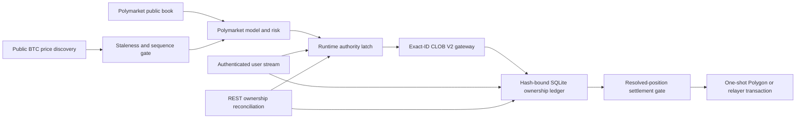

# Independent Polymarket Execution

## Status

The BTC-only Polymarket path is live-capable infrastructure, disabled by
default. It has no promoted trading model, live-money release authority,
authenticated account test, or profitability claim. Binance testnet balances,
positions, orders, credentials, and execution state are never shared with it.

Optional public Binance BTCUSDT spot and USD-M futures observations are
read-only exogenous predictor features. A promoted Polymarket model may use
them to estimate BTC direction, and a separate safety overlay may preserve,
reduce, or veto its proposal. They cannot authenticate, fund, place, cancel,
settle, or reconcile an order, grant trading authority, or increase an approved
size. Disabling the Binance predictor leaves the Polymarket market, wallet,
order, ownership, risk, stop, and settlement system intact. The current Round
16 model requires those public observations and therefore abstains if that
predictor feed is disabled or incomplete; this is a model dependency, not a
shared venue or execution dependency.



## Implemented

- Official `py-clob-client-v2==1.1.0` V2 signing and exact EIP-712 order-hash
  reservation before submission.
- Official `polymarket-client==0.2.0` pinned for the typed transaction and
  redemption path.
- Environment-only, redacted credentials and a dedicated-wallet requirement.
- Current wallet types `0` (EOA), `1` (Polymarket proxy), `2` (Gnosis Safe),
  and `3` (POLY_1271 deposit wallet) are accepted. Every prepared order must
  preserve the configured signature type and funder. Types `0`-`2` must use
  the private-key signer field; type `3` must use the deposit wallet as both
  maker and signer, as required by the current V2 contract.
- FAK, FOK, or bounded GTD orders only. Live Polymarket execution is BTC-only;
  every SELL must close confirmed bot-owned inventory.
- Intent TTL, tick alignment, quote-plus-fee ceiling, token inventory ceiling,
  aggregate gross capital-at-risk ceiling, active-market ceiling, and exact
  pUSD or outcome-token balance/allowance checks. Conservative permits at most
  10 pUSD across one active market, regular 50 pUSD across two, and aggressive
  100 pUSD across three; each profile also retains its lower per-order ceiling.
- One POST attempt. A transport ambiguity becomes `unknown`; it is never
  blindly retried. HTTP `400` is also ambiguous because the official error
  catalog includes duplicate-order responses; exact signed-hash
  reconciliation must resolve it. Only non-ambiguous authentication,
  authorization, not-found, or unprocessable responses are terminal
  rejections.
- Exact owned-order cancellation only. Account-wide heartbeat, cancel-all, and
  market-wide cancellation are prohibited.
- Missing FAK/FOK orders are resolved through authenticated exact-ID lookup.
  Only documented V2 `LIVE`, `INVALID`, `CANCELED_MARKET_RESOLVED`,
  `CANCELED`, and `MATCHED` states are accepted. Market, token, side, original
  quantity, matched quantity, and fill evidence must reconcile.
- Hash-bound order and fill snapshots, an append-only audit chain, exact fill
  economics, cumulative-fill caps, and restart reconciliation.
- Confirmed BUY fills form parent-specific bot-owned lots. Confirmed and
  provisional child SELL fills, outstanding close reservations, and
  redemptions are reconciled per parent, preventing two closes from consuming
  the same shares.
- Stop cancels only exact bot-owned hashes, walks a fresh Polymarket bid book
  for each unreserved lot, cross-checks tick size and negative-risk mode, and
  submits bounded FAK SELLs. It succeeds only at zero bot-owned inventory and
  zero bot-owned open orders. Stale books, insufficient depth, sub-minimum
  dust, ambiguity, or timeout return a nonzero incomplete result with the exact
  remaining inventory.
- A hash-verified runtime-control record permits one autonomous process. Stop
  is persisted before credential or network access, polled without a
  write-heavy heartbeat, and ordered against the final order dispatch through
  a cross-process lock. A request already in flight is reconciled and closed;
  no later opening can pass the latch. Competing Stop callers serialize the
  complete ownership-only close routine, preventing duplicate close
  reservations. Crashed leases remain fail-closed until Stop proves zero owned
  exposure and the heartbeat is stale.
- The Windows `Stop + Close` control invokes Binance and Polymarket shutdown
  independently and attempts both even if either command fails.
- Hash-bound, numbered redemption attempts. Exact confirmed local inventory
  must equal the dedicated wallet snapshot; every account order must be closed
  and every token for the condition must be redeemable.
- Read-only settlement preflight proves market resolution, the exact standard
  or negative-risk adapter approval, and EOA gas reserve. It never creates an
  approval or deploys a wallet.
- EOA settlement broadcasts once through the pinned unified SDK. Proxy, Safe,
  and Deposit Wallet settlement uses its audited one-shot relayer primitive,
  bypassing the SDK retry wrapper. Transaction ID/hash is persisted before
  waiting; only matching Polygon or terminal relayer proof resolves ambiguity.
- Proven transaction failures create a new numbered attempt only after a fresh
  ownership and preflight check. Unknown outcomes are never retried and block
  new exposure.
- Independent user-stream and REST loops. Stream freshness is mandatory for
  opens; merely sending the authenticated subscription never grants liveness.
  At least one valid inbound server frame must be parsed first. A fresh
  ownership reconciliation can still permit an owned close.
- A separate autonomous supervisor discovers only the current and next BTC
  horizon named by an evidence-verified five-minute or fifteen-minute
  promotion. The horizon is bound into both the promotion and every proposal,
  so a model cannot cross from one market variant into the other. The
  supervisor rotates authenticated user-stream subscriptions, isolates bounded
  model work from reconciliation and settlement, and submits only hash-bound
  proposals. Pause blocks new proposals while safety loops continue. Stop
  blocks new proposals and retries exact bot-owned cancellation and closing
  until no owned order or position remains; an incomplete close is never
  reported as stopped.
- Every user-stream, reconciliation, settlement, predictor-data, model, and
  enabled public-signal task is supervised as critical. Safety services receive
  one scheduling turn before model decisions begin. An unexpected task
  exception or return immediately latches Stop, prevents further model work,
  enters a close-only recovery loop, and keeps retrying exact bot-owned
  cancellation and closing while reconciliation and settlement remain alive.
  The named failure is surfaced only after the owned ledger is flat. A network
  exception is retained as visible retry state instead of aborting cleanup.
- Current CLOB limits separate per-signer order and cancel token buckets.
  The standard tier documents 40 order tokens/s with a 60-token burst and 80
  cancel tokens/s with a 120-token burst; exact-ID cancels therefore do not
  compete with openings for the same bucket. The runtime cadence is far below
  these limits and never uses account-wide cancellation. Server
  `Poly-RateLimit-*` values are not fabricated when the pinned Python SDK does
  not expose response headers.
- The optional external BTC signal is a read-only callback. It receives no
  wallet, venue, coordinator, ledger, credential, balance, position, or order
  object and can only preserve, reduce, or veto a promoted Polymarket proposal.
  Failure or timeout vetoes the proposal. The runtime imports no Binance
  execution module and reports that no Binance execution connection exists.
- The concrete public-signal service uses the credential-free Binance
  market-data endpoint. Spot uses the documented one-second individual ticker,
  which includes exchange event time and best bid/ask. USD-M uses the real-time
  individual book ticker, which includes event time, transaction time, and
  update ID. Spot `bookTicker` is intentionally not used because its documented
  payload has no exchange timestamp; treating local receipt time as exchange
  time would understate transport latency. Missing, stale, crossed, regressed,
  delayed, or cross-feed-skewed observations veto the Polymarket proposal.
- The predictive shadow has a separate credential-free BTC aggregate-trade
  feed for Binance Spot and USD-M perpetual. It maintains bounded in-memory
  one-second flow only; raw messages are not persisted. Feed reconnects reset
  that venue's epoch and require a complete causal warmup. Model scoring takes
  one locked, copied cross-feed snapshot so ingestion cannot mutate a vector
  halfway through assembly. Automated parity tests prove that the live
  five-minute and fifteen-minute vectors are bit-identical to their historical
  builders. This feature path has no order or promotion authority.
- The fifteen-minute scorer additionally requires caller-pinned pretest and
  evaluation digests, exact candidate and implementation hashes, and all nine
  held-out predictive gates. It abstains outside train-only feature support or
  above label-blind tune-only settlement-anomaly thresholds. Held-out support
  and settlement abstention rates are reported without filtering the
  predictive metrics. A passing score remains telemetry only and must enter a
  separate prospective after-cost campaign before promotion.
- The concrete fifteen-minute decision provider can be constructed only when
  the promotion's raw model and evaluation file hashes equal the verified
  scorer files. It reserves each scheduled model timestamp while evaluating
  it, consumes the timestamp after any normal model or no-trade decision, and
  releases it only when a pre-proposal exception allows a bounded retry inside
  the original prediction lifetime. It reads only the selected Polymarket
  token book, validates exact market/token identity and source freshness,
  walks displayed asks for the full requested quantity, applies the recorded
  Polymarket fee curve, and emits a proposal only above the promoted after-cost
  edge floor. The execution coordinator independently requotes and rechecks
  every condition before submission.
- Foreign orders, positions, or authenticated stream events fail closed and
  are never modified.
- The installed CLI and native Windows app consume one generated command
  contract. `polymarket-live` exposes credential-free local status,
  authenticated preflight and reconciliation, foreground user-stream and
  settlement supervision, promotion-gated autonomous operation, exact
  owned-order cancellation, redemption recovery, exact owned-position Stop,
  and explicitly confirmed redemption.
- Native builds prefer the current `.venv`, then the legacy `.venv311`, and
  fail unless the selected environment's installed console metadata, imported
  source checkout, actual launcher help, and generated parser all resolve
  `simple_ai_trading.entrypoint:main` with `polymarket-live` registered.
- Local status does not create a missing ledger. Supervision opens no exposure;
  it runs only the independent authenticated safety and recovery loops.
- Autonomous operation requires an unexpired live-authority promotion, exact
  promotion-bound files, caller-pinned canonical pretest and evaluation
  digests, and the frozen Round 16 contract. The predictor-data service is
  explicitly non-authoritative and is supervised independently from model,
  reconciliation, stream, settlement, and execution loops.
- The execution proposal and promotion firewall support either BTC five-minute
  or BTC fifteen-minute contracts. They never pool or switch horizons
  automatically. Round 16 preregisters the fifteen-minute comparison after
  July 2026 research reported settlement manipulation in five-minute BTC
  contracts. Each horizon still needs its own predictive, prospective
  after-cost, lifecycle, and risk evidence before a promotion can name it; the
  venue boundary remains Polymarket-only.

## Still Closed

- No Polymarket model has passed prospective, after-cost promotion gates.
- No account credentials are available for an authenticated host test.
- No autonomous Polymarket decision policy has live-order authority. The
  autonomous action therefore fails closed before opening exposure.
- The Round 16 fifteen-minute decision provider and operator assembly are
  implemented, but no accepted model, prospective after-cost evaluation,
  implementation manifest, or live-authority promotion exists. The earlier
  five-minute first-candidate policy remains rejected.

These gaps block release authority. A public API check or offline signature is
not an authenticated order, cancellation, fill, or redemption test.

## Operator Surface

```powershell
simple-ai-trading polymarket-live --action status
simple-ai-trading polymarket-live --action preflight --json
simple-ai-trading polymarket-live --action supervise
simple-ai-trading polymarket-live --action autonomous `
  --promotion <promotion.json> `
  --evidence-root <evidence-directory> `
  --pretest-envelope-sha256 <sha256> `
  --evaluation-envelope-sha256 <sha256>
simple-ai-trading polymarket-live --action cancel-owned
simple-ai-trading polymarket-live --action stop --stop-timeout-seconds 30
simple-ai-trading polymarket-live --action recover-redemptions
```

`redeem` additionally requires `--confirm-redemption`. Automatic redemption is
off unless `--automatic-redemption` is set. Smart-wallet settlement also
requires exactly one complete relayer or builder credential set. Credentials
come only from process environment variables and are never stored in the
ledger, command contract, output, or documentation. The autonomous example is
not runnable with repository artifacts today because no promotion exists.

## Current Public Host Evidence

On 2026-07-29, a fresh production read probe returned CLOB protocol V2 and a
non-blocked CH/ZH geoblock result from this host. A later probe dynamically
discovered exact current and next BTC five-minute and fifteen-minute
conditions, each with two outcome tokens. The documented
`polygon.drpc.org` endpoint returned Polygon chain ID 137. Two current BTC
five-minute markets matched Gamma and CLOB identity, token, tick-size,
minimum-size, fee, and payload-hash checks; all four token books passed strict
identity and level validation. An offline SDK signature against one current
token preserved the requested 5 shares at 0.50 and derived the expected V2
order hash. No order, approval, wallet deployment, or transaction was
submitted.

A separate eight-second public predictor probe connected both credential-free
Binance BTC aggregate-trade streams and both bid/ask advisory streams. It
ingested 80 Spot and 153 USD-M aggregate messages with zero reconnects or wire
errors; the final advisory receipt ages were 308 ms and 0 ms. Both services
shut down cleanly and reported no credentials or execution authority. The
exact [machine-readable probe](model-research/polymarket/latest/public-predictor-live-probe.json)
explicitly records that the short transport check did not complete model
warmup and proves neither predictive nor financial edge.

## Primary Contracts

- [CLOB V2 migration](https://docs.polymarket.com/v2-migration)
- [Trading authentication and signature types](https://docs.polymarket.com/trading/overview)
- [Deposit wallets and POLY_1271](https://docs.polymarket.com/trading/deposit-wallets)
- [Per-signer CLOB trading limits](https://docs.polymarket.com/api-reference/trading-rate-limits)
- [Order lifecycle](https://docs.polymarket.com/concepts/order-lifecycle)
- [Market WebSocket channel](https://docs.polymarket.com/market-data/websocket/market-channel)
- [Get one authenticated order](https://docs.polymarket.com/api-reference/trade/get-single-order-by-id)
- [Get the current order book](https://docs.polymarket.com/api-reference/market-data/get-order-book)
- [Order placement](https://docs.polymarket.com/trading/place-orders)
- [Trading fees](https://docs.polymarket.com/trading/fees)
- [Real-time order updates](https://docs.polymarket.com/trading/realtime-order-updates)
- [Wallets and authentication](https://docs.polymarket.com/trading/wallets-auth)
- [Manage and redeem positions](https://docs.polymarket.com/trading/positions/manage#redeem-resolved-positions)
- [Current position schema](https://docs.polymarket.com/api-reference/core/get-current-positions-for-a-user)
- [Geographic restrictions](https://docs.polymarket.com/api-reference/geoblock)
- [Rate limits](https://docs.polymarket.com/api-reference/rate-limits)
- [Settlement Manipulation in Prediction Markets](https://arxiv.org/abs/2606.31675)
- [Polymarket order-book microstructure](https://arxiv.org/abs/2604.24366)
- [Five-minute probability calibration](https://ssrn.com/abstract=6863546)
- [Fixed-resolution binary labels versus triple barriers](https://ssrn.com/abstract=6519542)
- [Quarter-hour crypto-futures predictability](https://arxiv.org/abs/2607.09426)
- [Binance Spot WebSocket streams](https://developers.binance.com/docs/binance-spot-api-docs/web-socket-streams)
- [Binance USD-M individual book ticker](https://developers.binance.com/docs/derivatives/usds-margined-futures/websocket-market-streams/Individual-Symbol-Book-Ticker-Streams)
