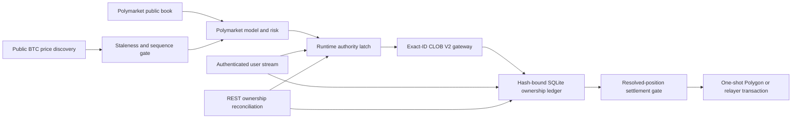

# Independent Polymarket Execution

## Status

The BTC-only Polymarket path is live-capable infrastructure, disabled by
default. It has no promoted trading model, live-money release authority,
authenticated account test, or profitability claim. Binance testnet balances,
positions, orders, credentials, and execution state are never shared with it.

Optional Binance BTCUSDT spot and USD-M futures observations are read-only
exogenous features. They can preserve, reduce, or veto a separately approved
Polymarket action; they cannot create one.

## Implemented

- Official `py-clob-client-v2==1.1.0` V2 signing and exact EIP-712 order-hash
  reservation before submission.
- Official `polymarket-client==0.2.0` pinned for the typed transaction and
  redemption path.
- Environment-only, redacted credentials and a dedicated-wallet requirement.
- FAK, FOK, or bounded GTD orders only. Live Polymarket execution is BTC-only;
  every SELL must close confirmed bot-owned inventory.
- Intent TTL, tick alignment, quote-plus-fee ceiling, token inventory ceiling,
  and exact pUSD or outcome-token balance/allowance checks.
- One POST attempt. A transport ambiguity becomes `unknown`; it is never
  blindly retried.
- Exact owned-order cancellation only. Account-wide heartbeat, cancel-all, and
  market-wide cancellation are prohibited.
- Hash-bound order and fill snapshots, an append-only audit chain, exact fill
  economics, cumulative-fill caps, and restart reconciliation.
- Hash-bound, numbered redemption attempts. Exact confirmed local inventory
  must equal the dedicated wallet snapshot; every account order must be closed
  and every token for the condition must be redeemable.
- Read-only settlement preflight proves market resolution, the exact standard
  or negative-risk adapter approval, and EOA gas reserve. It never creates an
  approval or deploys a wallet.
- EOA settlement broadcasts once through the pinned unified SDK. Proxy, Safe,
  and Deposit Wallet settlement uses its audited one-shot relayer primitive,
  bypassing the SDK retry wrapper. Transaction ID/hash is persisted before
  waiting; only matching Polygon or terminal relayer proof resolves ambiguity.
- Proven transaction failures create a new numbered attempt only after a fresh
  ownership and preflight check. Unknown outcomes are never retried and block
  new exposure.
- Independent user-stream and REST loops. Stream freshness is mandatory for
  opens; a fresh ownership reconciliation can still permit an owned close.
- Foreign orders, positions, or authenticated stream events fail closed and
  are never modified.

## Still Closed

- No Polymarket model has passed prospective, after-cost promotion gates.
- No account credentials are available for an authenticated host test.
- CLI and Windows controls do not yet expose this boundary.

These gaps block release authority. A public API check or offline signature is
not an authenticated order, cancellation, fill, or redemption test.

## Current Public Host Evidence

On 2026-07-29, the production read endpoints returned CLOB protocol V2 and a
non-blocked CH/ZH geoblock result from this host; the settlement RPC returned
Polygon chain ID 137. Two current BTC five-minute markets matched Gamma and
CLOB identity, token, tick-size, minimum-size, fee, and payload-hash checks. An
offline SDK signature against one current token preserved the requested 5
shares at 0.50 and derived the expected V2 order hash. No order, approval,
wallet deployment, or transaction was submitted.

## Primary Contracts

- [CLOB V2 migration](https://docs.polymarket.com/v2-migration)
- [Order lifecycle](https://docs.polymarket.com/concepts/order-lifecycle)
- [Order placement](https://docs.polymarket.com/trading/place-orders)
- [Real-time order updates](https://docs.polymarket.com/trading/realtime-order-updates)
- [Wallets and authentication](https://docs.polymarket.com/trading/wallets-auth)
- [Manage and redeem positions](https://docs.polymarket.com/trading/positions/manage#redeem-resolved-positions)
- [Current position schema](https://docs.polymarket.com/api-reference/core/get-current-positions-for-a-user)
- [Geographic restrictions](https://docs.polymarket.com/api-reference/geoblock)
- [Rate limits](https://docs.polymarket.com/api-reference/rate-limits)
