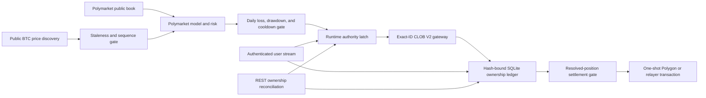

# Independent Polymarket Execution

## Status

The BTC-only Polymarket path is live-capable infrastructure, disabled by
default. It has no promoted trading model, live-money release authority,
authenticated account test, or profitability claim. Binance testnet balances,
positions, orders, credentials, and execution state are never shared with it.
This is an authenticated Polymarket CLOB V2 execution path, not a Binance paper
mode: Polymarket remains operable when Binance is absent, subject only to its
own promotion, qualification, credential, reconciliation, and risk gates.
There is no paper fallback in this authority path. A Polymarket-only `core`
promotion requires no Binance connection at all.

Optional public Binance BTCUSDT spot and USD-M futures observations are
read-only exogenous predictor features. A promoted Polymarket model may use
them to estimate BTC direction, and a separate safety overlay may preserve,
reduce, or veto its proposal. They cannot authenticate, fund, place, cancel,
settle, or reconcile an order, grant trading authority, or increase an approved
size. Disabling the Binance predictor leaves the Polymarket market, wallet,
order, ownership, risk, Stop, and settlement system intact. Round 21 evaluates
a Polymarket-only `core` model separately from `core_spot` and
`core_spot_usdm` challengers. A sealed `core` promotion starts no Binance
sidecar; an optional-layer promotion fails closed when its exact public feed is
missing or incomplete. This is a predictor dependency, never a shared venue or
execution dependency.



## Implemented

- Official `py-clob-client-v2==1.1.0` V2 signing and exact EIP-712 order-hash
  reservation before submission.
- Official `polymarket-client==0.2.0` pinned for the typed transaction and
  redemption path.
- Live and autonomous authority import the venue-specific fee primitive from
  `polymarket_fees`; they do not depend on the paper execution simulator. The
  paper module re-exports that exact class only for existing research readers.
- Environment-only, redacted credentials and a dedicated-wallet requirement.
- A live promotion must bind a canonical implementation manifest for the exact
  installed `simple_ai_trading` Python source set, package version, and pinned
  Polymarket client versions. Promotion loading rejects missing, extra,
  modified, symlinked, noncanonical, version-drifted, or commit-mismatched
  runtime evidence before account or order construction. An opaque file hash is
  not accepted as implementation evidence.
- Promotion schema v2 also parses the evaluation report rather than trusting an
  opaque report hash or caller-supplied gate. It binds the exact model, source
  commit, market variant, risk profile, frozen data/cost/regime/selection
  digests, isolated train/tune/test roles, and every required direction, path,
  volatility, liquidity, and execution-stress slice. Missing evidence, unknown
  execution, untracked inventory, or a failed slice blocks authority. Stale or
  missing books and unknown execution must demonstrate abstention. The report
  cannot grant paper or live authority by itself.
- Current wallet types `0` (EOA), `1` (Polymarket proxy), `2` (Gnosis Safe),
  and `3` (POLY_1271 deposit wallet) are accepted. Every prepared order must
  preserve the configured signature type and funder. Types `0`-`2` must use
  the private-key signer field; type `3` must use the deposit wallet as both
  maker and signer, as required by the current V2 contract.
- FAK, FOK, or bounded GTD orders only. Live Polymarket execution is BTC-only;
  every SELL must close confirmed bot-owned inventory.
- Intent TTL, tick alignment, quote-plus-fee ceiling, token inventory ceiling,
  exact event maximum-loss ceiling, active-market ceiling, and exact pUSD or
  outcome-token balance/allowance checks. Maximum loss is rebuilt from
  fee-verified fills, realized close proceeds, verified redemption payouts,
  and the guaranteed payout of paired Up/Down inventory. A loss cannot vanish
  after returning flat, while a genuinely risk-reducing complementary buy is
  not misclassified as two independent directional losses. Conservative permits at most
  10 pUSD across one active market, regular 50 pUSD across two, and aggressive
  100 pUSD across three; each profile also retains its lower per-order ceiling.
- Every submission performs an explicit venue-time preflight, then checks the
  intent age and expiry again inside the final dispatch lock after funding and
  signing. The SDK uses that verified local clock instead of inserting another
  blocking `/time` request between the final TTL check and the order POST. An
  intent that ages out during any pre-submit network or signing work creates no
  ledger reservation and is never dispatched.
- One POST attempt. A transport ambiguity becomes `unknown`; it is never
  blindly retried. HTTP `400` is also ambiguous because the official error
  catalog includes duplicate-order responses; exact signed-hash
  reconciliation must resolve it. Only non-ambiguous authentication,
  authorization, not-found, or unprocessable responses are terminal
  rejections.
- Matching-engine restrictions use the official response contract without
  broad `5xx` assumptions. HTTP `425` proves a restart rejection and starts a
  monotonic 2, 4, 8, 16, then 30 second dispatch cooldown. The exact documented
  cancel-only `503` starts a 30 second cooldown; the exact post-only `503`
  honors its validated 1-120 second `retry_after_seconds`. The unchanged
  non-post-only order is never retried automatically. HTTP `425` cools both
  order and cancellation dispatch because every order-related endpoint is
  unavailable; a proven cancel rejection restores the exact owned order to
  `live` or `partial` instead of inventing `cancel_unknown`. Exact post-only and
  cancel-only `503` modes cool only new order POSTs, so cancellation remains
  available. Authenticated monitoring, reconciliation, and settlement continue
  in every mode. Any malformed or unrecognized `503` remains an ambiguous
  submission and fails closed.
- HTTP `429` is a deterministic pre-processing rejection under the documented
  CLOB contract, so the rejected request is not replayed. Order and cancel rate
  limits are independent: an order `429` cools only new order dispatch, while a
  cancel `429` cools only cancellation dispatch. The pinned SDK does not expose
  `Retry-After`, so each affected bucket uses a conservative 30 second local
  monotonic cooldown. This preserves cancellation during order throttling and
  prevents cancel throttling from changing new-order authority.
- Every submitted order uses `deferExec=false`. The adapter never places an
  execution-deferred FAK, FOK, or GTD order and never mistakes a deferred
  acceptance for an executed trade. The official client may briefly resolve
  asynchronous trade IDs; authenticated user-stream and exact-ID REST
  reconciliation remain authoritative for fills and terminal state.
- Exact owned-order cancellation only. Account-wide heartbeat, cancel-all, and
  market-wide cancellation are prohibited. `cancel-owned` does not reuse the
  position-closing gate: geoblocking, close-only mode, or unrelated foreign
  state cannot strand a known bot-owned resting order. The coordinator still
  authenticates and compares every exact local order hash before cancellation,
  never targets a foreign order, and returns a nonzero final status while any
  foreign or unknown state remains.
- Autonomous opening additionally requires a canonical, exact-file-hash-bound
  authenticated lifecycle qualification. Its append-only event chain must
  prove geoblock/protocol preflight, a flat known account snapshot, a valid
  inbound authenticated user-stream frame, exact expected-versus-observed
  order identity, exact-ID terminal cancellation behavior, and a separate
  confirmed opening fill followed by a parent-bound confirmed close. A valid
  unfilled-cancellation report is retained as subsystem evidence but cannot
  unlock autonomous opening. Full qualification then
  requires a forced stream reconnect, authoritative order/trade reconciliation,
  unchanged foreign-state hashes, zero bot orders and positions, no unknown
  state, and no recorded secret material. The qualification capability grants
  no trading authority; the separate promotion remains mandatory.
- Missing FAK/FOK orders are resolved through authenticated exact-ID lookup.
  Only documented V2 `LIVE`, `INVALID`, `CANCELED_MARKET_RESOLVED`,
  `CANCELED`, and `MATCHED` states are accepted. Order hash, dedicated-wallet
  maker, market, token, side, order type, signed price, original quantity,
  matched quantity, and fill evidence must reconcile.
- Hash-bound order and fill snapshots, an append-only audit chain, maker/taker
  role, reported fee metadata, transaction hash, exact per-market fee-schedule
  provenance, cumulative-fill caps, and restart reconciliation. User-stream
  fills may establish quantity before fee evidence is available, but that
  state is explicitly unverified and blocks new exposure. Authenticated REST
  evidence can upgrade it once; verified accounting cannot be rewritten.
  Version-1 ledgers migrate without inventing fees and remain close-capable
  while their historical accounting is unresolved.
- Confirmed BUY fills form parent-specific bot-owned lots. Confirmed and
  provisional child SELL fills, outstanding close reservations, and
  redemptions are reconciled per parent, preventing two closes from consuming
  the same shares.
- A promoted five-minute decision can submit one initial FOK entry, one exact
  parent-bound FAK reduction, or one complementary FAK lock per consumed model
  timestamp. The portfolio input is rebuilt from the Polymarket ledger and
  hash-bound before inference. Reductions recheck a conservative
  probability-plus-edge proceeds floor against the fresh executable bid book.
  Locks must fit confirmed unpaired bot inventory, retain positive guaranteed
  profit after both legs and taker fees, and cannot increase exact event
  maximum loss. Model actions never replace Stop: Stop remains an unconditional
  ownership-only close-all routine and AI cannot veto it.
- Autonomous entry requires an explicit positive `--risk-capital-quote`.
  Startup reads the dedicated wallet's actual collateral once and refuses new
  exposure when that capital basis is unsupported. The hash-verified ledger
  reconstructs exact fee-inclusive realized SELL/redemption P&L, UTC daily
  loss, settled equity, drawdown, two-loss cooldown, and remaining event/daily/
  drawdown headroom after restart. Every opening proposal binds that risk-state
  hash and maximum downside; the supervisor rechecks both and the execution
  adapter independently rejects a worse fresh quote. Locks, reductions,
  reconciliation, settlement, and Stop remain available while entry is gated.
- The pinned V2 SDK posts with `deferExec=false`; matching is never deferred.
  Its built-in best-effort transaction-hash resolver is bypassed because it can
  poll for up to 30 seconds after the CLOB has already accepted a matched order.
  The initial order ID returns immediately, while the authenticated user stream
  and exact-order reconciliation remain the only fill and settlement authority.
- The current unified SDK remains pinned for typed account and settlement work,
  but its high-level order helper performs automatic allowance-recovery and can
  issue a second POST after a proven balance/allowance rejection. Live order
  dispatch therefore retains the audited V2 direct one-POST path. Migration of
  that path requires a public unified-SDK primitive that preserves exact signed
  hash identity, `deferExec=false`, and no implicit order resubmission.
- Stop cancels only exact bot-owned hashes, walks a fresh Polymarket bid book
  for each unreserved lot, cross-checks tick size, minimum size,
  negative-risk mode, and the condition-specific fee schedule, then submits
  bounded FAK SELLs with a nonzero taker-fee reserve when applicable. It
  succeeds only at zero bot-owned inventory and zero bot-owned open orders.
  Stale books, insufficient depth, sub-minimum dust, ambiguity, or timeout
  return a nonzero incomplete result with the exact remaining inventory.
- A hash-verified runtime-control record permits one autonomous process. Stop
  is persisted before credential or network access, polled without a
  write-heavy heartbeat, and ordered against the final order dispatch through
  a cross-process lock. A request already in flight is reconciled and closed;
  no later opening can pass the latch. Competing Stop callers serialize the
  complete ownership-only close routine, preventing duplicate close
  reservations. Crashed leases remain fail-closed until Stop proves zero owned
  exposure and the heartbeat is stale.
- Stop also latches when no autonomous owner is running. If credentials,
  network access, or closing fails, the ownerless `stop_requested` state blocks
  every later autonomous lease; it clears only after a subsequent exact-owned
  recovery proves the ledger flat.
- The Windows `Start Polymarket`, `Pause Polymarket`, and `Stop Polymarket`
  controls invoke only Polymarket activation, runtime-control, and shutdown
  paths. Binance has separate
  `Start Binance`, `Pause Binance`, and `Stop Binance` controls. A slow or
  failed Binance command cannot delay or suppress Polymarket Start, Pause, or
  Stop; Polymarket Start has its own long-running worker gate.
- `Start Polymarket` accepts no loose model, evidence, wallet, or capital
  parameters. It loads the non-secret `data/polymarket/live-activation.json`
  bundle written by `prepare-autonomous`, rehashes every referenced artifact,
  and fails before venue creation if the bundle or any bound evidence changed.
- Polymarket Pause is durable across processes. It blocks new model proposals
  and opening-order dispatch while reconciliation, user-stream monitoring,
  settlement recovery, heartbeats, and exact-owned closing remain active.
  Resume is rejected when the runtime heartbeat is stale.
- Hash-bound, numbered redemption attempts. Exact confirmed local inventory
  must equal the dedicated wallet snapshot; every account order must be closed
  and every token for the condition must be redeemable.
- Read-only settlement preflight proves market resolution, the exact standard
  or negative-risk adapter approval, and EOA gas reserve. It never creates an
  approval or deploys a wallet.
- EOA settlement broadcasts once through the pinned unified SDK. Proxy, Safe,
  and Deposit Wallet settlement uses its audited one-shot relayer primitive,
  bypassing the SDK retry wrapper. Transaction ID/hash is persisted before
  waiting; only matching Polygon or terminal relayer proof resolves submission
  ambiguity.
- A relayer `CONFIRMED` state or successful receipt status does not establish
  realized proceeds. The receipt block must be at or below Polygon's
  `finalized` block and its block hash must match the canonical block query.
  Standard redemption requires the condition-bound Conditional Tokens
  `PayoutRedemption`; negative-risk redemption requires the condition-bound
  Neg Risk Adapter `PayoutRedemption`. Both must agree with exactly one pUSD
  `Wrapped` event and one pUSD mint to the dedicated wallet. The exact
  six-decimal payout and a canonical proof digest are stored in the hash-bound
  ledger.
- Ledger v3 never invents historical proceeds. Version-2 confirmed
  redemptions migrate as payout-accounting `UNKNOWN`, block new exposure, and
  may be upgraded only by replaying their immutable transaction hash through
  the same finalized receipt proof. Verified payout accounting cannot change.
- Proven transaction failures create a new numbered attempt only after a fresh
  ownership and preflight check. Unknown outcomes are never retried and block
  new exposure.
- Independent user-stream and REST loops. Stream freshness is mandatory for
  opens; merely sending the authenticated subscription never grants liveness.
  At least one valid inbound server frame must be parsed first. A fresh
  ownership reconciliation can still permit an owned close. Every initial
  connection and reconnect advances a stream epoch and invalidates earlier
  REST authority; both opens and closes remain blocked until a reconciliation
  started in the new epoch completes. The official nonterminal
  `MATCHED_NOT_BROADCASTED` trade state remains tracked through settlement,
  while undocumented or contradictory order-stream statuses latch a hard
  fault instead of being interpreted optimistically.
- A separate autonomous supervisor discovers only the current and next BTC
  horizon named by an evidence-verified five-minute or fifteen-minute
  promotion. The horizon is bound into both the promotion and every proposal,
  so a model cannot cross from one market variant into the other. The
  supervisor rotates authenticated user-stream subscriptions, isolates bounded
  model work from reconciliation and settlement, and submits only hash-bound
  proposals. Pause blocks new proposals while safety loops continue. Stop
  blocks new proposals and retries exact bot-owned cancellation and closing
  until no owned order or position remains; an incomplete close is never
  reported as stopped.
- The legacy fifteen-minute Round 16 provider remains opening-only and now
  abstains whenever the hash-bound portfolio contains current or historical
  event exposure. It cannot silently receive the five-minute multi-action
  authority.
- Every user-stream, reconciliation, settlement, predictor-data, model, and
  enabled public-signal task is supervised as critical. Safety services receive
  one scheduling turn before model decisions begin. An unexpected task
  exception or return immediately latches Stop, prevents further model work,
  enters a close-only recovery loop, and keeps retrying exact bot-owned
  cancellation and closing while reconciliation and settlement remain alive.
  The named failure is surfaced only after the owned ledger is flat. A network
  exception is retained as visible retry state instead of aborting cleanup.
  The same rule applies before those loops start: a preflight, wallet-balance,
  or market-discovery failure with existing owned/unknown bot state enters the
  indefinite exact-owned close retry loop and re-raises only after the ledger
  is flat.
- A recoverable settlement-iteration failure latches new exposure closed with
  its exception class before the independent loop retries. It cannot disappear
  behind the retry loop or leave the runtime authority open.
- Process-exit cleanup never suppresses a failed ownership read, durable Stop
  latch, lease release, or resource close. Unknown inventory is treated as
  exposure and requests `STOPPING`; all resource closes are attempted before
  cleanup failures are surfaced with the original runtime failure in context.
- Current CLOB limits separate per-signer order and cancel token buckets.
  The standard tier documents 40 order tokens/s with a 60-token burst and 80
  cancel tokens/s with a 120-token burst; exact-ID cancels therefore do not
  compete with openings for the same bucket. The runtime cadence is far below
  these limits and never uses account-wide cancellation. Server
  `Poly-RateLimit-*` values are not fabricated when the pinned Python SDK does
  not expose response headers.
- Binance BTC data can enter only through the verified predictor selected by
  the Polymarket promotion. Round 21 binds one sealed feature population:
  Polymarket-only `core`, `core_spot`, or `core_spot_usdm`. Round 16 binds its
  public aggregate-trade feed in the verified artifact. There is no independent
  operator switch that can add or remove a Binance callback at launch, so live
  behavior cannot drift from the evaluated model configuration.
- A `core` promotion starts no Binance sidecar. A `core_spot` or
  `core_spot_usdm` promotion treats the public Binance stream as model input
  only; loss or staleness of that input blocks new model proposals and latches
  close-only recovery without entering any Binance account or execution path.
  Polymarket reconciliation, exact-owned cancellation, Stop, closure, and
  settlement continue on their independent tasks.
- A repository architecture test prevents Binance imports in the Polymarket
  account, order, ownership, settlement, Stop, promotion, qualification, and
  autonomous-execution modules. Reciprocal tests prevent the Binance public
  sidecar from importing private Polymarket authority modules and pin its
  credential and execution flags to false.
- The predictive shadow has a separate credential-free BTC aggregate-trade
  feed for Binance Spot and USD-M perpetual. It maintains bounded in-memory
  one-second flow only; raw messages are not persisted. Feed reconnects reset
  that venue's epoch and require a complete causal warmup. Model scoring takes
  one locked, copied cross-feed snapshot so ingestion cannot mutate a vector
  halfway through assembly. Automated parity tests prove that the live
  five-minute and fifteen-minute vectors are bit-identical to their historical
  builders. This feature path has no order or promotion authority.
- The fifteen-minute scorer additionally requires caller-pinned pretest and
  evaluation digests, exact candidate and implementation hashes, and all nine
  held-out predictive gates. It abstains outside train-only feature support or
  above label-blind tune-only settlement-anomaly thresholds. Held-out support
  and settlement abstention rates are reported without filtering the
  predictive metrics. A passing score remains telemetry only and must enter a
  separate prospective after-cost campaign before promotion.
- The Round 21 five-minute path now has a separate target-free prospective
  scorer and in-memory public-feature coordinator. It requires an accepted
  sealed result whose model hash and selected layer match the development
  artifact. It keeps at most 16 contiguous 250 ms rows, records exact causal
  row/model/batch/latency evidence, and grants no execution authority. Any
  Polymarket CLOB or Chainlink gap interlocks new entries for the current
  market. An optional Binance disconnect clears only optional predictor state;
  the Polymarket core, authenticated safety loops, reconciliation, Stop,
  closure, and settlement remain independent.
- AI output is not trusted merely because it is typed JSON. Provider-response
  contract v3 checks a proposed approval against the packet's deterministic
  after-fee edge floor. A contradiction is retained as provider evidence,
  converted to an invalid fail-closed veto, and can never grant order permission.
- Terminal model development preserves the same isolation. The Binance sidecar
  has its own plan, state ledger, terminal manifest, and WAL-free read-only replay.
  It contributes only causal public spot/USD-M feature vectors at exact
  Polymarket decision times. Recorded gaps, reconnects, and segment boundaries
  erase only optional predictor state. No Binance credential, account, order,
  risk, Stop, ownership, recovery, or execution object enters the Polymarket
  runtime.
- Development economics uses `polymarket-round21-evaluate-development`. It
  verifies the model's exact dataset and target-manifest identities, confirms
  panel labels against official CLOB/Gamma consensus outcomes, reconstructs
  exact top-20 books from one terminal redundant-receipt scan, and applies the
  captured market fee and order-delay rules. All 81 conservative, regular, and
  aggressive latency/depth/adverse-tick ledgers advance in one pass. A matched
  optional Binance comparison reuses identical Polymarket paths and cannot
  connect to Binance execution. The report remains non-authoritative even when
  a development gate passes.
- The Round 21 no-order shadow runtime loads exact caller-expected model and
  sealed-evaluation file hashes without accepting a live promotion. Its
  dedicated SQLite ledger binds the model/result/layer before scoring, stores
  bounded compressed canonical predictions in one append-only hash chain, and
  permits a complete semantic audit only after terminalization. Stop,
  cancellation, and public-feed failure all create terminal evidence. The
  shadow has no credential, account, wallet, order, fill, position, promotion,
  or execution authority; it is a prerequisite for the independent live path,
  not a substitute for that path.
- The concrete fifteen-minute decision provider can be constructed only when
  the promotion's raw model and evaluation file hashes equal the verified
  scorer files. It reserves each scheduled model timestamp while evaluating
  it, consumes the timestamp after any normal model or no-trade decision, and
  releases it only when a pre-proposal exception allows a bounded retry inside
  the original prediction lifetime. It reads only the selected Polymarket
  token book, validates exact market/token identity and source freshness,
  walks displayed asks for the full requested quantity, applies the recorded
  Polymarket fee curve, and emits a proposal only above the promoted after-cost
  edge floor. The execution coordinator independently requotes and rechecks
  every condition before submission.
- Foreign orders, positions, or authenticated stream events fail closed and
  are never modified.
- The installed CLI and native Windows app consume one generated command
  contract. `polymarket-live` exposes credential-free local status,
  authenticated preflight and reconciliation, foreground user-stream and
  settlement supervision, promotion-gated autonomous operation, exact
  owned-order cancellation, redemption recovery, exact owned-position Stop,
  and explicitly confirmed redemption.
- Native builds prefer the current `.venv`, then the legacy `.venv311`, and
  fail unless the selected environment's installed console metadata, imported
  source checkout, actual launcher help, and generated parser all resolve
  `simple_ai_trading.entrypoint:main` with `polymarket-live` registered.
- Local status does not create a missing ledger. Supervision opens no exposure;
  it runs only the independent authenticated safety and recovery loops.
- Autonomous operation requires an unexpired live-authority promotion, exact
  promotion-bound files, an unexpired exact-hash authenticated lifecycle
  qualification bound to the same source commit, bot, horizon, wallet, and
  credentials, and the selected model's required evidence. The predictor-data
  service is explicitly non-authoritative and is supervised independently from
  model, reconciliation, stream, settlement, and execution loops.
- The execution proposal and promotion firewall support either BTC five-minute
  or BTC fifteen-minute contracts. They never pool or switch horizons
  automatically. Round 16 preregisters the fifteen-minute comparison after
  July 2026 research reported settlement manipulation in five-minute BTC
  contracts. Each horizon still needs its own predictive, prospective
  after-cost, lifecycle, and risk evidence before a promotion can name it; the
  venue boundary remains Polymarket-only.

## Still Closed

- No Polymarket model has passed prospective, after-cost promotion gates.
- No account credentials are available for an authenticated host test.
- The qualification schema, strict loader, runtime binding, and opening
  interlock are implemented, but no real authenticated qualification report
  exists. No repository fixture or cancellation-only report can satisfy this
  release requirement.
- No autonomous Polymarket decision policy has live-order authority. The
  autonomous action therefore fails closed before opening exposure.
- The Round 16 fifteen-minute decision provider and operator assembly are
  implemented, but no accepted model, prospective after-cost evaluation,
  implementation manifest, or live-authority promotion exists. The earlier
  five-minute first-candidate policy remains rejected.
- Round 21 capture remains open. Five-minute decision-provider and autonomous
  CLI assembly plus no-order shadow persistence/runner mechanics are
  implemented. No accepted sealed result, prospective score record,
  authenticated lifecycle qualification, or promotion exists.

These gaps block release authority. A public API check or offline signature is
not an authenticated order, cancellation, fill, or redemption test.

## Operator Surface

```powershell
simple-ai-trading polymarket-round21-shadow --action run `
  --shadow-database <shadow.sqlite3> `
  --model-artifact <model.json> --model-file-sha256 <sha256> `
  --evaluation-report <sealed-result.json> `
  --evaluation-file-sha256 <sha256> --duration-seconds 3600
simple-ai-trading polymarket-round21-shadow --action audit `
  --shadow-database <shadow.sqlite3> --run-id <32-hex-run-id> --json
simple-ai-trading polymarket-live --action status
simple-ai-trading polymarket-live --action preflight --json
simple-ai-trading polymarket-live --action pause
simple-ai-trading polymarket-live --action resume
simple-ai-trading polymarket-live --action supervise
simple-ai-trading polymarket-live --action prepare-autonomous `
  --promotion <promotion.json> `
  --evidence-root <evidence-directory> `
  --lifecycle-qualification <authenticated-lifecycle.json> `
  --risk-capital-quote <dedicated-wallet-capital> `
  --activation-output data/polymarket/live-activation.json
simple-ai-trading polymarket-live --action autonomous `
  --activation data/polymarket/live-activation.json
simple-ai-trading polymarket-live --action autonomous `
  --promotion <promotion.json> `
  --evidence-root <evidence-directory> `
  --lifecycle-qualification <authenticated-lifecycle.json> `
  --lifecycle-qualification-sha256 <exact-file-sha256> `
  --risk-capital-quote <dedicated-wallet-capital> `
  --pretest-envelope-sha256 <sha256> `
  --evaluation-envelope-sha256 <sha256>
simple-ai-trading polymarket-live --action cancel-owned
simple-ai-trading polymarket-live --action stop --stop-timeout-seconds 30
simple-ai-trading polymarket-live --action recover-redemptions
```

`prepare-autonomous` reads current Polymarket credentials only to verify the
authenticated lifecycle binding. It stores no credential, submits no order,
and grants no authority; the resulting bundle is a portable, self-hashed set
of exact file references and execution limits. `redeem` additionally requires
`--confirm-redemption`. Automatic redemption is
off unless `--automatic-redemption` is set. Smart-wallet settlement also
requires exactly one complete relayer or builder credential set. Credentials
come only from process environment variables and are never stored in the
ledger, command contract, output, or documentation. The autonomous example is
not runnable with repository artifacts today because no promotion exists.

## Current Public Host Evidence

On 2026-07-29, a fresh production read probe returned CLOB protocol V2 and a
non-blocked CH/ZH geoblock result from this host. A later probe dynamically
discovered exact current and next BTC five-minute and fifteen-minute
conditions, each with two outcome tokens. The documented
`polygon.drpc.org` endpoint returned Polygon chain ID 137. Two current BTC
five-minute markets matched Gamma and CLOB identity, token, tick-size,
minimum-size, fee, and payload-hash checks; all four token books passed strict
identity and level validation. An offline SDK signature against one current
token preserved the requested 5 shares at 0.50 and derived the expected V2
order hash. No order, approval, wallet deployment, or transaction was
submitted.

A separate eight-second public predictor probe connected both credential-free
Binance BTC aggregate-trade streams and both bid/ask advisory streams. It
ingested 80 Spot and 153 USD-M aggregate messages with zero reconnects or wire
errors; the final advisory receipt ages were 308 ms and 0 ms. Both services
shut down cleanly and reported no credentials or execution authority. The
exact [machine-readable probe](model-research/polymarket/latest/public-predictor-live-probe.json)
explicitly records that the short transport check did not complete model
warmup and proves neither predictive nor financial edge.

## Primary Contracts

- [CLOB V2 migration](https://docs.polymarket.com/v2-migration)
- [API authentication](https://docs.polymarket.com/getting-started/api#authentication)
- [Trading authentication and signature types](https://docs.polymarket.com/trading/overview)
- [Deposit wallets and POLY_1271](https://docs.polymarket.com/trading/deposit-wallets)
- [Per-signer CLOB trading limits](https://docs.polymarket.com/api-reference/trading-rate-limits)
- [Order lifecycle](https://docs.polymarket.com/concepts/order-lifecycle)
- [Market WebSocket channel](https://docs.polymarket.com/market-data/websocket/market-channel)
- [Get one authenticated order](https://docs.polymarket.com/api-reference/trade/get-single-order-by-id)
- [Get the current order book](https://docs.polymarket.com/api-reference/market-data/get-order-book)
- [Order placement](https://docs.polymarket.com/trading/place-orders)
- [Matching-engine restarts and restricted modes](https://docs.polymarket.com/trading/matching-engine)
- [Authenticated order reads and exact-ID cancellation](https://docs.polymarket.com/trading/manage-orders)
- [Trading fees](https://docs.polymarket.com/trading/fees)
- [Real-time order updates](https://docs.polymarket.com/trading/realtime-order-updates)
- [Wallets and authentication](https://docs.polymarket.com/trading/wallets-auth)
- [Manage and redeem positions](https://docs.polymarket.com/trading/positions/manage#redeem-resolved-positions)
- [CTF V2 standard collateral adapter source](https://github.com/Polymarket/ctf-exchange-v2/blob/main/src/adapters/CtfCollateralAdapter.sol)
- [CTF V2 negative-risk collateral adapter source](https://github.com/Polymarket/ctf-exchange-v2/blob/main/src/adapters/NegRiskCtfCollateralAdapter.sol)
- [Legacy negative-risk redemption event source](https://github.com/Polymarket/neg-risk-ctf-adapter/blob/main/src/NegRiskAdapter.sol)
- [Current position schema](https://docs.polymarket.com/api-reference/core/get-current-positions-for-a-user)
- [Geographic restrictions](https://docs.polymarket.com/api-reference/geoblock)
- [Rate limits](https://docs.polymarket.com/api-reference/rate-limits)
- [Settlement Manipulation in Prediction Markets](https://arxiv.org/abs/2606.31675)
- [Polymarket order-book microstructure](https://arxiv.org/abs/2604.24366)
- [Five-minute probability calibration](https://ssrn.com/abstract=6863546)
- [Fixed-resolution binary labels versus triple barriers](https://ssrn.com/abstract=6519542)
- [Quarter-hour crypto-futures predictability](https://arxiv.org/abs/2607.09426)
- [Binance Spot WebSocket streams](https://developers.binance.com/docs/binance-spot-api-docs/web-socket-streams)
- [Binance USD-M individual book ticker](https://developers.binance.com/docs/derivatives/usds-margined-futures/websocket-market-streams/Individual-Symbol-Book-Ticker-Streams)
