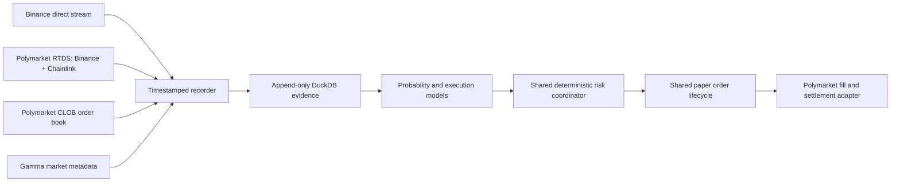

# Polymarket 5-minute paper trading

**Status:** frozen paper-only design. No authenticated order placement, wallet,
private key, live-money claim, or profitability claim is implemented or
authorized by this document.

The Polymarket lane targets only BTC, ETH, and SOL 5-minute Up/Down markets.
It reuses the Binance paper-trading lifecycle and risk core. Venue-specific
code may translate market data, binary tokens, fees, fills, and settlement; it
may not fork ownership, reconciliation, outage recovery, or stop semantics.

## Venue truth

- Market discovery comes from Gamma and must prove `recurrence=5m`, active
  order-book trading, exact event start/end times, fee schedule, tick size,
  minimum size, token IDs, and Chainlink resolution source.
- CLOB WebSocket events provide full aggregated books, price-level changes,
  trades, and best bid/ask changes. A reconnect or unprovable gap requires a
  fresh REST snapshot; missing events are never interpolated.
- Polymarket RTDS provides independent Binance and Chainlink crypto prices for
  BTC, ETH, and SOL. Direct Binance streams are recorded too. Any latency edge
  must be measured prospectively from source timestamps and local monotonic
  arrival clocks; it is never assumed.
- The official market outcome, not a Binance price inference, settles paper
  positions. The market rules use Chainlink and treat end price greater than or
  equal to start price as Up.
- Taker fees are read from each market's current fee schedule and calculated at
  match time. No hard-coded fee curve is allowed.

## Same lifecycle as Binance paper trading

Every paper order uses a deterministic bot-owned intent ID and the shared
idempotency journal. State transitions are append-only:

`INTENT -> SUBMITTED -> ACKNOWLEDGED -> PARTIAL | FILLED | CANCEL_PENDING -> CANCELLED | EXPIRED`

Ambiguous transitions enter `UNKNOWN`, block new exposure, and require
reconciliation. A simulated CLOB match then follows the venue's settlement
shape: `MATCHED -> MINED -> CONFIRMED | RETRYING -> CONFIRMED | FAILED`.
Paper P&L cannot treat `MATCHED` as final.

`Stop` cancels bot-owned orders and sells only bot-owned outcome inventory by
walking the observed book. If the book cannot absorb the full position, the
remainder stays visibly `CLOSE_PENDING`; the software must not report flat.
Externally opened positions are never adopted, netted, sold, or settled by the
bot. `Pause` blocks new intents but continues data, risk, reconciliation,
settlement, and verified close handling.

## Conservative fill simulation

- Aggressive FOK/FAK paper orders walk the exact observed depth after sampled
  submission latency and apply actual fee parameters to each fill level.
- Passive orders start behind all displayed quantity at their price. Only
  subsequent opposite aggressive trades at that price consume queue ahead.
  Cancellations receive zero fill credit.
- Partial fills reserve capital and create inventory only for the filled
  quantity. Unfilled quantity remains an order until cancelled or expired.
- Submission, market-data, and execution latencies come from prospective
  empirical distributions with a p99 stress replay. Fixed zero latency is
  prohibited.
- No synthetic liquidity, midpoint fill, last-price fill, or inferred hidden
  fill is permitted.

## Binary-market risk

The maximum loss at resolution sizes every position. A stop order is a loss
mitigation attempt, not a guaranteed cap, because five-minute books can gap or
empty. The conservative profile is default, profit reinvestment remains off,
and Polymarket leverage is disabled. Hedging means purchasing the opposing
outcome and must include both spreads and fees; naked outcome-token shorting is
not simulated.

New entries require fresh CLOB, Chainlink, RTDS Binance, and direct Binance
feeds; synchronized clocks; known fees; sufficient displayed depth; no market
gap; adequate API reserve; and enough time before event close. The coordinator
can abstain for an entire market or day. There is no trade quota.

## Outages and liveness

The live CLOB heartbeat cancels resting orders after missed liveness. Paper mode
models the same TTL and never fills an order after its last provable connected
state. On restart it first refreshes market metadata and books, reconciles the
paper journal, verifies any official resolutions, checks loss budgets, records
one clean observation, and completes a cooldown before new entry.

Market data, model, AI, risk, execution, reconciliation, and settlement loops
have independent deadlines. Risk, execution, and reconciliation never wait on
AI. Stale results carry their source timestamp and are discarded by the
coordinator.

## Evidence before model claims

Public price history is minute-fidelity and cannot validate second-level fills
or latency. The first deliverable is therefore a prospective BTC/ETH/SOL CLOB +
RTDS + direct-Binance recorder and paper shadow engine. Only complete windows
with gap-free books, source timestamps, fees, and official outcomes may enter
training. AI is a matched optional treatment and must beat the same ML baseline
after spread, fees, depth, latency, partial fills, and settlement failures.

Primary references: [authentication](https://docs.polymarket.com/api-reference/authentication),
[market WebSocket](https://docs.polymarket.com/market-data/websocket/market-channel),
[RTDS](https://docs.polymarket.com/market-data/websocket/rtds),
[orders](https://docs.polymarket.com/trading/orders/create),
[order lifecycle](https://docs.polymarket.com/concepts/order-lifecycle),
[fees](https://docs.polymarket.com/trading/fees), and
[rate limits](https://docs.polymarket.com/api-reference/rate-limits).
