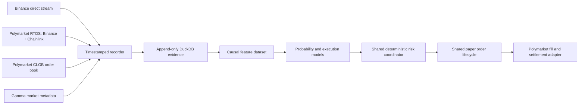

# Polymarket 5-minute paper trading

**Status:** the prospective public-data recorder, fail-closed level-2 replay,
causal feature materializer, shared paper execution contract, manual
evidence-bound open/close actions, cross-checked official resolution settlement,
durable operator Pause/Resume, fail-closed Stop, and independent source
reconstruction before CLI/app result publication are implemented. A frozen,
source-verified held-out model or AI policy can now run once through that same
owned paper lifecycle. A preregistered causal FOK retry challenger is executable
and source-verifiable as research. Its causal-settlement contract locks entry
capital until official resolution is locally available and caps aggregate open
risk across unresolved markets. Hash-bound label-free scoring inputs are also
implemented, so unresolved feature rows can be scored without outcome or
settlement fields. Neither challenger has paper-policy authority. Continuous
strategy coordination remains incomplete.
No authenticated order placement, wallet, private key, live-money claim, or
profitability claim is implemented or authorized.

The Polymarket lane targets only BTC, ETH, and SOL 5-minute Up/Down markets.
It reuses the Binance paper-trading lifecycle and risk core. Venue-specific
code may translate market data, binary tokens, fees, fills, and settlement; it
may not fork ownership, reconciliation, outage recovery, or stop semantics.

The lifecycle, risk, and outage sections below are the required parity contract.
The current executable subset is the public recorder, strict replay by default,
explicit segmented reconnect replay, manual aggressive FAK/FOK paper open/close,
journal reconciliation, official-resolution settlement, a reconciled Stop
operation, promotion-gated historical model replay, and a causal terminal-zero-fill
retry research treatment. Passive queue replay, empirical latency calibration,
continuous strategy/AI decisions, and independent live liveness loops remain
incomplete and must not be represented as available.



## Venue truth

- Market discovery comes from Gamma and must prove `recurrence=5m`, active
  order-book trading, exact event start/end times, fee schedule, tick size,
  minimum size, token IDs, and Chainlink resolution source.
- CLOB WebSocket events provide full aggregated books, price-level changes,
  trades, and best bid/ask changes. A reconnect or unprovable gap requires a
  fresh REST snapshot; missing events are never interpolated.
- Polymarket RTDS provides Binance and Chainlink crypto prices for BTC, ETH, and
  SOL. Direct Binance streams are the primary spot-price input; live Chainlink is
  the mandatory settlement-reference input. RTDS Binance is retained as optional
  relay telemetry and is never imputed when absent or stale. Any latency edge must
  be measured prospectively from source timestamps and local monotonic arrival
  clocks; it is never assumed.
- The official market outcome, not a Binance price inference, settles paper
  positions. Finalization requires exact agreement between independently fetched
  closed CLOB and Gamma market records; disagreement remains pending.
- Taker fees are read from each market's current fee schedule and calculated at
  match time. No hard-coded fee curve is allowed.

## Required lifecycle parity

Every paper order uses a deterministic bot-owned intent ID and the shared
idempotency journal. State transitions are append-only:

`INTENT -> SUBMITTED -> ACKNOWLEDGED -> PARTIAL | FILLED | CANCEL_PENDING -> CANCELLED | EXPIRED`

Ambiguous transitions enter `UNKNOWN`, block new exposure, and require
reconciliation. A simulated CLOB match then follows the venue's settlement
shape: `MATCHED -> MINED -> CONFIRMED | RETRYING -> CONFIRMED | FAILED`.
Paper execution remains explicitly simulated; it cannot be presented as an
authenticated `MATCHED`, `MINED`, or `CONFIRMED` user trade.

The implemented `Stop` action reconciles first and operates only on journal-proven
bot inventory. A dual-source official outcome settles a market that has already
closed; otherwise Stop walks the next causal recorded bid book using an explicit
nonzero latency. If the book cannot absorb the full position, the remainder stays
visible and the result remains `STOPPING`; the software does not report flat.
An unresolved `UNKNOWN` intent also keeps the result at `STOPPING`. Externally
opened positions are never adopted, netted, sold, or settled by the bot. The
  `Pause` persists through restart and blocks new intents while leaving
  reconciliation, settlement, verified close handling, and Stop available.

## Required fill simulation

- Implemented: aggressive FAK or FOK paper orders walk exact observed depth
  after an explicit nonzero submission latency and apply recorded fee parameters
  to each fill level. The first post-arrival book must be observed within a
  predeclared window (500 ms by default); a later update produces `UNKNOWN`, no
  fill credit, and blocks new exposure.
- Pending: passive orders start behind all displayed quantity at their price. Only
  subsequent opposite aggressive trades at that price consume queue ahead.
  Cancellations receive zero fill credit.
- Implemented: partial fills create inventory only for the filled quantity;
  unfilled FAK quantity is cancelled and a partial close remains visible.
- Pending: submission, market-data, and execution latencies come from prospective
  empirical distributions with a p99 stress replay. Fixed zero latency is
  prohibited.
- Implemented: no synthetic liquidity, midpoint fill, last-price fill, or inferred hidden
  fill is permitted.
- Implemented for research only: the retry challenger may submit at a later frozen
  decision horizon only after the earlier FOK is causally proven `CANCELLED` or
  `EXPIRED` with zero fill. It stops after one fill per market. `UNKNOWN` reserves
  worst-case risk and latches the entire portfolio closed to new exposure. The
  challenger must beat the model control after cost at every declared latency
  without worse drawdown or deployed-capital return; passing does not grant paper
  or live authority. The frozen contract is
  [`round-004-causal-retry-contract.json`](model-research/polymarket/round-004-causal-retry-contract.json).

## Binary-market risk

The maximum loss at resolution sizes every position. A stop order is a loss
mitigation attempt, not a guaranteed cap, because five-minute books can gap or
empty. The conservative profile is default, profit reinvestment remains off,
and Polymarket leverage is disabled. Hedging means purchasing the opposing
outcome and must include both spreads and fees; naked outcome-token shorting is
not simulated.

Market end is not settlement. Entry cost remains unavailable until the official
resolution event is both effective and locally observed. The same 1.5% budget
that limits one shared five-minute group also caps total entry cost at risk across
all unresolved groups, so delayed resolution cannot recycle capital. Equity rows
are keyed by market start and actual resolution availability. Reported drawdown
is realized settlement-equity drawdown only; mark-to-market drawdown remains a
mandatory promotion gate, so these reports grant no paper or live authority. The
hash-bound contract is
[`round-006-causal-settlement-contract.json`](model-research/polymarket/round-006-causal-settlement-contract.json).

The future coordinator must require fresh CLOB, Chainlink, and direct Binance
feeds; synchronized clocks; known fees; sufficient displayed depth; no market
gap; adequate API reserve; and enough time before event close. A strategy that
uses optional RTDS Binance telemetry must separately prove that feed fresh. The
coordinator can abstain for an entire market or day. There is no trade quota.

## Outages and liveness

The future authenticated lane must use Polymarket's server-side heartbeat, which
cancels open orders when expected heartbeats stop, in addition to local liveness
supervision. It is not present in the paper-only lane.
Current model replay refuses execution without a later state in the same
connection segment; `UNKNOWN` reserves worst-case risk and blocks all subsequent
portfolio exposure in that replay. The paper broker persists an `UNKNOWN` intent
as restart-blocking. Full reconnect refresh, clean-observation recovery, and
cooldown handling remain coordinator work.

The future market-data, model, AI, risk, execution, reconciliation, and
settlement loops must have independent deadlines. That coordinator is not yet
implemented for Polymarket.

## Evidence before model claims

Public price history is minute-fidelity and cannot validate second-level fills
or latency. The first deliverable is therefore a prospective BTC/ETH/SOL CLOB +
RTDS + direct-Binance recorder and paper shadow engine. Strict training admits
only complete gap-free windows with source timestamps, fees, and official
outcomes. BTC, ETH, and SOL must each independently contain both official
outcome classes in train, validation, and untouched test roles. An explicit
segmented mode can admit validated CLOB reconnect segments
plus independently validated direct-Binance and RTDS reconnect segments. Every
CLOB connection change clears reconstructed state and requires fresh token-book
baselines. Direct-Binance rolling features and Chainlink open/current anchors
must remain inside one named connection lane. Features and simulated execution
never cross a gap. AI is a matched optional treatment and must beat the same ML
baseline after spread, fees, depth, latency, partial fills, and settlement
failures.

Each AI treatment retains its exact label-free prompt and raw local-model
response. The publisher reconstructs candidate, permission, decision-delay, and
uplift chains instead of trusting aggregate AI claims. Repeated evaluation of an
identical valid case can reuse the integrity-checked response in the same DuckDB,
but replay still uses the first measured model latency. The cache is invalidated
by any case, request, prompt/schema, endpoint-policy, threshold, model-digest, or
model-metadata change. Invalid or late responses remain fail-closed and uncached.

Live model scoring uses a separate unresolved-input schema. It binds the source
feature-row digest, model-config digest, fixed horizon, causal feature vector,
and market prior; it structurally has no outcome, resolution, fill, payout, or
PnL fields. An identical historical causal input must produce the exact same
probability. This closes the prior offline-only label dependency but does not
implement the continuous coordinator or grant execution authority. The frozen
contract is
[`round-007-label-free-inference-contract.json`](model-research/polymarket/round-007-label-free-inference-contract.json).

Round 8 is an executable mechanism screen, not another fitted classifier. It
asks whether any short-horizon repricing remains after two FOK spreads, recorded
fee curves, displayed depth, per-leg submission latency, and each market's
recorded 250 ms taker-delay flag. It posts share-sized signed limit orders as
FOK, matching the official V2 client path; it does not reinterpret BUY quantity
through the quote-amount market-order helper. Dynamic ticks are checked when
each order is created and again on the post-target execution-confirmation book.
Both legs must remain outside the final 30 seconds and inside one connection
segment. Every rejected decision has a terminal reason, and source books,
markets, and execution parameters are streamed into independent SHA-256 roots.
The evaluator is deliberately noncausal because it retains each market's best
future timing; even a pass grants no training, paper, live, ROI, or profitability
authority. The preregistration is
[`round-008-executable-repricing-ceiling-contract.json`](model-research/polymarket/round-008-executable-repricing-ceiling-contract.json).

`polymarket-verify` goes beyond artifact-internal accounting. It rebuilds the
causal feature dataset, model dataset, purged chronological split, deterministic
model fit, held-out prediction rows, and every baseline/model/model-retry/AI
latency scenario from the complete recorder database. It reruns the shared
full-depth execution engine and requires canonical report equality.
`polymarket-publish` performs this verification automatically, rejects a report
that omits or substitutes any artifact scenario, writes
`latest/source-verification.json`, and binds that report into the publication
integrity manifest. Model artifact schema v2 makes the retry evidence mandatory.
The CLI and generated Windows command surface provide no source-verification
bypass.

CI also sends the same evidence state, FOK intent, model/AI delay, network
latency, quantity, and limit through the research evaluator and the bot-owned
paper broker, then requires exact fill state, quantity, price, fee, source hash,
effective latency, official payout, and realized PnL equality. This is the
executable venue-parity guard; changing either path alone fails the suite.

### Verified prospective run

Research round 2 used one real, gap-free 553.008-second capture from
`2026-07-15T00:46:38.779Z` through `00:55:51.787Z`. The immutable recorder
contains 559,482 raw frames, 559,445 normalized events, 12 market snapshots,
and 12 dual-source official resolutions. Strict replay reconstructed 612,522
book transitions and materialized 16,097 causal candidate states.

The final 46-feature dataset contains 3,458 unique, officially labeled rows
across two in-window resolved markets per asset. Rebuilding it produced the
same dataset hash and an `existing` materialization result. The first market was
already open when capture began and the fourth began after capture ended, so
neither is represented as a complete feature interval.
Bounded database scans then rebuilt the 939.5 MiB evidence store under the
default 1 GiB, two-thread database limits in 73.4 seconds.

| Evidence | Verified value |
| --- | ---: |
| Recorder report SHA-256 | `70dcd66b488dd7c0fb0c22719d7409bc22a48e80465f66b40a7d10577ed06495` |
| Dataset SHA-256 | `a137ffbb32691fdb9be0299f16f339a0e26db43e67379b6532713400c0d2a053` |
| BTC / ETH / SOL feature rows | 1,278 / 1,158 / 1,022 |
| Null labels / temporal violations / stream gaps | 0 / 0 / 0 |

This run validates the recorder-to-label pipeline only. The diagnostic command
used a one-market minimum; production model fitting remains blocked by the
default requirement of at least 30 featured resolved markets per asset. No ROI,
accuracy, AI-edge, or profitability graph is valid yet. The exact round report,
market rows, and archived round-2 coverage chart are in
[`model-research/polymarket`](model-research/polymarket/round-002-prospective-pipeline-evidence.json).

Run the public recorder from either the CLI or the generated Windows command
surface:

```powershell
simple-ai-trading polymarket-record --duration-seconds 660 `
  --database data/polymarket-paper.duckdb `
  --progress-path data/polymarket-recorder-progress.json
simple-ai-trading polymarket-resolve `
  --database data/polymarket-paper.duckdb
simple-ai-trading polymarket-features `
  --database data/polymarket-paper.duckdb
simple-ai-trading polymarket-model `
  --database data/polymarket-paper.duckdb `
  --output data/polymarket-model.json
simple-ai-trading polymarket-verify `
  --artifact data/polymarket-model.json `
  --database data/polymarket-paper.duckdb `
  --output data/polymarket-source-verification.json
simple-ai-trading polymarket-publish `
  --artifact data/polymarket-model.json `
  --database data/polymarket-paper.duckdb
simple-ai-trading polymarket-paper `
  --database data/polymarket-paper.duckdb `
  --action run-model `
  --artifact data/polymarket-model.json `
  --source-verification data/polymarket-source-verification.json `
  --output data/polymarket-paper-model-run.json --json
```

`run-model` is a one-shot historical paper diagnostic, not a live or shadow
market loop. By default, `auto` selects AI only when its independently verified
uplift gate passes; otherwise it selects the verified model. The selected policy
must pass probability, confirmatory sample, after-cost execution, terminal-order,
official-settlement, and every declared latency-stress gate. It must also have
positive after-cost PnL at every declared latency. `--allow-unconfirmed-research`
admits failed gates only for an explicitly labeled paper diagnostic; it never
creates trading authority or a profitability claim.

The causal retry challenger is compared with that model across every declared
latency and appears in the source-verified tables and charts. It is deliberately
not selected by `auto`, even when its research gates pass; promotion into the
owned paper lifecycle requires a separate reviewed policy-version change.

The plan binds the model artifact, source-reconstruction report, sealed recorder
report, execution report, latency configuration, and every held-out trade by
SHA-256. It requires a clean flat journal, executes chronologically through the
same broker and operator state used by manual paper actions, settles only against
the recorded dual-source official outcome, and pauses flat after completion. A
fill, fee, source-event, latency, payout, or PnL mismatch invokes the fail-closed
Stop path. An ambiguous order remains visible as `STOPPING`; it is never reported
as flat or successful.

A 300-second run is a connectivity smoke test, not model evidence: depending on
the start phase, it can end before the next market's post-open feature warm-up.
The 660-second example can contain one fully anchored interval in the worst start
phase, but it is still far below the default 30 resolved markets per asset needed
for training. Long-running prospective capture is required for model work.

The recorder emits an independent progress heartbeat every 30 seconds during
capture and reports verified raw/event row counts during the terminal integrity
audit. `--progress-interval-seconds` accepts 5-300 seconds. The optional
`--progress-path` is atomically replaced for app/status consumption; it never
reads the active database, calls an API, or participates in evidence hashes, so a
telemetry failure cannot interrupt capture. Queue growth, a stopped writer, and
an audit that is still advancing are therefore distinguishable without probing
the single-writer DuckDB.

The recorder's DuckDB memory ceiling defaults to 4 GiB because a real
9.17-million-event terminal audit exceeded the former 1 GiB ceiling. This is an
upper bound, not a reservation; short captures use less. Operators can lower it
with `--memory-limit`, but a failed full audit remains failed rather than silently
publishing partially verified evidence.

New recorder runs use `polymarket-evidence-storage-v2`. Exact UTF-8 source
messages are length-prefixed in bounded frames of at most 1,024 messages and 64
MiB, then compressed with checksummed Zstandard level 1. Chunk identity binds the
run, sequence, first and last message IDs, an order-aware row manifest, and the
uncompressed SHA-256. Message rows retain offsets and source hashes; event rows
retain normalized indexes and event hashes, but neither table stores a second
JSON body. Every reader reconstructs the event from the raw frame and rejects a
boundary, UTF-8, source hash, canonical JSON, normalized index, or event hash
disagreement. Unmigrated v1 databases remain read-only compatible.

A closed-data engineering benchmark on this host used 160,000 real frames
(135,000 CLOB, 24,000 direct Binance, and 1,000 RTDS) and 159,993 normalized
events. The same `PolymarketEvidenceStore`, schema, indexes, parser, and evidence
sample occupied 362,295,296 bytes in v1 and 110,112,768 bytes in v2, a 69.607%
reduction. V2 wrote in 13.44 seconds versus 14.88 seconds; its deeper reconstruction
audit took 7.37 seconds versus 3.16 seconds. All 160,000 raw-hash and 159,993
event-hash multiset comparisons had zero differences, and both audits returned
zero errors. This is storage/integrity evidence from a failed short recorder run,
not model, execution, ROI, or profitability evidence. DuckDB's native format
supports Zstandard but did not compress these short per-row JSON values; bounded
application frames were selected only after a same-row benchmark showed explicit
column Zstandard was larger ([DuckDB storage](https://duckdb.org/docs/stable/internals/storage),
[DuckDB compression pragmas](https://duckdb.org/docs/current/configuration/pragmas),
[python-zstandard decompression bounds](https://python-zstandard.readthedocs.io/en/latest/decompressor.html)).
The exact measured fields are retained in
[`storage-v2-benchmark-2026-07-15.json`](model-research/polymarket/storage-v2-benchmark-2026-07-15.json).

The recorder writes exact WebSocket frame text, canonical REST evidence,
normalized event indexes, connection gaps, per-market fee/tick/depth metadata,
and the shared append-only paper-order journal into one resource-bounded DuckDB
database. Completion requires BTC/ETH/SOL market evidence plus CLOB, RTDS, and
direct Binance frames. Feature readiness additionally requires live Chainlink,
direct Binance BBO/trades, and executable CLOB state for every asset. RTDS
history and live updates are counted separately. A run with a reconnect gap is
`degraded`; malformed,
incomplete, hash-inconsistent, post-finalization, or report-count-mismatched
evidence is rejected. Binance spot
`bookTicker` frames currently do not carry exchange event timestamps, so those
fields remain null instead of receiving an invented time.

Replay rebuilds each outcome token's level-2 book from full `book` snapshots and
`price_change` level replacements/removals, verifies published best bid/ask
checksums and dynamic tick changes, atomically combines split updates sharing a
source transition, and executes only against the first proven state after
nonzero latency when that state arrives inside the predeclared observation
window. Otherwise execution is `UNKNOWN`, with no economic credit. Custom
top-of-book events are corroboration rather than the
depth-ordering clock because prospective evidence shows they can precede their
matching depth update. Reusing depth or moving backward in replay time is
blocked. Partial-close dust remains owned until a later executable book or a
hash-bound CLOB/Gamma finalization pays the winning token at `1` and the losing
token at `0`; settlement never masquerades as a CLOB sale.

```powershell
simple-ai-trading polymarket-paper --database data/polymarket-paper.duckdb `
  --action status --json
simple-ai-trading polymarket-paper --database data/polymarket-paper.duckdb `
  --action resume --json
simple-ai-trading polymarket-paper --database data/polymarket-paper.duckdb `
  --action pause --json
simple-ai-trading polymarket-paper --database data/polymarket-paper.duckdb `
  --action stop --latency-ms 100 --json
```

`--allow-segmented-gaps` is an explicit exception on `polymarket-features`,
`polymarket-model`, and manual `polymarket-paper` replay; omitting it preserves
strict gap-free behavior. CLOB state resets at every connection and cannot resume
until both token books have full baselines. Direct Binance returns, realized
volatility, and trade-flow windows stay inside one connection and require a fresh
five-second lookback. Chainlink current/open points must share one named RTDS
lane. Historical rows received on reconnect become causal only at receipt.
Source verification reproduces these rules, and a model paper plan binds the
same continuity mode automatically. Reconciliation revalidates gaps and official
resolutions before every paper action. Mutation, deletion, cross-gap execution,
or a missing baseline blocks operation. The frozen policy is hash-bound in
[`prospective-continuity-contract-v2.json`](model-research/polymarket/prospective-continuity-contract-v2.json).

`open`, `close`, and `settle` require explicit immutable event IDs. `stop`
requires an explicit nonzero latency and returns nonzero while inventory or an
ambiguous order remains. The command
is generated into the Windows command contract from the same parser, so the CLI
and app cannot acquire separate option sets. `open` and `close` also require an
explicit `--latency-ms`; no unmeasured optimistic default is supplied. `open`
can reproduce either FAK or FOK research with `--order-type` and binds measured
model/AI review time separately through `--decision-delay-ms` before network
submission latency. `--max-execution-observation-delay-ms` controls the same
fail-closed confirmation bound in model research and paper execution; the bound,
requested latency, effective observed latency, and source events are hash-bound.
The database-specific operator state defaults to `STOPPED`. `resume` requires a
clean reconciliation, `pause` blocks new exposure across process restarts, and
Stop writes `STOPPING` before attempting any close. A malformed or unreadable
state file also fails closed as `STOPPED`. Close, settlement, reconciliation, and
Stop remain available while paused.

Primary references: [authentication](https://docs.polymarket.com/api-reference/authentication),
[market WebSocket](https://docs.polymarket.com/market-data/websocket/market-channel),
[server-side heartbeat](https://docs.polymarket.com/api-reference/trade/send-heartbeat),
[RTDS](https://docs.polymarket.com/market-data/websocket/rtds),
[official RTDS client](https://github.com/Polymarket/real-time-data-client),
[orders](https://docs.polymarket.com/trading/orders/create),
[order lifecycle](https://docs.polymarket.com/concepts/order-lifecycle),
[fees](https://docs.polymarket.com/trading/fees), and
[rate limits](https://docs.polymarket.com/api-reference/rate-limits).
