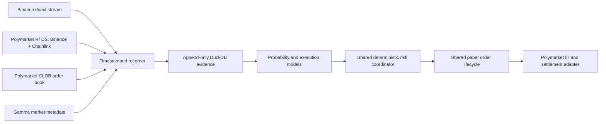

# Polymarket 5-minute paper trading

**Status:** the prospective public-data recorder, strict level-2 replay, shared
paper execution contract, manual evidence-bound open/close actions, and official
resolution settlement are implemented. Continuous strategy coordination remains
incomplete. No authenticated order placement, wallet, private key, live-money
claim, or profitability claim is implemented or authorized.

The Polymarket lane targets only BTC, ETH, and SOL 5-minute Up/Down markets.
It reuses the Binance paper-trading lifecycle and risk core. Venue-specific
code may translate market data, binary tokens, fees, fills, and settlement; it
may not fork ownership, reconciliation, outage recovery, or stop semantics.

The lifecycle, risk, and outage sections below are the required parity
contract. The current executable subset is the public recorder, strict replay,
manual aggressive FAK paper open/close, journal reconciliation, and recorded
official-resolution settlement. Stop/Pause coordination, passive queue replay,
empirical latency calibration, automated strategy/AI decisions, and independent
live liveness loops remain incomplete and must not be represented as available.



## Venue truth

- Market discovery comes from Gamma and must prove `recurrence=5m`, active
  order-book trading, exact event start/end times, fee schedule, tick size,
  minimum size, token IDs, and Chainlink resolution source.
- CLOB WebSocket events provide full aggregated books, price-level changes,
  trades, and best bid/ask changes. A reconnect or unprovable gap requires a
  fresh REST snapshot; missing events are never interpolated.
- Polymarket RTDS provides independent Binance and Chainlink crypto prices for
  BTC, ETH, and SOL. Direct Binance streams are recorded too. Any latency edge
  must be measured prospectively from source timestamps and local monotonic
  arrival clocks; it is never assumed.
- The official market outcome, not a Binance price inference, settles paper
  positions. The market rules use Chainlink and treat end price greater than or
  equal to start price as Up.
- Taker fees are read from each market's current fee schedule and calculated at
  match time. No hard-coded fee curve is allowed.

## Required lifecycle parity

Every paper order uses a deterministic bot-owned intent ID and the shared
idempotency journal. State transitions are append-only:

`INTENT -> SUBMITTED -> ACKNOWLEDGED -> PARTIAL | FILLED | CANCEL_PENDING -> CANCELLED | EXPIRED`

Ambiguous transitions enter `UNKNOWN`, block new exposure, and require
reconciliation. A simulated CLOB match then follows the venue's settlement
shape: `MATCHED -> MINED -> CONFIRMED | RETRYING -> CONFIRMED | FAILED`.
Paper execution remains explicitly simulated; it cannot be presented as an
authenticated `MATCHED`, `MINED`, or `CONFIRMED` user trade.

The future `Stop` action must cancel bot-owned orders and sell only bot-owned outcome inventory by
walking the observed book. If the book cannot absorb the full position, the
remainder stays visibly `CLOSE_PENDING`; the software must not report flat.
Externally opened positions are never adopted, netted, sold, or settled by the
bot. The future `Pause` action must block new intents but continue data, risk, reconciliation,
settlement, and verified close handling.

## Required fill simulation

- Implemented: aggressive FAK paper orders walk exact observed depth after an
  explicit nonzero submission latency and apply recorded fee parameters to each
  fill level.
- Pending: passive orders start behind all displayed quantity at their price. Only
  subsequent opposite aggressive trades at that price consume queue ahead.
  Cancellations receive zero fill credit.
- Implemented: partial fills create inventory only for the filled quantity;
  unfilled FAK quantity is cancelled and a partial close remains visible.
- Pending: submission, market-data, and execution latencies come from prospective
  empirical distributions with a p99 stress replay. Fixed zero latency is
  prohibited.
- Implemented: no synthetic liquidity, midpoint fill, last-price fill, or inferred hidden
  fill is permitted.

## Binary-market risk

The maximum loss at resolution sizes every position. A stop order is a loss
mitigation attempt, not a guaranteed cap, because five-minute books can gap or
empty. The conservative profile is default, profit reinvestment remains off,
and Polymarket leverage is disabled. Hedging means purchasing the opposing
outcome and must include both spreads and fees; naked outcome-token shorting is
not simulated.

The future coordinator must require fresh CLOB, Chainlink, RTDS Binance, and direct Binance
feeds; synchronized clocks; known fees; sufficient displayed depth; no market
gap; adequate API reserve; and enough time before event close. The coordinator
can abstain for an entire market or day. There is no trade quota.

## Outages and liveness

The future live CLOB heartbeat must cancel resting orders after missed liveness.
Current replay refuses an execution without a later gap-free recorded state and
persists the resulting `UNKNOWN` intent as restart-blocking. Full reconnect
refresh, loss-budget checks, clean-observation recovery, and cooldown handling
remain coordinator work.

The future market-data, model, AI, risk, execution, reconciliation, and
settlement loops must have independent deadlines. That coordinator is not yet
implemented for Polymarket.

## Evidence before model claims

Public price history is minute-fidelity and cannot validate second-level fills
or latency. The first deliverable is therefore a prospective BTC/ETH/SOL CLOB +
RTDS + direct-Binance recorder and paper shadow engine. Only complete windows
with gap-free books, source timestamps, fees, and official outcomes may enter
training. AI is a matched optional treatment and must beat the same ML baseline
after spread, fees, depth, latency, partial fills, and settlement failures.

Run the public recorder from either the CLI or the generated Windows command
surface:

```powershell
simple-ai-trading polymarket-record --duration-seconds 300 `
  --database data/polymarket-paper.duckdb
```

The recorder writes exact WebSocket frame text, canonical REST evidence,
normalized event indexes, connection gaps, per-market fee/tick/depth metadata,
and the shared append-only paper-order journal into one resource-bounded DuckDB
database. Completion requires BTC/ETH/SOL market evidence plus CLOB, RTDS, and
direct Binance frames. A run with a reconnect gap is `degraded`; malformed,
incomplete, hash-inconsistent, post-finalization, or report-count-mismatched
evidence is rejected. Binance spot
`bookTicker` frames currently do not carry exchange event timestamps, so those
fields remain null instead of receiving an invented time.

Replay rebuilds each outcome token's level-2 book from full `book` snapshots and
`price_change` level replacements/removals, verifies published best bid/ask
checksums and dynamic tick changes, atomically combines split updates sharing a
source transition, and executes only against the first proven state after
nonzero latency. Custom top-of-book events are corroboration rather than the
depth-ordering clock because prospective evidence shows they can precede their
matching depth update. Reusing depth or moving backward in replay time is
blocked. Partial-close dust remains owned until a later executable book or an
exact recorded `market_resolved` event pays the winning token at `1` and the
losing token at `0`; settlement never masquerades as a CLOB sale.

```powershell
simple-ai-trading polymarket-paper --database data/polymarket-paper.duckdb `
  --action status --json
```

`open`, `close`, and `settle` require explicit immutable event IDs. The command
is generated into the Windows command contract from the same parser, so the CLI
and app cannot acquire separate option sets. `open` and `close` also require an
explicit `--latency-ms`; no unmeasured optimistic default is supplied.

Primary references: [authentication](https://docs.polymarket.com/api-reference/authentication),
[market WebSocket](https://docs.polymarket.com/market-data/websocket/market-channel),
[RTDS](https://docs.polymarket.com/market-data/websocket/rtds),
[orders](https://docs.polymarket.com/trading/orders/create),
[order lifecycle](https://docs.polymarket.com/concepts/order-lifecycle),
[fees](https://docs.polymarket.com/trading/fees), and
[rate limits](https://docs.polymarket.com/api-reference/rate-limits).
