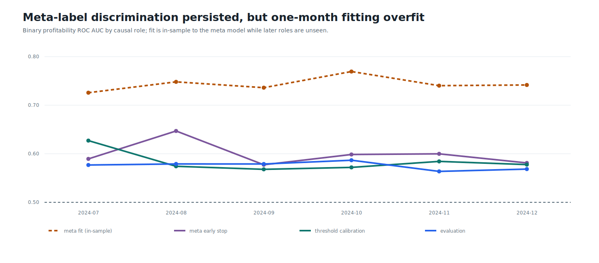
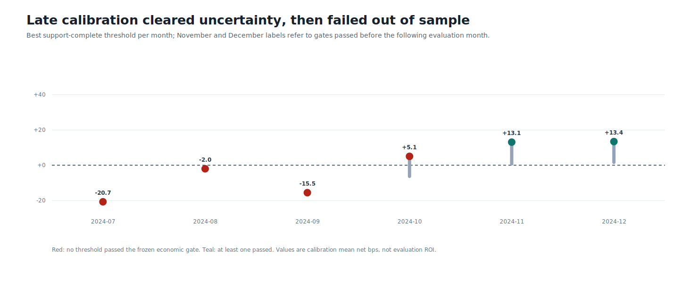
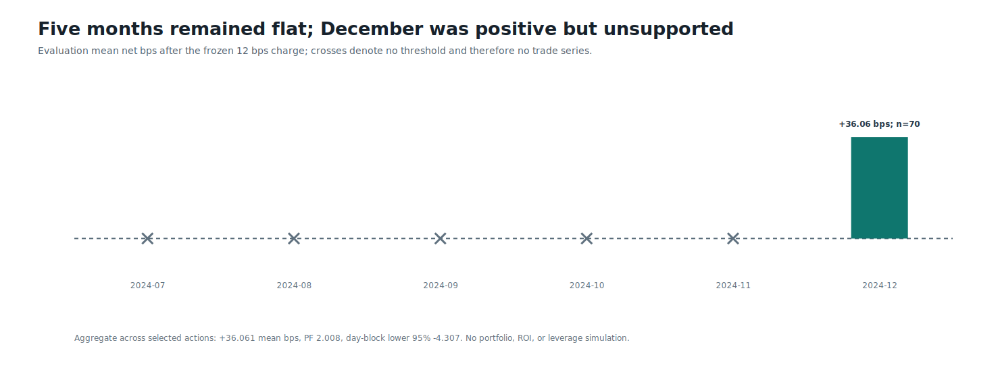

# Round 41: prequential meta-label screen rejected

**Longer out-of-fold history improved model discipline, but not post-cost stability.** All 48 OpenCL LightGBM artifacts reloaded exactly. Meta-label evaluation AUC stayed above chance in every month. Only November and December inherited a prior-month threshold that cleared the frozen economic and uncertainty gates, and both evaluation months lost money after costs.

| Evidence | Verified result |
| --- | ---: |
| Source / evaluation span | Binance USD-M 1m / 2024-07-01 to 2024-12-31 UTC |
| Primary / meta GPU artifacts | 42 / 6 |
| Threshold cells / months selected | 216 / 2 of 6 |
| Meta evaluation AUC range | 0.573 to 0.598 |
| Selected evaluation actions | 466 (103/169/194 BTC/ETH/SOL) |
| Conditional action result | -0.677 mean net bps; PF 0.980 |
| Six-month day-block lower 95% | -11.019 bps |
| AI cases / AI models run | 0 / 0; ML gate failed first |
| Compute / runtime / peak working set | opencl:auto / 346.9s / 4.37 GiB |
| Trading authority / leverage | none / none |

November and December calibration averaged `+13.106` and `+13.426` net bps per trade, then their next-month evaluations reversed to `-0.731` and `-0.622` bps. This is evidence of threshold and regime instability, not profitability or ROI. The repeated development period is selection-contaminated. Selection-confirmation 2025-H2 and terminal 2026 remain sealed.

Data: [candidate.csv](candidate.csv) | [monthly.csv](monthly.csv) | [thresholds.csv](thresholds.csv) | [models.csv](models.csv) | [sources.csv](sources.csv) | [progress.csv](progress.csv) | [validated source report](screen.json) | [integrity report](report.json)
