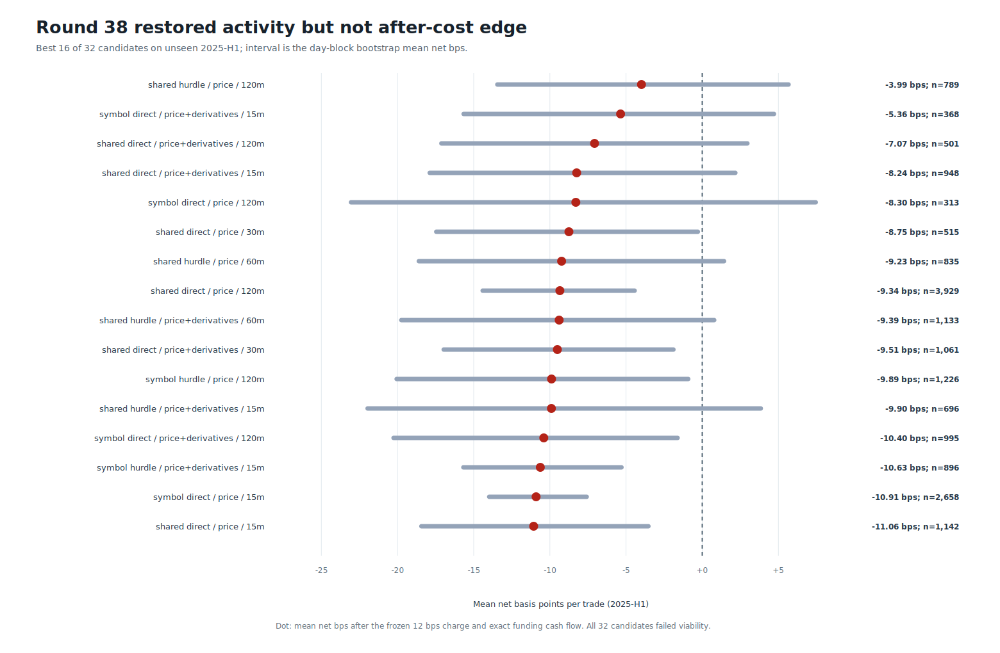
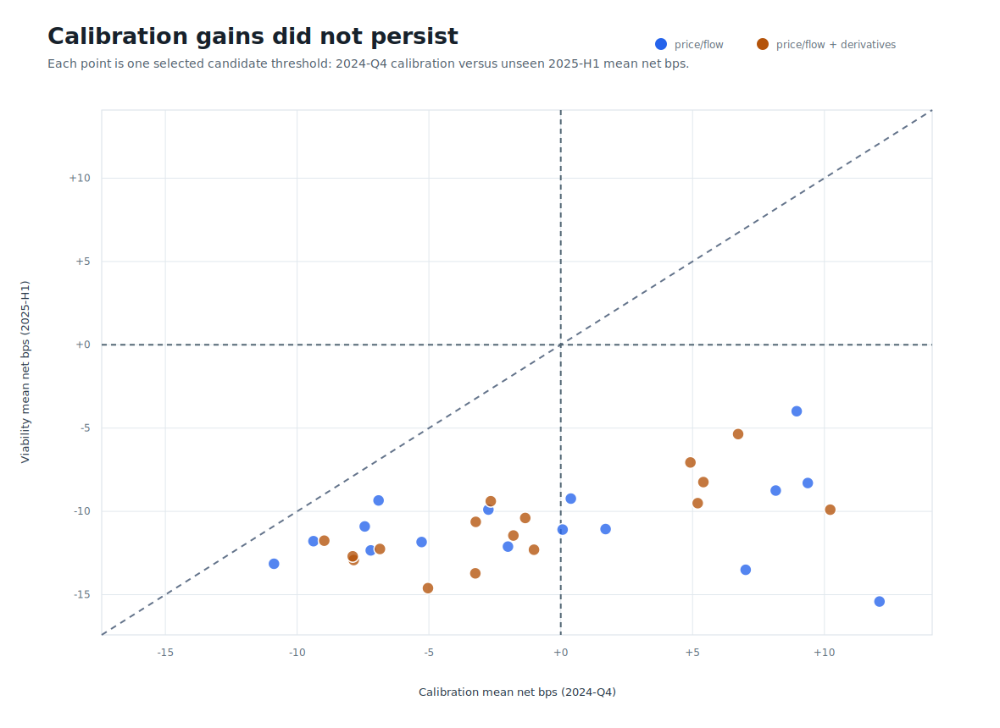
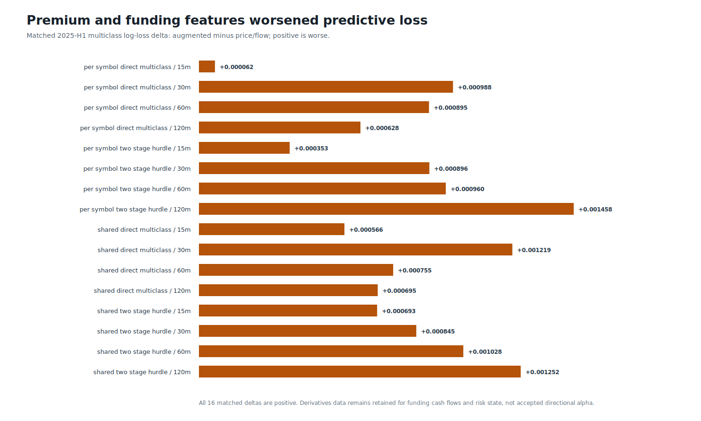

# Round 38: activity restored, economic edge rejected

**The derivatives-hurdle lane traded often enough, but did not earn permission to trade.** Every frozen candidate lost money after the 12 bps execution charge and exact funding cash flows on unseen 2025-H1. Premium and funding features worsened multiclass log loss in all 16 matched ablations.

| Evidence | Verified result |
| --- | ---: |
| Source / target span | Binance USD-M 1m / 2022-01-01 to 2025-06-30 UTC |
| Decision rows / causal features | 1,098,105 / 103 |
| GPU artifacts / candidates / threshold cells | 96 / 32 / 640 |
| Viability activity range | 313 to 8,515 trades |
| Best 2025-H1 candidate | price_flow_only_shared_two_stage_hurdle_lightgbm_h120 |
| Best viability result | 789 trades; -3.989 mean net bps; PF 0.925 |
| Best day-block lower 95% bound | -13.447 net bps |
| Derivatives log-loss improvements | 0 / 16 |
| AI cases / local models called | 0 / 0 |
| Compute / runtime / peak working set | opencl:auto / 594.3s / 4.34 GiB |
| Trading authority / leverage | none / none |

These are independent, non-overlapping trade replays, not a capital-constrained portfolio, ROI series, or equity curve. No ROI graph is published because the experiment did not produce one. Qwen3 and Fino1 were not called because no ML candidate passed the frozen viability gate; inventing AI cases would invalidate the ablation.

The next experiment addresses the observed regime decay with causal monthly refits. It does not weaken cost, support, diversification, or confidence gates. Selection-confirmation 2025-H2 and terminal 2026 data remain sealed.

Data: [candidates.csv](candidates.csv) | [thresholds.csv](thresholds.csv) | [models.csv](models.csv) | [derivatives-uplift.csv](derivatives-uplift.csv) | [sources.csv](sources.csv) | [progress.csv](progress.csv) | [validated source report](screen.json) | [integrity report](report.json)
