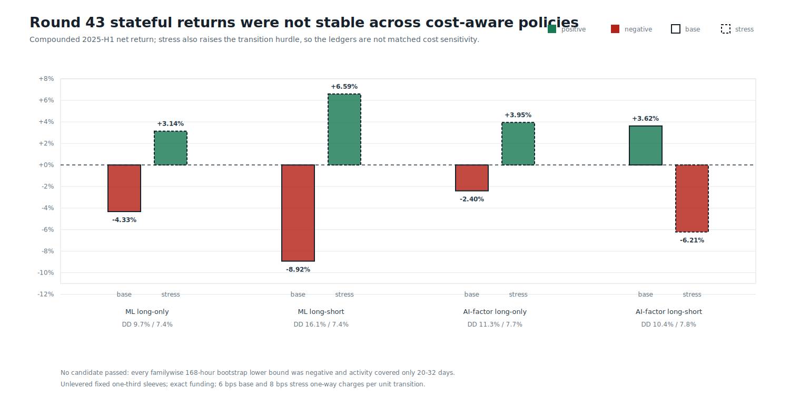
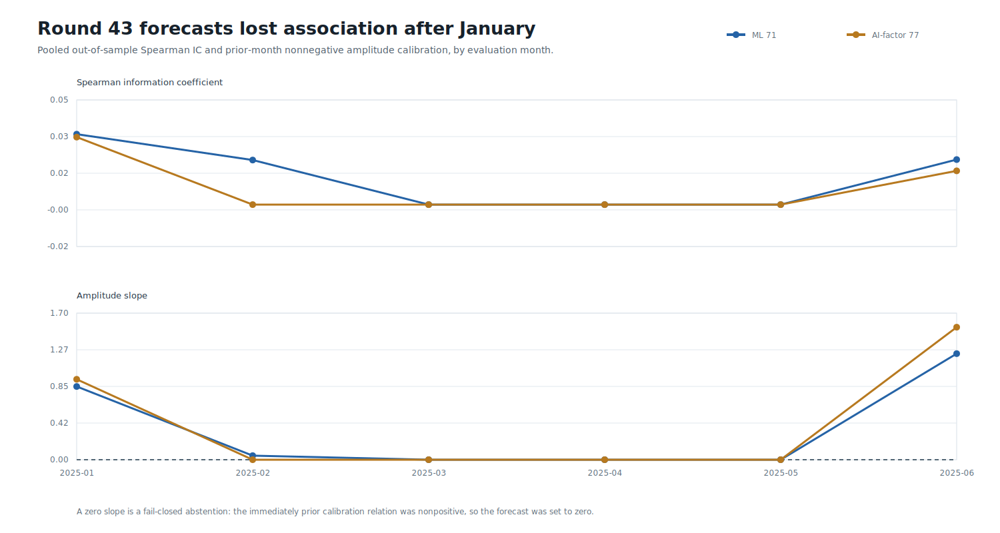
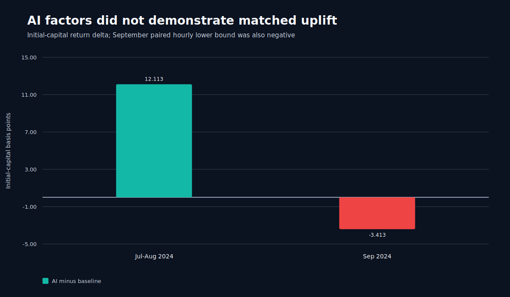

# Round 43: Stateful Turnover and AI-Factor Ablation

> **Beta research warning:** rejected, selection-contaminated development evidence. No model is approved for testnet, live day trading, leverage, or autonomous execution.

Round 43 replaced fictitious hourly close/reopen cycles with persistent positions and actual transition costs. It also tested six bounded factors proposed through a local 8B AI research workflow. All 12 monthly LightGBM models ran on OpenCL and reloaded exactly; no candidate passed.

| Candidate | Base return | Stress-policy return | Base max DD | Stress bootstrap lower bps/hour | Active days |
|---|---:|---:|---:|---:|---:|
| ML long-only | -4.33% | +3.14% | 9.66% | -0.293 | 21 |
| ML long-short | -8.92% | +6.59% | 16.09% | -0.257 | 25 |
| AI-factor long-only | -2.40% | +3.95% | 11.28% | -0.447 | 20 |
| AI-factor long-short | +3.62% | -6.21% | 10.37% | -0.538 | 23 |

The stress ledger is **not** a matched cost-only sensitivity: its 8 bps one-way charge also raises the transition hurdle. This explains why some stress point estimates exceed base. Future stress tests must reprice one fixed action ledger.

The primary AI-factor long-only pair improved point estimates, but its paired stress delta was `+0.024` bps/hour with a 95% block-bootstrap interval of `[-0.353, +0.503]`; drawdown also worsened. AI uplift is not established.

Data: [replays](replays.csv) | [monthly](monthly.csv) | [symbols](symbols.csv) | [forecast diagnostics](diagnostics.csv) | [models](models.csv) | [gates](gates.csv) | [AI uplift](ai-uplift.csv) | [daily equity](daily-equity.csv) | [sources](sources.csv) | [progress](progress.csv) | [failure analysis](../round-043-failure-analysis.json) | [validated source report](screen.json) | [integrity report](report.json)
