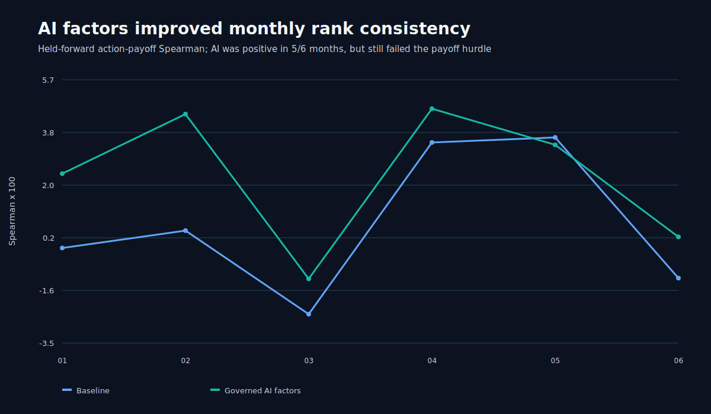

# Round 44: Causal Distributional TCN

> **Beta research warning:** rejected, selection-contaminated development evidence. No model is approved for testnet, live day trading, leverage, or autonomous execution.

Round 44 replaced one-hour point forecasts with a 127-hour causal temporal convolutional network that predicts calibrated 1, 4, 12, and 24-hour return distributions. Three seeds trained on the AMD GPU through DirectML and reloaded exactly with zero fallback warnings.

| Horizon | Pinball skill | Median Spearman | Positive months | 80% coverage | 50% coverage |
|---:|---:|---:|---:|---:|---:|
| 1 h | 4.31% | 0.0501 | 9/9 | 0.773 | 0.460 |
| 4 h | 3.87% | 0.0295 | 5/9 | 0.782 | 0.461 |
| 12 h | 3.55% | 0.0623 | 8/9 | 0.781 | 0.467 |
| 24 h | 2.33% | 0.0439 | 6/9 | 0.793 | 0.496 |

Forecast learning improved materially, but the frozen gate failed because minimum pairwise seed stability was `0.452`, below `0.500`.

The descriptive lower-quartile policy admitted one BTCUSDT short. It returned `-0.321%` at 6 bps one-way and `-0.335%` when the identical ledger was repriced at 8 bps. This is not viable economic evidence.

Data: [horizons](horizons.csv) | [monthly forecast diagnostics](diagnostics.csv) | [seed stability](seed-stability.csv) | [models](models.csv) | [roles](roles.csv) | [trades](trades.csv) | [replays](replays.csv) | [monthly economics](monthly.csv) | [symbols](symbols.csv) | [daily equity](daily-equity.csv) | [sources](sources.csv) | [progress](progress.csv) | [failure analysis](../round-044-failure-analysis.json) | [validated source report](screen.json) | [integrity report](report.json)
