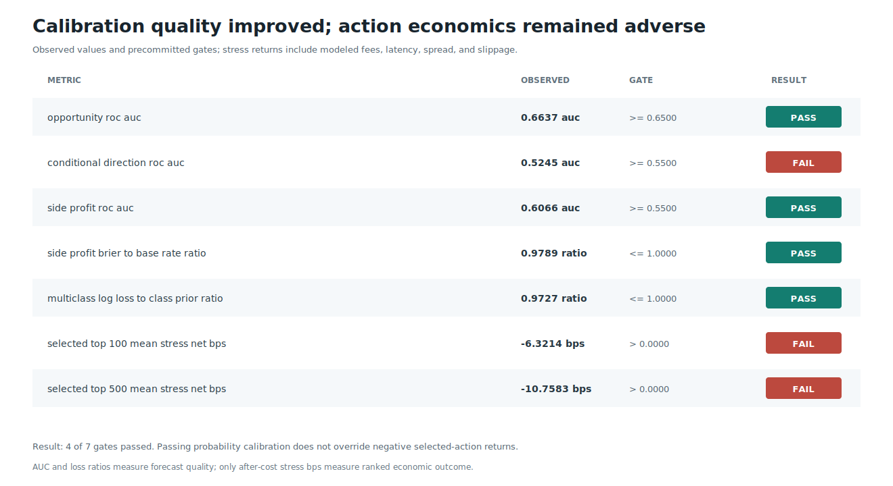

# Round 33: selective-action calibration rejected

**Rejected without trading authority.** The factorized model separated opportunity detection from direction conditional on an after-cost opportunity. Opportunity discrimination passed, but direction and selected-action economics failed their frozen calibration gates. Threshold selection and every later role remained withheld.

| Evidence | Verified result |
| --- | ---: |
| Source window | 2023-05-16 to 2023-07-06 UTC |
| Causal one-second rows | 877,894 |
| CUSUM events / valid barrier outcomes | 230,941 / 229,000 |
| Train / early-stop / calibration rows | 128,307 / 21,934 / 28,581 |
| Opportunity ROC AUC / gate | 0.6627 / 0.6500 |
| Conditional direction ROC AUC / gate | 0.5436 / 0.5500 |
| Selected-action side AUC / Spearman IC | 0.5256 / -0.0328 |
| Top-100 / top-500 stress mean | -17.24 / -12.77 bps |
| Eligible rows: conservative / regular / aggressive | 0 / 0 / 0 |
| Final profiles | none |

All three direction calibrators reached temperature `54.598`, the configured search boundary, which is recorded in `models.csv`. This is evidence of weak confidence calibration, not a reason to loosen risk controls. DirectML tensor execution and OpenCL FP64 LightGBM training were attested. No leverage, testnet or live execution, untouched-period claim, or profitability claim is permitted.

Data: [stages.csv](stages.csv) | [profiles.csv](profiles.csv) | [architecture.csv](architecture.csv) | [forecast.csv](forecast.csv) | [models.csv](models.csv) | [progress.csv](progress.csv) | [integrity report](report.json)
