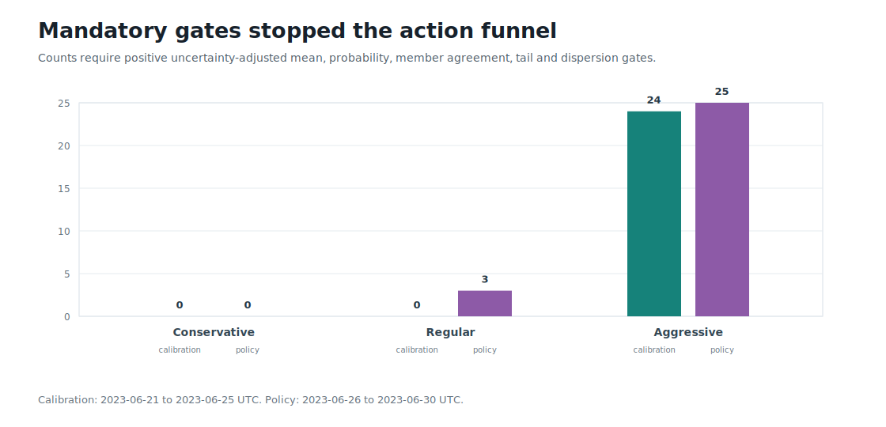

# Round 17: conditional outcome mixture abstained

**Rejected safely.** The conditional win/loss decomposition improved point-error metrics versus the zero predictor, but probability calibration was mostly worse than prevalence and it did not rank a positive after-cost action tail. All three risk profiles had zero eligible calibration rows, so no threshold, policy trade, development access, leverage, or trading authority was permitted.

| Evidence | Result |
| --- | ---: |
| Best calibration stress AUC | 0.629 (long) |
| Best policy stress AUC | 0.609 (short) |
| Least-negative policy top-100 mean | -13.24 bps (long) |
| Calibration eligible rows | 0 / 28,581 per side window |
| Authorized / executed trades | 0 / 0 |

BTCUSDT, 2023-05-16 through 2023-07-06 UTC; 229,001 valid event labels from 877,894 exact-BBO rows. The replay uses 900 s positions, 100 ms paths, 750 ms total latency, and 12 bps configured taker round-trip cost.

The classifier signal did not translate into a usable mean-action rank: calibration stress AUC reached 0.629, while every top-100 and top-500 realized mean stayed negative. The next precommitted model change must target regime-conditioned tail ranking and calibration rather than relax these gates. The development window and reserved 2023-07-07 terminal day remain untouched.

Data: [forecast.csv](forecast.csv) | [profiles.csv](profiles.csv) | [thresholds.csv](thresholds.csv) | [barrier-outcomes.csv](barrier-outcomes.csv) | [progress.csv](progress.csv) | [diagnostics.json](diagnostics.json) | [integrity report](report.json)
