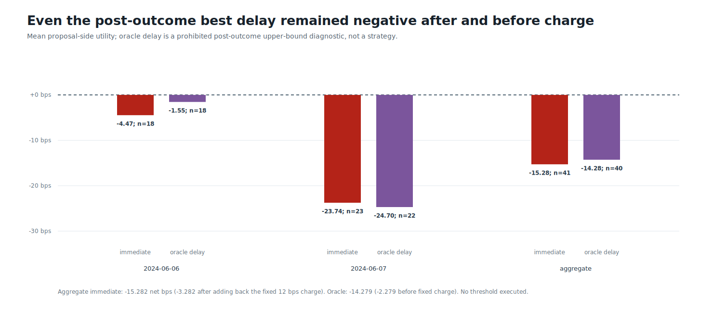
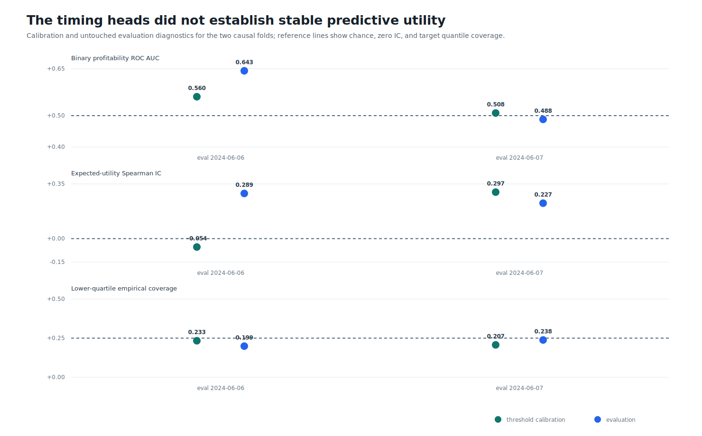
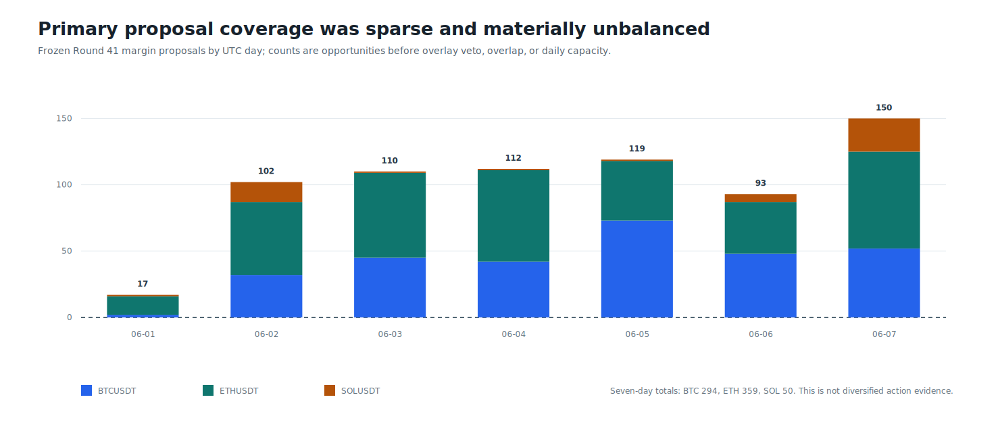

# Round 42: one-second execution overlay rejected

**Second-level taker flow did not rescue the frozen primary signal.** The verified source contains 1,814,400 contiguous one-second bars derived from 15,475,296 checksum-backed Binance USD-M aggregate trades. Six OpenCL LightGBM heads reloaded exactly, but no calibration cell admitted an action.

| Evidence | Verified result |
| --- | ---: |
| Source / evaluation span | Binance USD-M 1s / 2024-06-06 to 2024-06-07 UTC |
| Frozen proposals / delay options | 703 / 2812 |
| Features / GPU artifacts / threshold cells | 251 / 6 / 54 |
| Immediate comparator | 41 trades; -15.282 net bps; PF 0.360 |
| Post-outcome best-delay diagnostic | 40 trades; -14.279 net bps; +5.724 bps vs matched immediate |
| Timing-overlay actions / selected folds | 0 / 0 of 2 |
| AI cases / AI models run | 0 / 0; seconds-loop AI prohibited by design |
| Compute / runtime / peak working set | opencl:auto / 105.7s / 4.55 GiB |
| Trading authority / leverage | none / none |

Zero overlay trades means the frozen hurdle rejected every option, not that proposals disappeared: 703 primary opportunities were evaluated. Adding back the fixed 12 bps charge leaves the immediate comparator at `-3.282` bps and the prohibited best-delay diagnostic at `-2.279` bps on their respective capacity-selected sets. The primary direction signal was therefore negative even before that fixed charge; more execution tuning is not justified.

This seven-day, repeatedly consumed development pilot is not multi-year evidence, an equity curve, ROI, portfolio drawdown, execution quality, AI uplift, or profitability. Larger second-level acquisition was not authorized.

Data: [comparators.csv](comparators.csv) | [diagnostics.csv](diagnostics.csv) | [thresholds.csv](thresholds.csv) | [proposals.csv](proposals.csv) | [models.csv](models.csv) | [sources.csv](sources.csv) | [progress.csv](progress.csv) | [validated source report](screen.json) | [integrity report](report.json)
