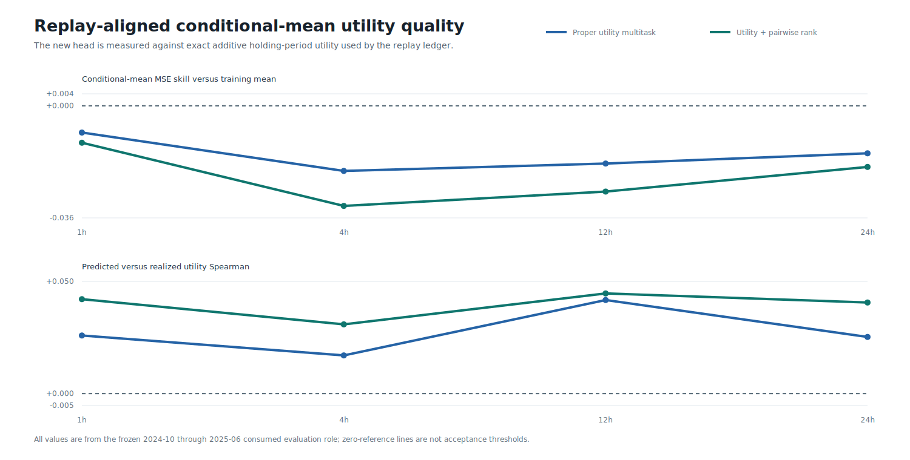
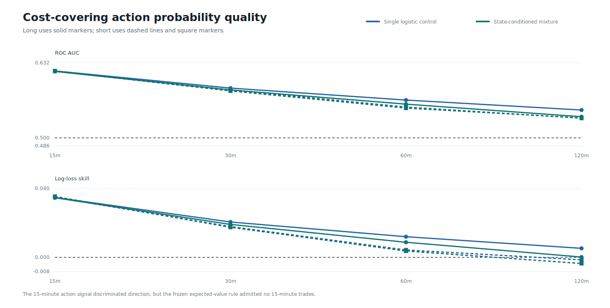

# Round 47: Replay-Aligned Utility TCN

> **Beta research warning:** no model is approved for testnet, live day trading, leverage, or autonomous execution. All results use a consumed development period.

Round 47 fixes a model-policy mismatch: a conditional median is not expected P&L. The stable causal TCN now learns exact additive holding-period mean utility plus calibrated long/short probabilities, while retaining monotone return quantiles. The second candidate adds one bounded pairwise ranking term.

| Candidate | Best utility Spearman | Trades | Base return | Stress return | Base drawdown | Profit factor | Forecast/action/economic gate |
|---|---:|---:|---:|---:|---:|---:|:---:|
| Proper utility multitask | +0.0417 | 102 | +27.34% | +25.62% | 12.56% | 1.178 | True/False/False |
| Utility + pairwise rank | +0.0447 | 153 | +31.08% | +28.43% | 19.53% | 1.125 | True/False/False |

Point estimates are not validated profitability. The fixed ledger charges 6 bps per side at base and 8 bps per side under stress, uses one-third sleeves, and forbids overlapping positions within a symbol.

DirectML trained six AMD-GPU artifacts in `89.2s`; all three output heads reloaded exactly and the warning-fatal preflight recorded zero CPU fallbacks. The local 8B language model remains a risk-review component only; AI trading uplift is not established.

Data: [forecast horizons](horizons.csv) | [utility horizons](utility-horizons.csv) | [action horizons](action-horizons.csv) | [seed stability](seed-stability.csv) | [training](training.csv) | [models](models.csv) | [roles](roles.csv) | [label prevalence](labels.csv) | [trades](trades.csv) | [replays](replays.csv) | [monthly economics](monthly.csv) | [symbol economics](symbols.csv) | [daily equity](daily-equity.csv) | [sources](sources.csv) | [progress](progress.csv) | [failure analysis](../round-047-failure-analysis.json) | [validated source report](screen.json) | [integrity report](report.json)
