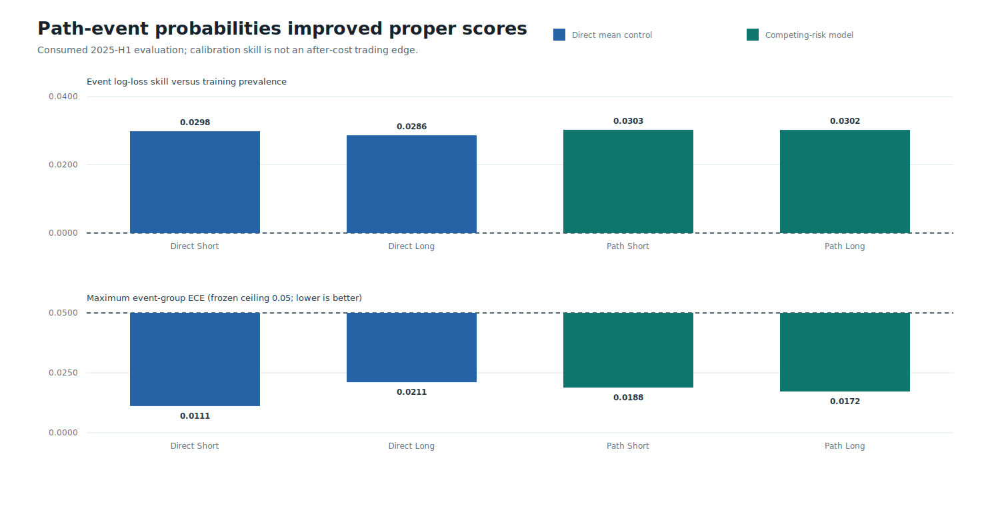
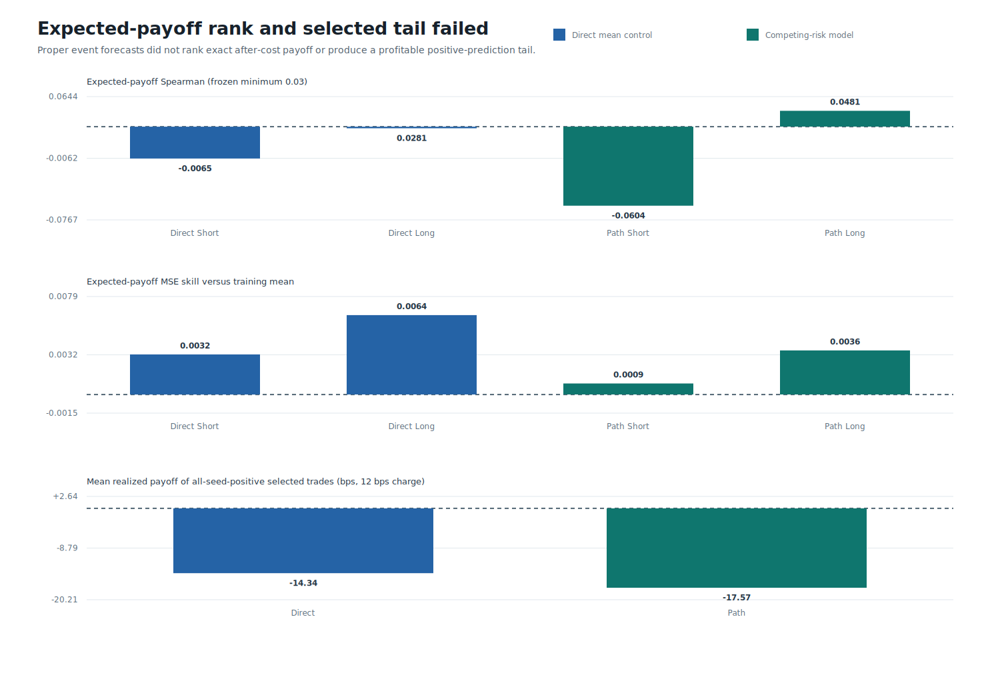
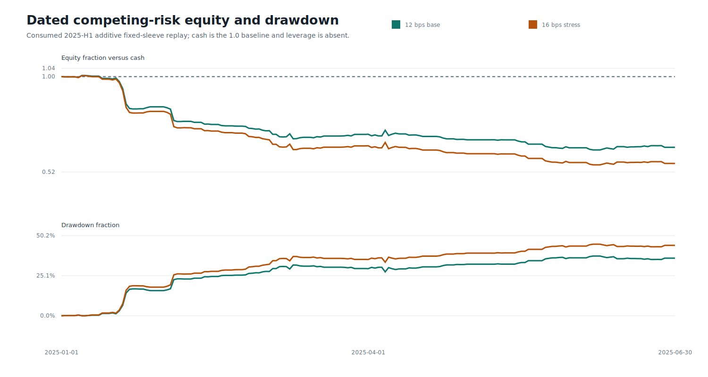
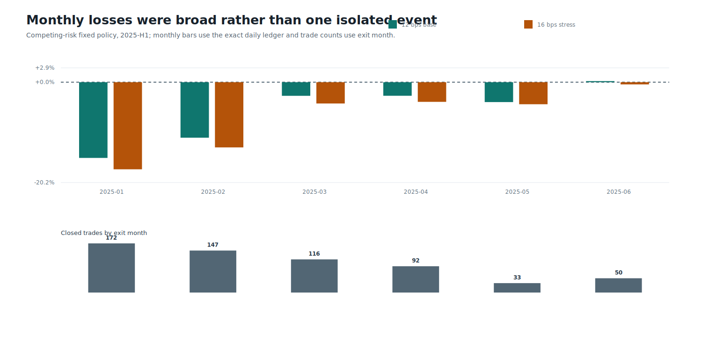
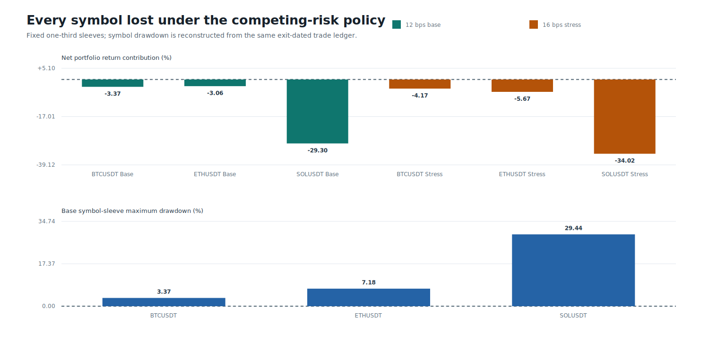

# Round 50: Path-Bounded Competing-Risk TCN

> **Beta research warning:** neither model is approved for testnet, live day trading, leverage, autonomous execution, or a profitability claim. The 2025-H1 interval is consumed development evidence.

Round 50 tested whether exact stop-loss, take-profit, and timeout probabilities produce better after-cost action values than a matched direct-mean control. Event distributions improved, but payoff ranking and fixed-policy economics failed. The candidate was rejected.

| Candidate | Short payoff rank | Long payoff rank | Trades | Base return | Stress return | Base drawdown | Profit factor | Quality/economic gate |
|---|---:|---:|---:|---:|---:|---:|---:|:---:|
| Direct mean control | -0.0065 | +0.0281 | 90 | -4.30% | -5.50% | 7.38% | 0.737 | false/false |
| Competing-risk model | -0.0604 | +0.0481 | 610 | -35.73% | -43.86% | 37.41% | 0.684 | false/false |

The competing-risk model made `610` non-overlapping trades on `108` active days, including `525` shorts. It lost `35.73%` at 12 bps and `43.86%` at 16 bps, with `37.41%` base drawdown; BTCUSDT, ETHUSDT, and SOLUSDT all lost. The direct control made `90` trades and lost `4.30%`. These are additive fixed-sleeve research returns, not deployable portfolio estimates.

The source is verified Binance USD-M **one-minute** BTCUSDT, ETHUSDT, and SOLUSDT data from 2022 through 2025-H1. Decisions occur every five minutes and each target follows the next-minute open for up to 60 minutes. This is not a multi-year second-level dataset claim.

DirectML trained six models on the AMD GPU in `382.1s`, peaked at `6.73 GiB` working set, recorded zero CPU fallbacks, and hash-verified every checkpoint and prediction artifact. `qwen3:8b` passed the separate safety benchmark, but AI uplift was not run because no deterministic model passed. Leverage was likewise withheld.

Data: [forecast quality](forecast.csv) | [monthly forecast](monthly-forecast.csv) | [symbol forecast](symbol-forecast.csv) | [seed stability](seed-stability.csv) | [training](training.csv) | [models](models.csv) | [target baselines](target-baselines.csv) | [trades](trades.csv) | [scenarios](scenarios.csv) | [monthly performance](monthly-performance.csv) | [symbol economics](symbols.csv) | [daily equity](daily-equity.csv) | [gates](gates.csv) | [mechanism](mechanism.csv) | [roles](roles.csv) | [sources](sources.csv) | [progress](progress.csv) | [failure analysis](../round-050-failure-analysis.json) | [validated source report](screen.json) | [integrity report](report.json)
