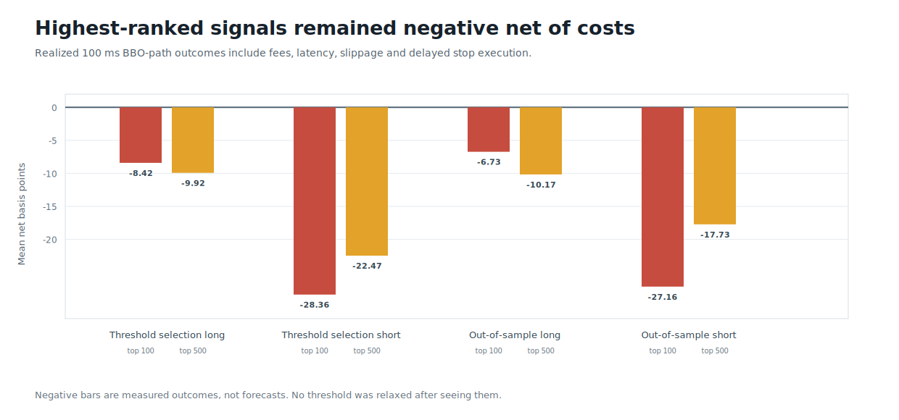
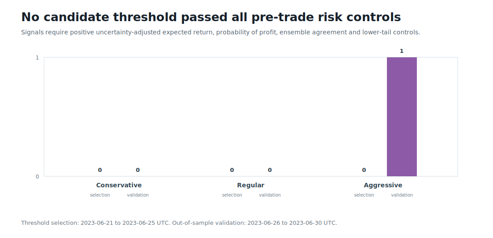
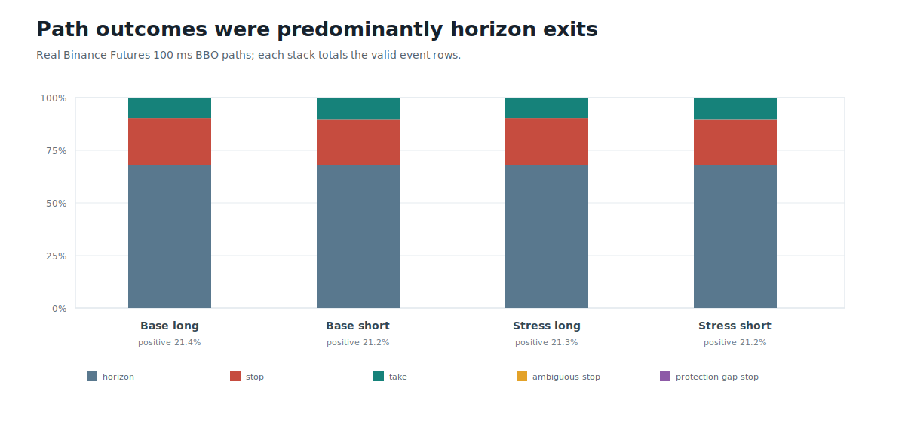

# Round 25: soft mixture-of-experts outcome model abstained

**Rejected without trading authority.** The nearly parameter-matched soft experts restored global ranking and increased signals passing pre-threshold controls, but every threshold-selection candidate lost money after stress costs, every displayed ranked tail remained negative, and near-maximum routing entropy showed little expert specialization. Signals meeting pre-threshold controls appeared only for Regular (10), Aggressive (26); Conservative produced none. The 8 resulting threshold candidates all failed the stress-test acceptance criteria, so no out-of-sample simulated trade, development access, leverage, or trading authority was permitted.

| Evidence | Result |
| --- | ---: |
| Best threshold-selection stress ROC AUC | 0.630 (long) |
| Best out-of-sample stress ROC AUC | 0.614 (short) |
| Best out-of-sample top-100 mean net return | -3.79 bps (long) |
| Largest pre-threshold eligible signal set | 26 / 28,554 (aggressive) |
| Thresholds evaluated / accepted | 8 / 0 |
| Out-of-sample simulated trades | 0 |
| Authorized / live-executed trades | 0 / 0 |

BTCUSDT, 2023-05-16 through 2023-07-06 UTC; 229,001 valid event labels from 877,894 exact-BBO rows. The simulation uses 900 s positions, 100 ms paths, 750 ms total latency, and 12 bps configured taker round-trip cost.

Probability-of-profit discrimination did not translate into an economically usable net-return ranking: threshold-selection stress ROC AUC reached 0.630, and every displayed top-100 and top-500 realized mean net return remained negative. Homogeneous experts with near-uniform routing are rejected; the next precommitted change must test economically motivated multi-scale causal context while preserving the proper losses and every execution and risk control. The development window and reserved 2023-07-07 terminal day remain untouched.

Data: [forecast.csv](forecast.csv) | [profiles.csv](profiles.csv) | [thresholds.csv](thresholds.csv) | [barrier-outcomes.csv](barrier-outcomes.csv) | [progress.csv](progress.csv) | [diagnostics.json](diagnostics.json) | [integrity report](report.json)
