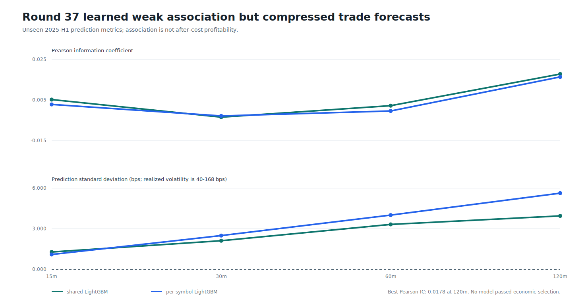
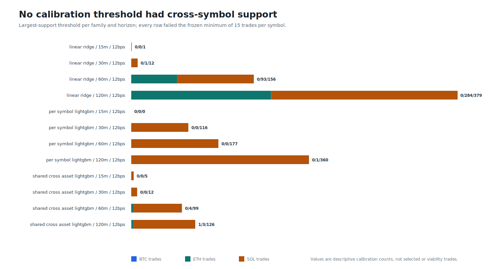

# Round 37: diversified candidate selection rejected

**The cross-asset regression lane did not earn permission to trade.** GPU-trained LightGBM found weak out-of-period association, but forecasts were too compressed and the rare profitable calibration tails were concentrated in SOLUSDT. The frozen BTC/ETH/SOL support gate rejected every threshold before viability replay or AI review.

| Evidence | Verified result |
| --- | ---: |
| Source / target span | Binance USD-M 1m / 2022-01-01 to 2025-06-30 UTC |
| Decision rows / causal features | 1,103,328 / 71 |
| GPU models / candidates / threshold cells | 16 / 20 / 100 |
| Best 2025-H1 Pearson / Spearman IC | 0.0178 / 0.0437 (shared cross asset lightgbm, 120m) |
| Selected thresholds / viability trades | 0 / 0 |
| AI cases / AI models evaluated | 0 / 0 |
| Compute / runtime / peak working set | opencl:auto / 65.7s / 3.31 GiB |
| Trading authority / leverage | none / none |

The positive tail observations are calibration diagnostics, not selected trades, ROI, an equity curve, or profitability evidence. No ROI graph exists because no portfolio or executable trade series was produced. Qwen3 and Fino1 were intentionally not invoked: without a diversified ML candidate set, an AI veto ablation would have no causal cases to review.

The next lane changes the target rather than weakening risk controls: cost-aware long/abstain/short classification with real futures premium and funding features. Selection-confirmation 2025-H2 and terminal 2026 data remain sealed.

Data: [candidates.csv](candidates.csv) | [thresholds.csv](thresholds.csv) | [models.csv](models.csv) | [sources.csv](sources.csv) | [progress.csv](progress.csv) | [validated source report](screen.json) | [integrity report](report.json)
