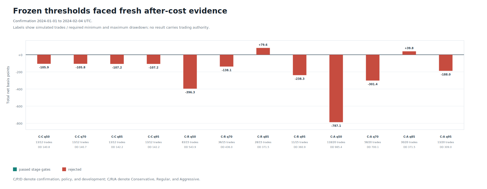

# Round 31: frozen chronological confirmation rejected

**Rejected without trading authority.** The exact Round 30 models and twelve thresholds were evaluated without retraining or recalibration. The deepest opened stage was **confirmation**; withheld stages: **policy, development**. 0 candidate(s) passed that stage. No leverage or trading authority was permitted.

| Evidence | Result |
| --- | ---: |
| Exact-BBO archive availability | 2023-05-16 to 2024-03-30 UTC (320 gap-free days) |
| Confirmation window | 2024-01-01 to 2024-02-04 UTC |
| Policy window | 2024-02-06 to 2024-03-05 UTC |
| Development window | 2024-03-06 to 2024-03-29 UTC; 2024-03-15 excluded |
| Deepest opened stage | confirmation |
| Candidates in deepest stage / passed | 12 / 0 |
| Best deepest-stage stress net return | +79.56 bps from 28 simulated trades |
| Best deepest-stage maximum drawdown | 371.51 bps |
| Final research profiles | none |
| Authorized / live-executed trades | 0 / 0 |

The terminal date, **2024-03-30**, was not ingested, queried, labeled, predicted, or evaluated. Dates already consumed by earlier rounds were excluded from targets. Official archive ingestion and deterministic causal-feature materialization occurred before model evaluation, but later-stage target, prediction, and metric construction remained gated.

This is single-symbol BTCUSDT research evidence. It cannot satisfy portfolio-diversification requirements and is not a profitability, execution, leverage, or deployment claim. Binance publishes years of trade data, but its public exact `bookTicker` history begins on 2023-05-16; the 320-day BBO limit is reported rather than extrapolated.

Data: [stages.csv](stages.csv) | [candidates.csv](candidates.csv) | [forecast.csv](forecast.csv) | [progress.csv](progress.csv) | [integrity report](report.json)
