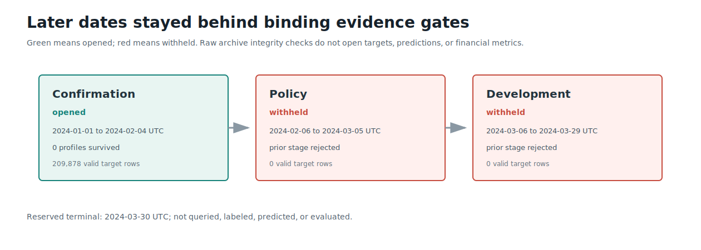
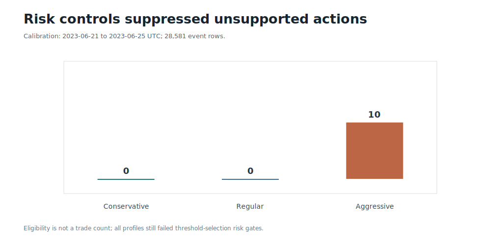
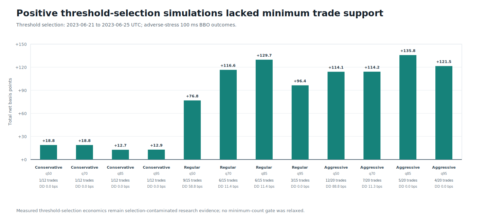

# Round 32: shared-action calibration rejected

**Rejected without trading authority.** A three-seed, symmetric long/short LightGBM ensemble trained on official BTCUSDT top-of-book and trade events. All profiles failed the first economic gate, so policy, development, and distant-confirmation predictions stayed withheld.

| Evidence | Verified result |
| --- | ---: |
| Source window | 2023-05-16 to 2023-07-06 UTC |
| Causal one-second rows | 877,894 |
| CUSUM events / valid barrier outcomes | 230,941 / 229,000 |
| Train / early-stop / calibration rows | 128,307 / 21,934 / 28,581 |
| Eligible rows: conservative / regular / aggressive | 0 / 0 / 10 |
| Selected-side AUC / Spearman IC | 0.5095 / -0.0127 |
| Top-100 / top-500 stress mean | -6.32 / -10.76 bps |
| Highest calibration total (insufficient support) | q95: +57.63 bps over 1 trade |
| Final profiles | none |

The positive q85 and q95 totals came from only two and one simulated trades. They failed minimum-support and positive-day gates and are not evidence of profitability. DirectML tensor execution and OpenCL FP64 LightGBM training were attested; LightGBM prediction used its CPU path. No leverage, live execution, portfolio claim, or untouched-period claim is permitted.

Data: [stages.csv](stages.csv) | [profiles.csv](profiles.csv) | [thresholds.csv](thresholds.csv) | [forecast.csv](forecast.csv) | [models.csv](models.csv) | [progress.csv](progress.csv) | [integrity report](report.json)
