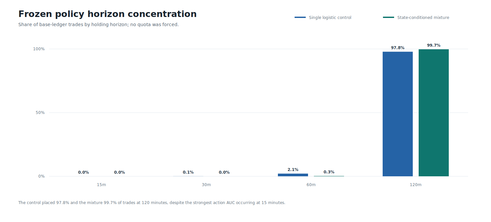

# Round 48: Minute Logistic-Mixture TCN

> **Beta research warning:** neither model is approved for testnet, live day trading, leverage, or autonomous execution. The 2025-H1 result is consumed development evidence.

Round 48 trained six causal large-kernel TCNs on 366,035 five-minute timestamps derived from verified Binance one-minute archives. The mixture improved return-density likelihood, but both policies lost money after fixed costs and were rejected.

| Candidate | Best action AUC | Trades | Base return | Stress return | Base drawdown | Profit factor | Distribution/action/economic gate |
|---|---:|---:|---:|---:|---:|---:|:---:|
| Single logistic control | 0.618 | 1808 | -54.03% | -63.88% | 54.06% | 0.762 | False/True/False |
| State-conditioned mixture | 0.618 | 795 | -41.35% | -47.25% | 41.97% | 0.633 | False/True/False |

The strongest measured signal was 15-minute direction classification, but the expected-value rule admitted no 15-minute trades. Instead, both ledgers concentrated almost entirely at 120 minutes and failed every economic gate.

DirectML completed in `434.0s`, peaked at `4.49 GiB` working set, recorded zero CPU fallbacks, and reloaded all six models exactly. AI was correctly withheld because no deterministic candidate passed.

Data: [forecast horizons](horizons.csv) | [action horizons](action-horizons.csv) | [symbol horizons](symbol-horizons.csv) | [seed stability](seed-stability.csv) | [training](training.csv) | [models](models.csv) | [roles](roles.csv) | [trades](trades.csv) | [replays](replays.csv) | [monthly economics](monthly.csv) | [symbol economics](symbols.csv) | [daily equity](daily-equity.csv) | [source lineage](sources.csv) | [progress](progress.csv) | [failure analysis](../round-048-failure-analysis.json) | [validated source report](screen.json) | [integrity report](report.json)
