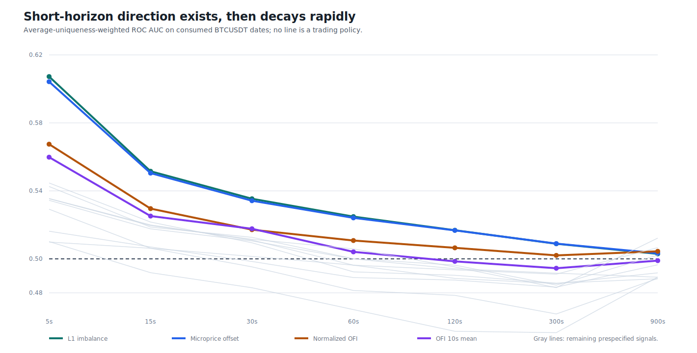
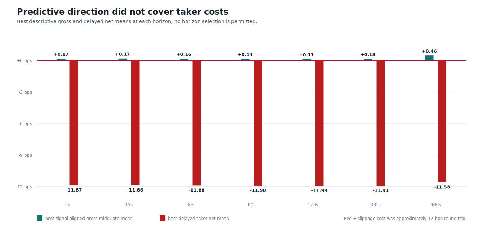
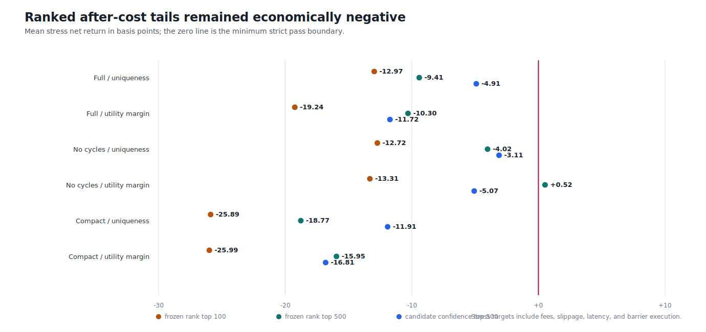
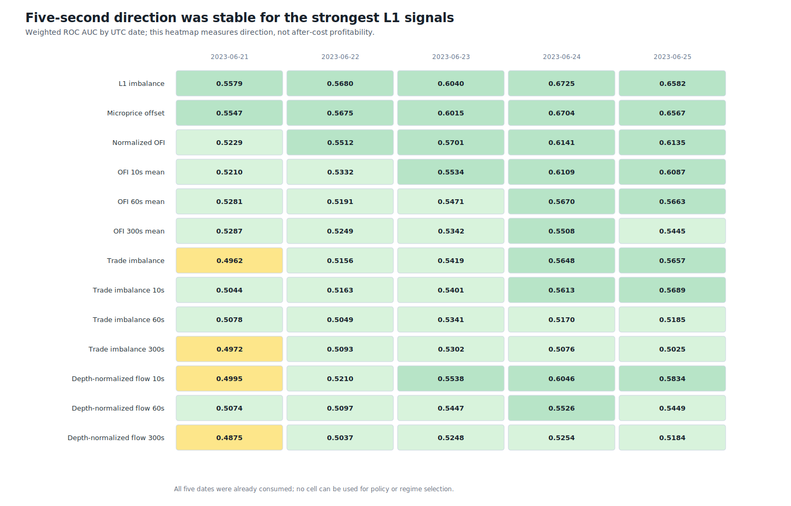
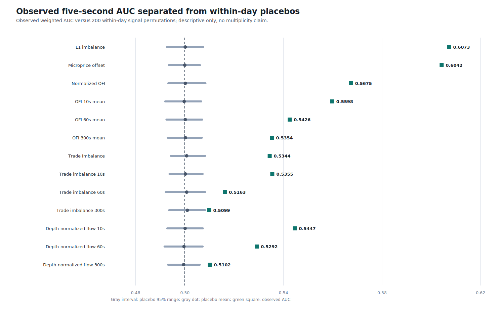

# Round 36: direction exists, taker edge rejected

**The consumed BTCUSDT L1/tape lane is rejected for taker trading.** Short-horizon direction is measurable, but no prespecified signal, horizon, non-overlapping sample, ranked tail, or causal regime slice covered observed spread plus the frozen fee/slippage model.

| Evidence | Verified result |
| --- | ---: |
| Metric dates | 2023-06-21 to 2023-06-25 UTC |
| Causal one-second rows / calibration events | 877,894 / 28,845 |
| Signals x horizons | 13 x 7 = 91 |
| Best weighted direction ROC AUC | 0.6073 (L1 imbalance, 5s) |
| Daily minimum / median AUC | 0.5579 / 0.6040 |
| Measured half-life | 14.63s (consumed role only) |
| Best all-routed delayed taker mean | -11.58 bps |
| Best top-100 / 500 / 1000 means | -3.50 / -10.01 / -10.66 bps |
| Positive regime slices | 0 / 819 |
| Peak / final working set | 8.96 / 0.76 GiB |
| Model candidate / trading authority | none / none |

The strongest L1 imbalance and microprice effects decay to roughly half their excess AUC within 15 seconds. The largest signal-aligned gross mean across all 91 cells was only `+0.46` bps, while the frozen round-trip fee and adverse-slippage charge was approximately `12` bps. Leverage cannot repair negative unlevered expectancy.

This is post-hoc evidence on five already-consumed BTCUSDT dates. It contains no out-of-sample, ETHUSDT, SOLUSDT, model-training, portfolio-return, testnet/live-execution, or profitability claim.

Data: [signals.csv](signals.csv) | [daily.csv](daily.csv) | [regimes.csv](regimes.csv) | [ranked-event-outcomes.csv](ranked-event-outcomes.csv) | [decay.csv](decay.csv) | [horizon-support.csv](horizon-support.csv) | [progress.csv](progress.csv) | [validated source report](screen.json) | [integrity report](report.json)
