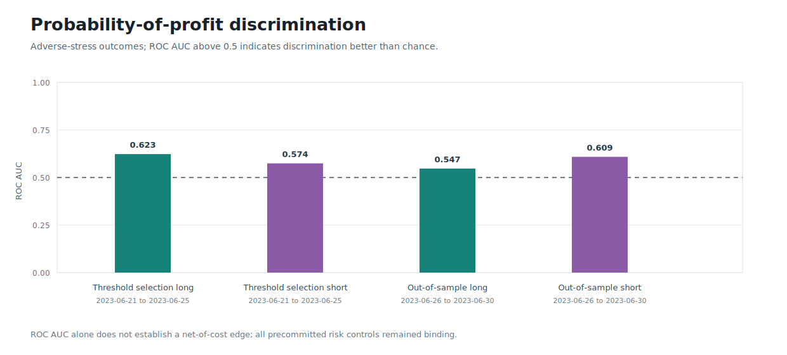
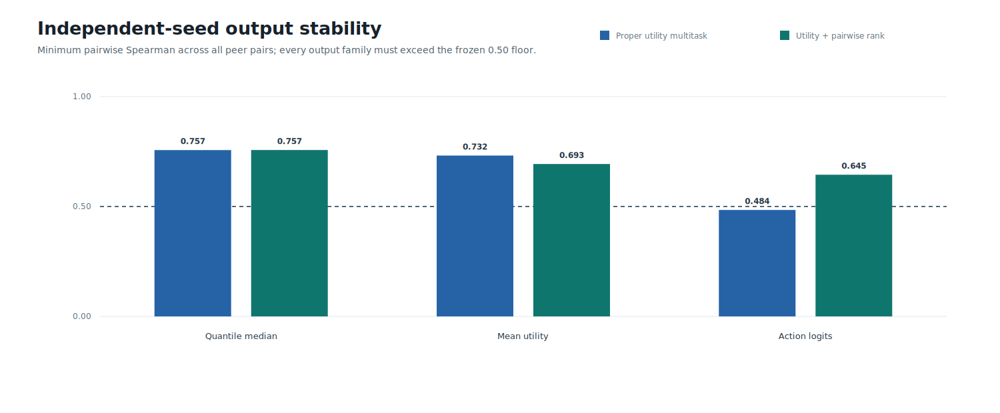
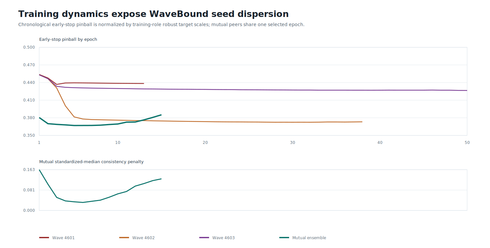
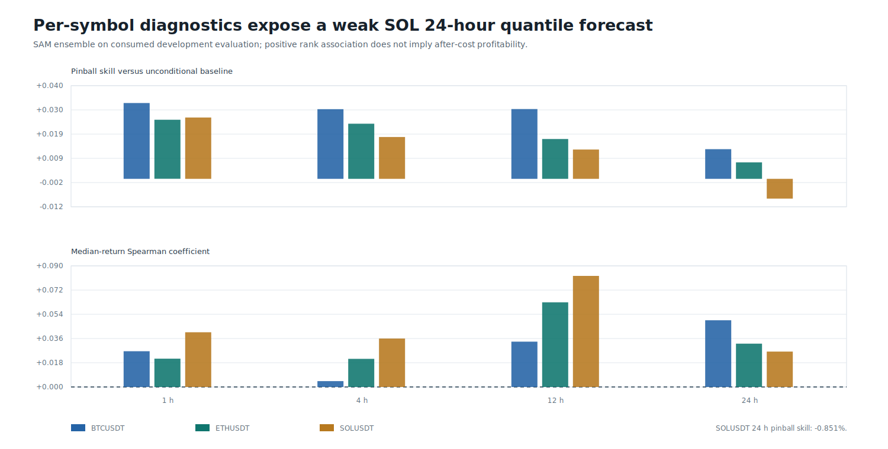
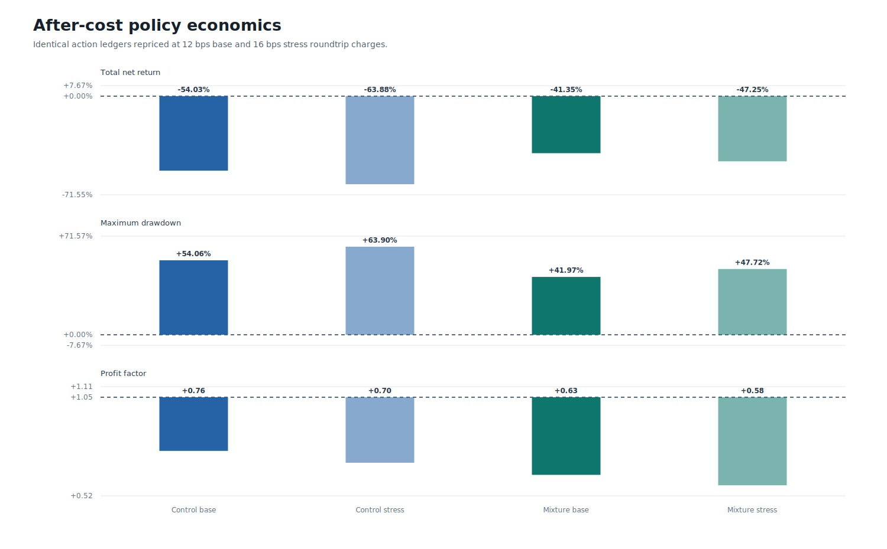
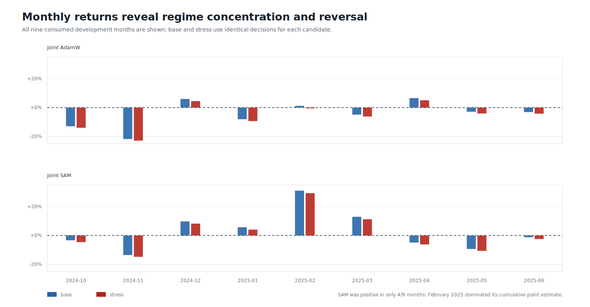
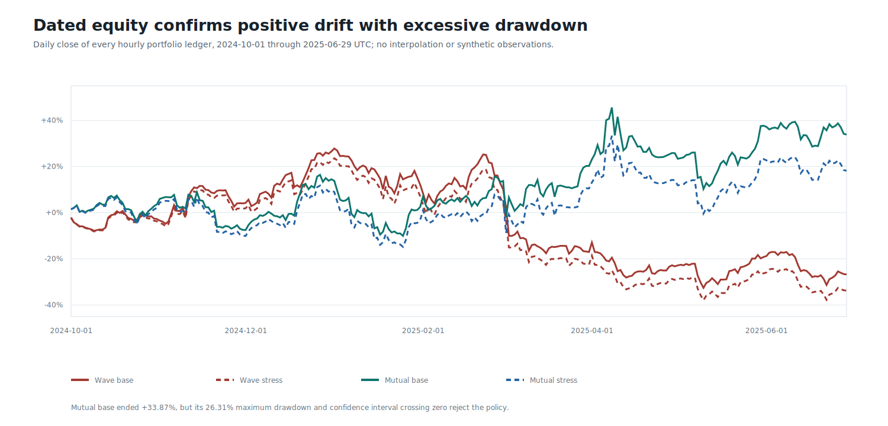
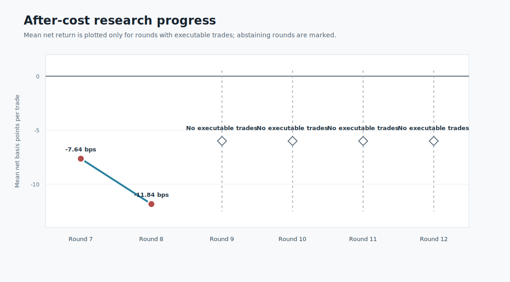

# Round 46: Stability-Regularized TCN

> **Beta research warning:** the economic gate failed. No model is approved for testnet, live day trading, leverage, or autonomous execution.

Round 46 compared WaveBound EMA error bounds with three co-trained distributional TCN peers. Six artifacts trained through DirectML on the AMD GPU, reloaded exactly, and emitted zero fallback warnings. The source dataset and every cached forward target were independently re-hashed and reproduced before training.

Mutual consistency passed the frozen forecast and mechanism screens. Minimum seed agreement rose from `0.452` in Round 44 to `0.867`; WaveBound fell to `0.211`.

| Horizon | Pinball skill | Spearman | 50% coverage | 80% coverage |
|---:|---:|---:|---:|---:|
| 1 h | +4.41% | 0.0444 | 46.9% | 77.9% |
| 4 h | +4.08% | 0.0500 | 46.5% | 78.3% |
| 12 h | +3.55% | 0.0658 | 46.8% | 78.2% |
| 24 h | +2.08% | 0.0272 | 49.2% | 78.9% |

The mutual ledger made `935` trades over `272` active days. Its base and stress point estimates were `+33.87%` and `+18.17%`. They are **not validated profitability**: base drawdown was `26.31%`, hourly profit factor `1.036`, ETH represented `72.4%` of absolute symbol P&L, and the stress bootstrap lower bound was `-1.076` bps/hour.

Data: [horizons](horizons.csv) | [symbol horizons](symbol-horizons.csv) | [forecast diagnostics](diagnostics.csv) | [seed stability](seed-stability.csv) | [training](training.csv) | [models](models.csv) | [roles](roles.csv) | [trades](trades.csv) | [replays](replays.csv) | [monthly economics](monthly.csv) | [symbol economics](symbols.csv) | [daily equity](daily-equity.csv) | [sources](sources.csv) | [progress](progress.csv) | [failure analysis](../round-046-failure-analysis.json) | [validated source report](screen.json) | [integrity report](report.json)
