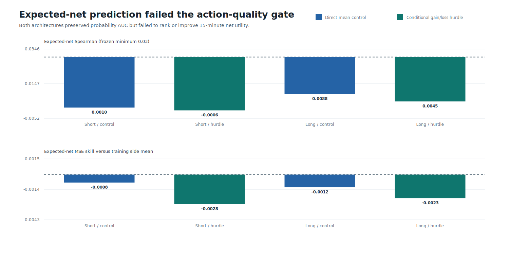
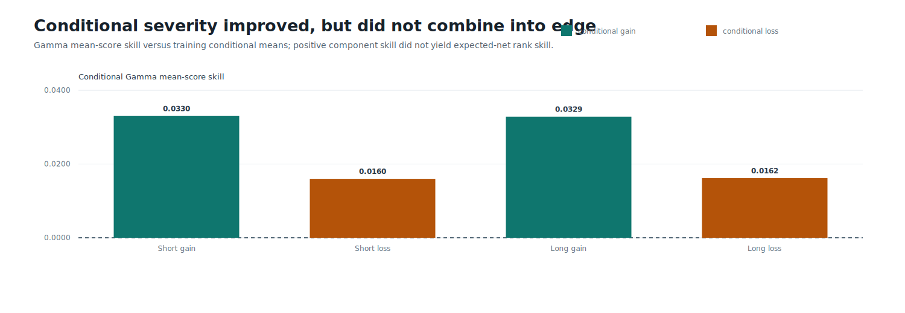

# Round 49: Cost-Aware Action-Hurdle TCN

> **Beta research warning:** neither candidate is approved for testnet, live day trading, leverage, or autonomous execution. The 2025-H1 result is consumed development evidence.

Round 49 trained six causal large-kernel TCNs on verified Binance BTCUSDT, ETHUSDT, and SOLUSDT data. Explicit conditional gain/loss modeling created a positive point estimate, but expected-net prediction, temporal breadth, diversification, and stress confidence failed. The candidate was rejected.

| Candidate | Best 15m AUC | Trades | Base return | Stress return | Base drawdown | Profit factor | Numerical/action/economic gate |
|---|---:|---:|---:|---:|---:|---:|:---:|
| Direct mean control | 0.619 | 0 | +0.00% | +0.00% | 0.00% | n/a | True/False/False |
| Conditional gain/loss hurdle | 0.618 | 165 | +2.53% | +0.30% | 6.23% | 1.093 | True/False/False |

The hurdle ledger made 165 trades on 35 days. Its base return was `+2.53%`, but the 16 bps stress return fell to `+0.30%`; the familywise bootstrap lower bound was negative. ETHUSDT supplied `+1,457.49` net bps while BTCUSDT and SOLUSDT lost, and 130 trades occurred in January-February. This is not a profitability claim.

DirectML completed in `254.2s`, peaked at `4.49 GiB` working set, recorded zero CPU fallbacks, and reloaded all six models and prediction arrays exactly. AI was withheld because no deterministic candidate passed.

Data: [probability](probability.csv) | [expected net](expected-net.csv) | [conditional severity](severity.csv) | [seed stability](seed-stability.csv) | [training](training.csv) | [models](models.csv) | [roles](roles.csv) | [target geometry](target-geometry.csv) | [trades](trades.csv) | [replays](replays.csv) | [monthly economics](monthly.csv) | [symbol economics](symbols.csv) | [daily equity](daily-equity.csv) | [gates](gates.csv) | [mechanism](mechanism.csv) | [source lineage](sources.csv) | [progress](progress.csv) | [failure analysis](../round-049-failure-analysis.json) | [validated source report](screen.json) | [integrity report](report.json)
