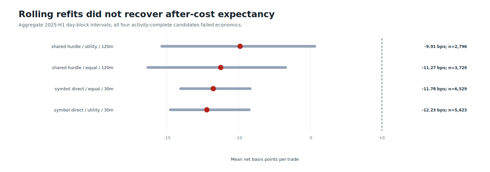
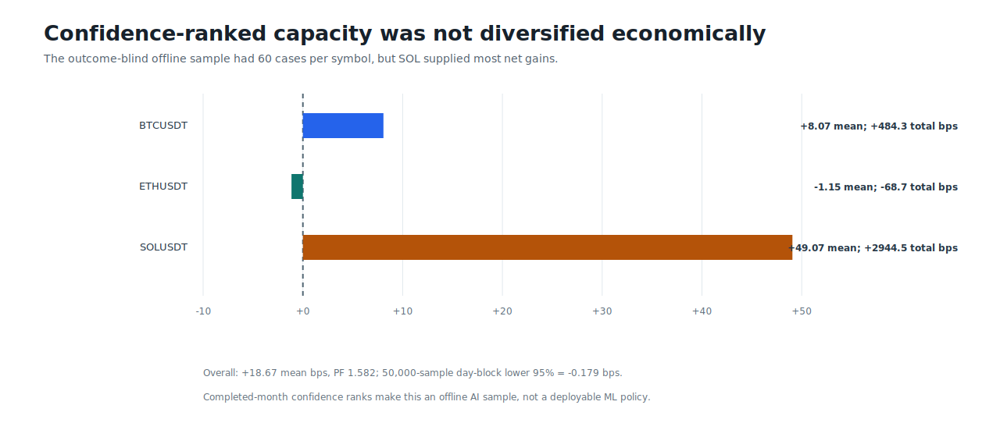
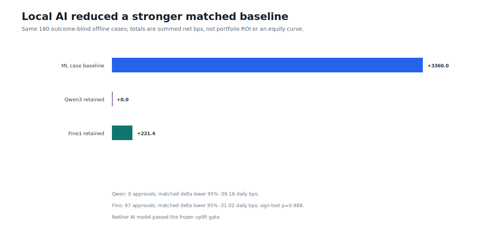

# Round 39: rolling ML and local AI rejected

**Monthly refits restored support, not after-cost edge.** All four BTC/ETH/SOL candidates traded across all six 2025-H1 months, but their aggregate means remained negative. Both local 8B models processed the same 180 outcome-blind offline cases without provider failures; neither improved the matched baseline.

| Evidence | Verified result |
| --- | ---: |
| Source / evaluation span | Binance USD-M 1m / 2025-01-01 to 2025-06-30 UTC |
| Rolling candidates / monthly refits / model artifacts | 4 / 24 / 60 |
| Threshold cells / selected month thresholds | 480 / 24 |
| Best full candidate | rolling_shared_hurdle_h120_utility |
| Best full-candidate result | 2,796 trades; -9.908 mean net bps; PF 0.789 |
| Confidence-capacity diagnostic | 180 cases; +18.667 mean; PF 1.582; lower 95% -0.179 |
| Qwen3 | 0 approvals; uplift gate failed |
| Fino1 | 97 approvals; +221.4 retained net bps; uplift lower 95% -31.02; failed |
| Compute / runtime / peak working set | opencl:auto / 1174.0s / 4.34 GiB |
| Trading authority / leverage | none / none |

The confidence-ranked subset is an offline diagnostic, not an accepted policy. Features and outcomes remain causal, but selecting the top cases across each completed evaluation month uses a future opportunity set that is unavailable to a live controller. Its 50,000-sample lower bound is below zero, ETH lost money, and SOL supplied most gains. Fino retained positive total economics but underperformed the stronger matched baseline; Qwen vetoed every case. No AI, ML, ROI, portfolio, leverage, execution, or profitability claim passed.

Data: [candidates.csv](candidates.csv) | [monthly.csv](monthly.csv) | [thresholds.csv](thresholds.csv) | [models.csv](models.csv) | [ai-cases.csv](ai-cases.csv) | [ai-models.csv](ai-models.csv) | [ai-decisions.csv](ai-decisions.csv) | [capacity-summary.csv](capacity-summary.csv) | [utility-uplift.csv](utility-uplift.csv) | [sources.csv](sources.csv) | [progress.csv](progress.csv) | [validated source report](screen.json) | [integrity report](report.json)
