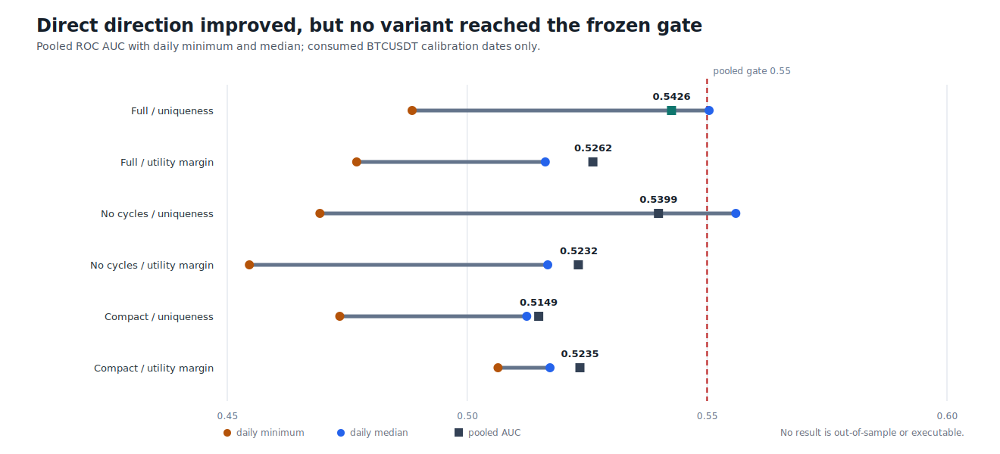
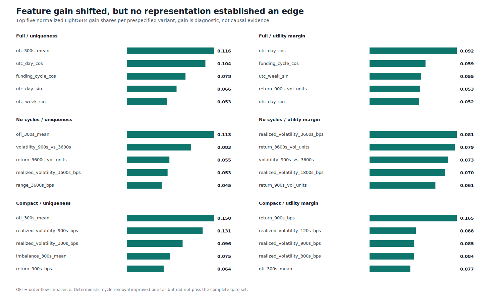

# Round 35: direct direction screen rejected

**Rejected without a viability candidate or trading authority.** Six prespecified mirror-equivariant LightGBM variants were trained sequentially on the same consumed BTCUSDT roles. Direct binary side-superiority learning improved discrimination over Round 34, but no variant passed the complete stability and after-cost gate set.

| Evidence | Verified result |
| --- | ---: |
| Source materialization | 2023-05-16 to 2023-07-06 UTC |
| Calibration metrics | 2023-06-21 to 2023-06-25 UTC |
| Causal one-second rows | 877,894 |
| CUSUM events / valid barrier outcomes | 230,941 / 229,000 |
| Calibration opportunity rows | 15,222 |
| Variants / eligible variants | 6 / 0 |
| Best pooled direction ROC AUC | 0.5426 (Full / uniqueness) |
| Best daily minimum / median AUC | 0.4885 / 0.5504 |
| Best frozen top-500 stress mean | +0.52 bps (No cycles / utility margin) |
| Best frozen top-100 stress mean | -12.72 bps |
| DirectML / LightGBM training | pass / OpenCL FP64 |
| Architecture-freeze candidate | none |

The isolated positive `+0.52 bps` top-500 result belongs to the noncycle utility-margin variant, whose top-100 and confidence-ranked top-500 means were negative and which failed six of eight gates. It is not evidence of profitability. Full feature gain remained concentrated in OFI and deterministic cycle variables; removing cycles improved one ranked tail but reduced pooled and worst-day stability. Utility-margin weighting did not provide a consistent improvement.

This screen is post-hoc discovery on already-consumed BTCUSDT dates. No ETHUSDT or SOLUSDT result, out-of-sample result, leverage, portfolio return, testnet/live execution, or profitability claim is permitted.

Data: [variants.csv](variants.csv) | [daily.csv](daily.csv) | [features.csv](features.csv) | [gates.csv](gates.csv) | [models.csv](models.csv) | [progress.csv](progress.csv) | [validated source report](screen.json) | [integrity report](report.json)
