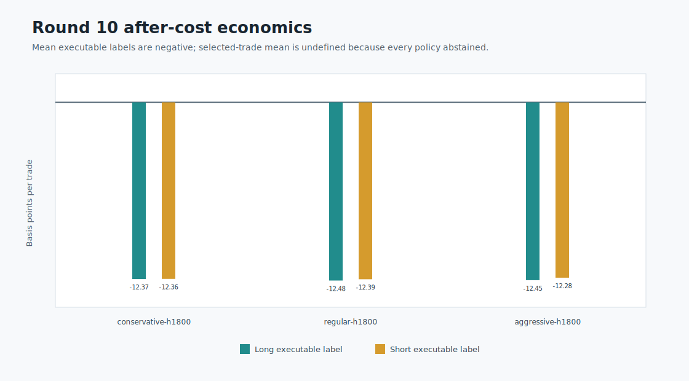
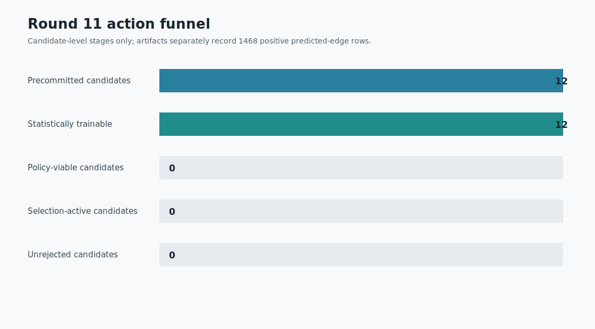

# Round 12: bounded viability

**Rejected.** All 18 candidates completed; none had positive after-cost policy utility. The best policy trace lost **-50.69 bps** over **31 trades** with **170.57 bps** max drawdown.

BTCUSDT, 2023-05-16 through 2023-07-06 UTC. The window is consumed; the 2023-07-07 terminal day remains untouched. This is research evidence, not profitability or trading authority.

Data: [candidates.csv](candidates.csv) | [progress.csv](progress.csv) | [diagnostics.json](diagnostics.json) | [integrity report](report.json)
