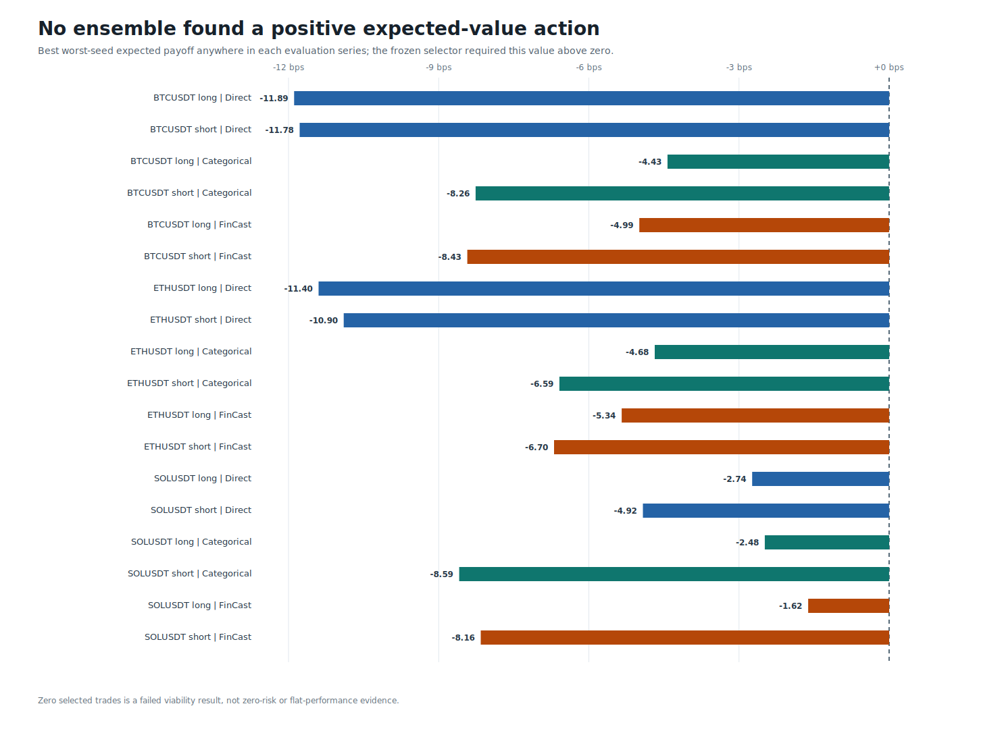
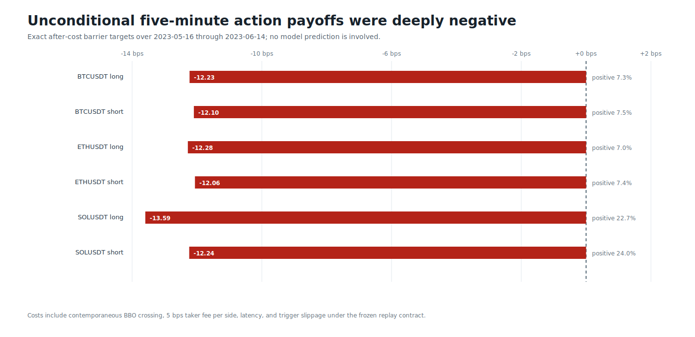
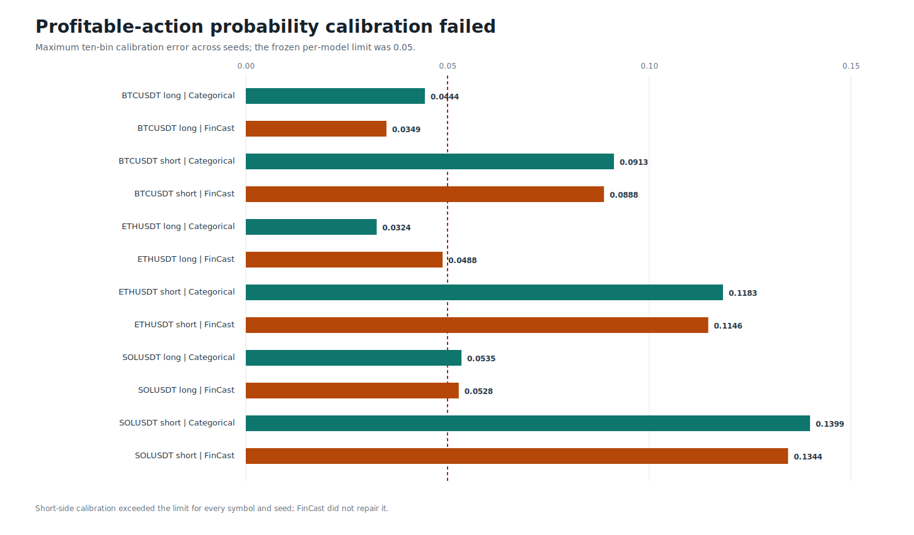

# Round 51: Categorical Payoff + FinCast

> **Beta research warning:** this consumed-development screen is not approved for testnet, live day trading, leverage, autonomous execution, or a profitability claim.

Round 51 tested direct after-cost regression, a categorical payoff model, and the same categorical model with causal features from the 991,437,160-parameter FinCast foundation model. All three selectors produced **zero eligible actions**. The round was rejected.

The result is not a threshold accident. Across BTCUSDT, ETHUSDT, and SOLUSDT, even the best worst-seed expected payoff remained below zero after spread, fees, latency, and slippage. An empty ledger has no meaningful ROI, profit factor, or drawdown.

| Candidate | Selected trades | Base net | Stress net | Economic gate |
|---|---:|---:|---:|:---:|
| Direct mean | 0 | 0 bps | 0 bps | false |
| Categorical | 0 | 0 bps | 0 bps | false |
| Categorical + FinCast | 0 | 0 bps | 0 bps | false |

The categorical models showed positive aggregate proper-score skill, but short-side profitable-probability calibration failed the frozen `0.05` limit. SOL short payoff rank also fell below `0.03`.

FinCast changed average ranked-probability skill by `-0.000074`, expected-payoff Spearman by `+0.002023`, and expected-payoff MSE by a ratio of `1.001171`. It missed both precommitted `+0.005` uplift gates and did not establish economic uplift.

The source is verified, checksummed Binance USD-M `bookTicker`, trades, and sampled aggregate depth for **2023-05-16 through 2023-06-14**. Decisions are ten seconds apart; each target follows exact 100 ms BBO paths for up to five minutes. Evaluation covers **2023-06-09 through 2023-06-14**. This is real tick evidence, but it is only 30 days and is not a multi-year claim.

FinCast ran through DirectML on the AMD GPU with zero warnings or CPU fallback. All 27 LightGBM models used OpenCL. The publisher independently verified 27 model files, 27 prediction files, three FinCast matrices, finite arrays, and probability normalization.

Data: [forecast](forecast.csv) | [prediction tails](prediction-tails.csv) | [barrier baselines](barrier-baselines.csv) | [scenarios](scenarios.csv) | [symbols](symbols.csv) | [daily ledger](daily-policy.csv) | [AI uplift](ai-uplift.csv) | [models](models.csv) | [roles](roles.csv) | [sources](sources.csv) | [gates](gates.csv) | [progress](progress.csv) | [source report](screen.json) | [publication integrity](report.json)
