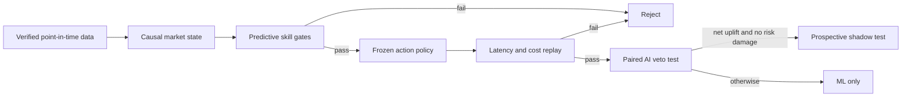

# Round 71: Institutional microstructure, predictive skill, and AI

**Status:** research and architecture decision only. No model was trained and no
economic replay was run. This round makes no accuracy, profitability, ROI,
drawdown, AI-uplift, leverage, testnet, or live-trading claim.

## Decision

The next directional model will not search for a profitable backtest and then
explain it. It must first show repeatable, calibrated predictive skill against
strong chronological baselines. Only then may the same frozen predictions enter
an after-cost execution replay. Positive P&L cannot rescue a failed predictive
gate, and high classification accuracy cannot rescue negative after-cost value.

## What the evidence supports

| Mechanism | Observable contract | Model use | Hard limit |
|---|---|---|---|
| Market-maker inventory and adverse selection | spread, microprice, order-flow imbalance, depth, fill probability, post-fill return | execution quality, maker/taker choice, abstention | public data does not reveal another participant's inventory |
| Large institutional execution | persistent signed-flow runs, participation versus trailing volume/depth, impact and recovery | auditable `large_flow` and `metaorder_pressure` proxies | never label an identity or a "whale" from a candle or one transfer |
| Transient displayed liquidity | quote pressure versus executed flow, depth persistence, disappearance and cancellation intensity | toxicity score, larger cost buffer, cooldown, abstention | spoofing intent requires order-lifecycle/L3 evidence and cannot be inferred from coarse depth snapshots |
| Wash-like activity | abnormal trade intensity, size concentration, entropy, price impact, cross-venue disagreement | mark volume as less informative; do not create alpha from it | beneficial ownership is unavailable, so the bot cannot call a trade a wash trade |
| Derivatives crowding | point-in-time funding, basis, open interest, liquidation flow and depth recovery | state conditioning and tail-risk control | historical open interest is short-lived unless collected prospectively; missing data stays unavailable |
| Listed crypto-product sessions | exchange open/close, auction window, holiday/early close, NAV and reference-rate cuts | external liquidity and information regimes for BTC/ETH spot and derivatives | spot crypto remains continuous; an ETF close is not a Binance close |

## Venue and session contract

- Binance spot and USD-M perpetual markets have no formal daily close. They are
  modeled as continuously tradeable except for observed exchange status and
  maintenance. Funding applies only where current product metadata says it
  does; settlement applies only to products that actually settle.
- U.S.-listed Bitcoin and Ether products use their actual listing venue's
  session, auction, halt, holiday, and early-close schedule. NYSE Arca, Nasdaq,
  Cboe BZX, and other venues have distinct mechanics; none is a generic ETF
  clock, and their auction data is distinct from Binance's continuous book.
- CME cryptocurrency futures and options now trade continuously apart from
  declared maintenance windows, but still assign trade dates and retain daily
  settlement, final settlement, and reference-rate cuts. Those events remain
  economically meaningful without becoming a spot-market close.
- Calendar features must be generated from a versioned schedule, converted to
  UTC with an IANA timezone, hashed into the experiment, and cross-checked
  against the official exchange calendar. A fixed local clock or fixed list of
  holidays is prohibited.
- Auction imbalance, ETF flow, or NAV data may be used only when a real,
  timestamped source and publication-latency contract are available. Missing
  licensed data cannot be replaced by zeros, estimates, or synthetic values.

## Predictive-skill gate

Every metric is computed on untouched chronological blocks, by BTC, ETH, SOL,
month, and predeclared market state. Thresholds are selected before those blocks
are opened. Confidence intervals use day-block or dependence-aware resampling,
and related comparisons use false-discovery-rate control.

| Task | Mandatory metrics | Baseline |
|---|---|---|
| Direction or positive-after-cost event | balanced accuracy, Matthews correlation, precision-recall AUC, ROC AUC, log loss, Brier score, calibration error | training prevalence, no-change, and simple regularized model |
| Continuous net payoff | MAE/MSE skill, rank correlation, sign accuracy, lower-tail pinball loss | zero payoff and training-fold conditional mean |
| Passive fill time | exact and within-one-bucket accuracy, macro recall, log loss, ranked/integrated Brier score, fill calibration | training-fold conditional hazards |
| Market state | balanced accuracy, macro F1, negative log likelihood, multiclass Brier score | marginal and pre-state transition probabilities |

Promotion requires all of the following:

1. Proper-score skill is positive and statistically supported against every
   precommitted baseline.
2. The blocked lower confidence bounds for incremental balanced accuracy and
   Matthews correlation are above zero. Raw accuracy against an imbalanced
   majority class is not accepted.
3. Predicted probabilities are calibrated, finite, and stable by symbol and
   regime; calibration cannot worsen held-out proper scores.
4. Fixed-coverage selective predictions retain skill as coverage falls. The
   model may abstain, but it may not hide errors by reporting only favorable
   examples.
5. Action support is broad enough to estimate uncertainty. One trade, one day,
   one symbol, or one lucky month cannot pass.

Only a predictive pass reaches economic replay. That replay additionally
requires positive stress-net expectancy and its lower confidence bound, bounded
drawdown and expected shortfall, no liquidation, no single-trade/symbol
concentration, and realistic fees, spread, latency, impact, funding, queue, and
capacity. Leverage remains a downstream exposure ceiling; it cannot create
predictive edge.

## Low-compute model hierarchy

1. Test a non-causal opportunity ceiling first. If the available moves cannot
   clear frozen costs at useful support, reject the execution family.
2. Benchmark no-change, transition-frequency, logistic, and shallow LightGBM
   models before temporal neural networks.
3. Use a shared action-conditioned hurdle model: probability of positive
   after-cost payoff, conditional payoff, lower-tail payoff, adverse excursion,
   and fill-time heads where passive execution is eligible.
4. Add market-state conditioning only from causal inputs: flow persistence,
   impact/recovery, spread/depth stress, dynamic funding/basis/open interest,
   and verified venue-event windows.
5. Use Bayesian online change-point detection only as a challenger to trailing
   robust statistics. A fixed number of regimes is not presumed.
6. Use successive halving on development blocks. DeepLOB/TLOB-style temporal
   models advance only when the exact data semantics support them and they beat
   the simple control on proper scores, stability, and after-cost replay.

The current Round 62 coarse-depth screen remains frozen. It predicts depth
stress, not return or P&L, and cannot detect spoofing, queue position, spread, or
subsecond execution. Its pass can authorize only its already-defined paired
economic test; its failure removes coarse depth from the next action model.

## AI contract

Language-model financial fluency is not evidence of price predictiveness.
Finance-specific 8B/14B models such as Fin-R1 and Fin-o1 improve selected
financial reasoning benchmarks, while current trading benchmarks still report
numerical, robustness, reproducibility, and cost-model gaps. The latest
time-series-foundation-model evidence also finds only sparse gains over a random
walk. Model size therefore does not grant trading authority.

The already-frozen Qwen3 14B v9 run remains the next one-shot host benchmark. It
tests structured governance reasoning on the exact preregistered cases, model
digest, AMD GPU telemetry, context, and timeout. It is not a price forecast. A
later model comparison must use a new preregistration and the same cases; it may
include Qwen3.5 9B, Fin-R1 8B, and Fin-o1 8B/14B only after license, model-card,
quantization, runtime, and provenance review.

In trading experiments AI may only veto, downsize, or extend cooldown for an ML
candidate. It cannot create a side, increase leverage, submit or close an order,
override deterministic risk, or block reconciliation. The paired treatment uses
the same ML actions, costs, periods, and fills. AI passes only if it improves
loss-risk proper scores and the dependence-aware lower bound of net P&L while
not worsening calibration, drawdown, tail loss, concentration, missed profitable
actions, latency, or close safety. Otherwise the AI path is disabled.

## Data decisions

- The active warehouse remains the single checksummed DuckDB source. Archives
  are streamed, verified, transacted, and discarded rather than duplicated.
- Existing Binance `bookDepth` is a roughly 30-second percentage-band product.
  It is suitable only for coarse depth-state research.
- Historical `bookTicker` plus trades supports exact BBO/tape research but is
  large and ends in the currently verified public inventory on 2024-03-30. A
  full 119 GB ingest is not authorized by curiosity alone.
- Diff-depth sequence, BBO, trades, funding, open interest, liquidation events,
  exchange status, and request telemetry should be captured prospectively from
  official streams. Gaps invalidate affected windows; reconnects require a new
  snapshot and observation cooldown.
- On-chain large-transfer data is slower and attribution is ambiguous. It may
  enter only a separately tested slow-state lane with exact publication time and
  no exchange-flow meaning assumed from an address transfer.

## Primary sources

- [Avellaneda and Stoikov, inventory-aware market making](https://doi.org/10.1080/14697680701381228)
- [Cont, Kukanov, and Stoikov, order-flow imbalance and depth](https://arxiv.org/abs/1011.6402)
- [Queue-reactive limit-order-book model](https://arxiv.org/abs/1312.0563)
- [Almgren and Chriss, optimal execution and implementation shortfall](https://doi.org/10.3905/jpm.2001.319105)
- [Institutional-order impact crossover](https://arxiv.org/abs/1811.05230)
- [Online order-flow and impact change-point detection](https://arxiv.org/abs/2307.02375)
- [LOBFrame executable-transaction evaluation](https://arxiv.org/abs/2403.09267)
- [TLOB and transaction-cost sensitivity](https://arxiv.org/abs/2502.15757)
- [Interpretable L3 spoofability research](https://arxiv.org/abs/2504.15908)
- [CFTC disruptive-practices guidance](https://www.cftc.gov/LawRegulation/FederalRegister/FinalRules/2013-12365.html)
- [SEC crypto wash-trading enforcement example](https://www.sec.gov/newsroom/press-releases/2024-166)
- [NYSE hours, holidays, and auctions](https://www.nyse.com/trade/hours-calendars)
- [Nasdaq Closing Cross](https://www.nasdaq.com/solutions/nasdaq-closing-cross)
- [Cboe U.S. equities hours and holidays](https://www.cboe.com/about/hours)
- [Cboe BZX auction-feed specification](https://www.cboe.com/document/tech-spec/document/technical-specifications/cboe-titanium-bzx-equities-auction-feed-specification/)
- [CME cryptocurrency futures FAQ](https://www.cmegroup.com/articles/faqs/frequently-asked-questions-cryptocurrency-futures.html)
- [CME CF Bitcoin Reference Rate](https://www.cmegroup.com/education/courses/introduction-to-cryptocurrency-futures/bitcoin/introduction-to-bitcoin-reference-rate)
- [Crypto intraday liquidity periodicity](https://arxiv.org/abs/2109.12142)
- [Binance WebSocket and local-order-book semantics](https://developers.binance.com/en/docs/binance-spot-api-docs/web-socket-streams)
- [Binance REST uncertainty and rate-limit semantics](https://developers.binance.com/en/docs/products/spot/rest-api)
- [Selective time-series forecasting](https://arxiv.org/abs/2606.23448)
- [Pretrained time-series models for financial returns](https://arxiv.org/abs/2606.27100)
- [FinTradeBench](https://arxiv.org/abs/2603.19225)
- [Fin-R1](https://arxiv.org/abs/2503.16252)
- [Fin-o1](https://arxiv.org/abs/2502.08127)

These sources motivate falsifiable tests. They do not validate this repository,
prove manipulation, identify institutions, or establish a market edge.
