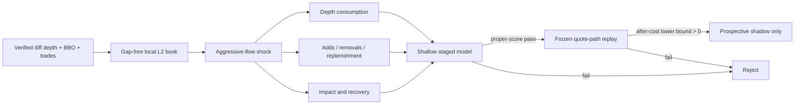

# Round 73: Impact absorption and liquidity recovery

**Status:** preregistered research design v2. No modeling capture, model, replay, or
profit result exists yet. This round grants no AI, leverage, testnet, or live
authority.

## Why this is different

Round 36 found repeatable five-second directional information in static L1
imbalance, but its best gross move was only `0.4584 bps` and its best delayed
after-cost mean was `-11.5790 bps`. Round 58 rejected value-blind symmetric
touch making. Round 72 rejected all nine BTC/ETH/SOL spot-flow components.

Round 73 therefore does not add another threshold or larger network to those
inputs. It asks a different, event-conditioned question: after an aggressive
flow shock, does the **way the multi-level book is consumed and replenished**
distinguish absorption/reversion from toxic continuation after realistic delay
and costs?

## Data truth

- BTCUSDT, ETHUSDT, and SOLUSDT USD-M perpetuals only.
- Official Binance `depth@100ms`, `bookTicker`, `aggTrade`, `markPrice@1s`,
  `forceOrder`, depth snapshot, exchange metadata, clock, and open interest.
- Every sequence gap, queue overflow, crossed book, product mismatch, or stale
  state invalidates the affected segment. Reconnect means resnapshot and cool
  down; missing events are never filled in.
- The liquidation feed is a throttled snapshot. No message means "not observed",
  not zero liquidations. Public L2 also omits hidden/RPI liquidity and cannot
  identify market makers, whales, spoofing, or manipulation.
- Diff-depth quantity decreases are displayed removals, not observed
  cancellations. Aggregate trades and removals remain separate when their
  attribution is ambiguous; the software never invents an order-lifecycle fact.
- The single evidence store is `data/microstructure.duckdb`; long collection
  starts only after a one-hour qualification measures integrity and storage rate.

Crypto trades continuously. UTC days are statistical blocks, not closes. Any
later ETF or listed-product context must use the product's actual venue calendar,
including holidays, early closes, halts, and auctions.

## Gates

The staged comparison is prevalence/zero payoff, linear L1+tape, shallow L1+tape,
L2 state, then L2 impact absorption. Model capacity and rows stay identical.
Impact absorption must beat both L2 state and the frozen L1+tape control on held
out log loss, Brier score, MSE, calibration, dependence-aware uncertainty, and a
one-second stress-delay check.

The first seven complete days are only a bounded viability screen. Promotion
requires at least 30 complete prospective days with the final seven sealed.
Each symbol passes or fails independently; unsupported symbols are disabled.
Portfolio research requires at least two independent symbol passes.

Only the same frozen predictions may enter an unlevered quote-path replay. Entry
and exit walk the synchronized visible book for `$100`, `$1,000`, and `$5,000`
notionals and apply at least `12 bps` of round-trip fees and adverse charge. A
positive point estimate is insufficient: the blocked lower confidence bound of
net expectancy and profit factor must clear zero and one, with at least 100 test
trades and bounded tail risk. The result is still not a fill claim.

## Model and AI boundary

A fixed shallow LightGBM is the primary challenger. A TCN/TLOB-style temporal
model can be separately preregistered only after the shallow feature layer passes
on 30 days for at least two symbols. Reinforcement learning, language-model
forecasting, AI vetoes, and leverage are closed in this round. This prevents
capacity from hiding a failed financial mechanism.

## Primary sources

- [Binance USD-M Futures API](https://developers.binance.com/en/docs/products/derivatives-trading-usds-futures/Introduction)
- [The Price Impact of Order Book Events](https://arxiv.org/abs/1011.6402)
- [Multi-Level Order-Flow Imbalance](https://arxiv.org/abs/1907.06230)
- [Order Flows and LOB Resiliency](https://arxiv.org/abs/1708.02715)
- [Deep Limit Order Book Forecasting / LOBFrame](https://arxiv.org/abs/2403.09267)
- [TLOB](https://arxiv.org/abs/2502.15757)
- [State-dependent L2 liquidity transitions](https://arxiv.org/abs/2607.09230)
- [CFTC disruptive-practices guidance](https://www.cftc.gov/LawRegulation/FederalRegister/FinalRules/2013-12365.html)

These sources motivate the experiment. None establishes an edge for this
repository.
