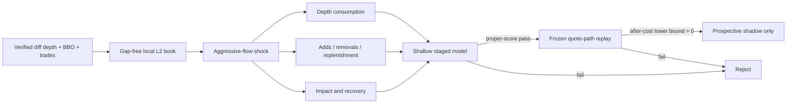

# Round 73: Impact absorption and liquidity recovery

**Status:** a qualified one-hour v9 exact-wire run now has an independently
audited v4 causal grid and v1 executable-target diagnostic. Of 382,284 frozen
quote-path options, 380,483 were mechanically eligible and none cleared the
12 bps round-trip reserve. This hour is development-only after outcome access;
no model was trained. Compact target v2 is now preregistered before collection:
it uses only feature-selected shocks from new v9 data, retains the cost floor,
and evaluates 15, 60, and 300-second paths one source run at a time. Its
deterministic cohort builder and independent deep auditor are implemented, but
no eligible seven-day cohort exists yet. Selected-anchor v2 replay validated the
bounded mechanics API on pre-eligibility fixtures, but its all-role sealing
sequence exposed test targets before model freeze. V3 now supersedes that
sequence and blocks v2 on every eligible anchor. No prospective target has been
observed. A new untouched seven-day v9 feature corpus is next; the staged
development/pretest/test store and one-use evaluator are implemented. The evaluation keeps
source-boundary censoring deterministic, counts pre-entry safety aborts as
attempted zero-return actions, and fails on a selected unresolved post-entry
exit. Profitability, AI, leverage, paper, testnet, and live authority remain
closed.

## Why this is different

Round 36 found repeatable five-second directional information in static L1
imbalance, but its best gross move was only `0.4584 bps` and its best delayed
after-cost mean was `-11.5790 bps`. Round 58 rejected value-blind symmetric
touch making. Round 72 rejected all nine BTC/ETH/SOL spot-flow components.

Round 73 therefore does not add another threshold or larger network to those
inputs. It asks a different, event-conditioned question: after an aggressive
flow shock, does the **way the multi-level book is consumed and replenished**
distinguish absorption/reversion from toxic continuation after realistic delay
and costs?



## Data truth

- BTCUSDT, ETHUSDT, and SOLUSDT USD-M perpetuals only.
- Official Binance `depth@100ms`, `bookTicker`, `aggTrade`, `markPrice@1s`,
  `forceOrder`, depth snapshot, exchange metadata, clock, and open interest.
- Every sequence gap, queue overflow, crossed book, product mismatch, or stale
  state invalidates the affected segment. Reconnect means resnapshot and cool
  down; missing events are never filled in.
- The liquidation feed is a throttled snapshot. No message means "not observed",
  not zero liquidations. Public L2 also omits hidden/RPI liquidity and cannot
  identify market makers, whales, spoofing, or manipulation.
- Diff-depth quantity decreases are displayed removals, not observed
  cancellations. Aggregate trades and removals remain separate when their
  attribution is ambiguous; the software never invents an order-lifecycle fact.
- The single evidence store is `data/microstructure.duckdb`. Contract-v2 run
  `5d89804a8f404d9b80b3a3ce2d796561` passed one uninterrupted hour with
  3,988,592 exact-wire messages and an independent full replay audit. It
  authorizes feature-pipeline diagnostics only; the one-hour corpus is far
  below the seven-day viability and thirty-day promotion gates. See
  `round-073-capture-qualification-2026-07-22.json`.
- The v2 indexed row layout was measured before any long capture. Contract v3
  removed redundant per-message strings and primary-key indexes without
  weakening exact-wire replay, but probe `feb1289d71884a23818be1b7f1de3b3e`
  exposed a terminal latency-query defect and is permanently development-only.
  Contract v4 restores provider event time to the compact link and adds an
  absolute DuckDB-plus-WAL cap. Live probes `7ffd4edbd2654b5997704c988802580d`
  and `ec114dd2c28d4641b0158f4bd0b32c72` passed fresh-process replay. They
  authorized one v4 one-hour qualification attempt. Run
  `ec6d54470ef04b0baddc73fd0e27fd5b` then captured 3,181,236 messages and
  passed both in-process and fresh-process replay with zero audit errors. Its
  measured process write transfer was about 56,293.5 MiB for 629.5 MiB of
  physical database growth. That metric is not an SSD-wear measurement, but it
  rejects the observed checkpoint policy for multi-day use. Feature-pipeline
  diagnostics are authorized; long capture and model evaluation remain closed.
  See `round-073-v4-capture-qualification-2026-07-22.json`.
- Exact-wire feature-source replay then reconstructed 104,570 depth updates,
  104,484 synchronized top-20 states, and 7,432,729 individual price-level
  changes. Every event-level quote-flow sum and every stored top-20 state
  reconciled with zero mismatches or nonfinite values. Level bands use the
  synchronized pre-event book, so future state cannot change a feature's band.
  The reported additions and removals are gross displayed-book churn, not
  executions, accessible fill capacity, or performance. Grid features, shocks,
  targets, and models remain unconstructed. See
  `round-073-v4-feature-source-diagnostic-2026-07-22.json`.
- Contracts v5-v7 isolated terminal I/O telemetry and rejected a larger
  checkpoint threshold after live probes still exceeded the frozen process-I/O
  limit. Contract v8 instead routes new frames and typed streams to fresh
  versioned tables inside the same database while preserving v1-v7 audit
  support. One-hour run `f3e92ba29e1e4d3188c3f309f5c160a2` captured
  1,294,128 real messages in 847 frames with zero reconnects, zero physical
  database growth, 21.68% peak queue use, and 3,514.6 process-I/O bytes per
  message against the frozen 4,096 limit. Its fresh-process audit passed every
  frame. Independent replay reconciled all 104,305 depth-band rows and
  reconstructed 4,459,493 level changes without future data. Storage headroom
  is only 14.2%, so the evidence authorizes a bounded rotating corpus pipeline
  and feature construction, not an unbounded seven-day run or model evaluation.
  See `round-073-v8-capture-qualification-2026-07-22.json`.
- The first immutable corpus manifest catalogs that same qualified run after a
  second exact-wire replay and a post-write frame-chain audit. It contributes
  3,608.934 seconds to the 2026-07-22 UTC statistical partition. No complete
  day exists, so target construction and model evaluation remain closed. See
  `round-073-first-corpus-manifest-2026-07-22.json`.
- V9 run `0aabddb515794668a8a54129aa6e1d47` passed one hour with 2,277,593
  real public messages. Its v4 grid retained 10,629 one-second anchors and
  10,619 financially valid vectors; independent scans found zero vector or
  anchor-primitive violations. The frozen target replay then produced 382,284
  long/short options across two delays, three horizons, and three notionals.
  The best gross path was 11.52 bps, below the approximately 12 bps charge, so
  every after-cost binary label was negative. This is mechanics evidence, not
  a model result or a reason to reduce costs post hoc. See the v4 grid
  qualification and v1 target-mechanics diagnostic dated 2026-07-23.
- `round-073-compact-shock-target-contract-v2.json` freezes the response to that
  diagnostic before any new eligible target is observed. It excludes the
  diagnostic hour, admits v9 only from 2026-07-24 UTC, deterministically selects
  the earliest seven consecutive integrity-complete UTC days, learns each
  symbol's shock threshold from the first four days only, and freezes days five,
  six, and seven as tuning and test. UTC midnight remains a partition, not a
  crypto market close. Exchange-listed ETF/ETP sessions remain context only.
- The v2 target store materializes only selected cohort anchors, with 36 frozen
  long/short scenarios per anchor across 500/1,000 ms delays, 15/60/300 second
  horizons, and $100/$1,000/$5,000 reference notionals. Every option binds the
  original mechanics hash, cohort ID, and selected-anchor hash. Per-run writes
  are atomic and bounded. Independent audits reconstruct every target from the
  source's exact-wire frames. The final study seal requires every source run,
  fresh cohort/source audits, exact replay equality, complete dimensions, and
  no orphan rows. Those mechanics remain reusable, but the v2 public builder now
  rejects every anchor at or after the prospective eligibility timestamp.
  `round-073-staged-holdout-contract-v4.json` requires development-role targets
  first, an immutable pretest model/policy manifest, then a one-time test unlock
  and test-only replay. The role-scoped target store, bounded float32 symbol
  loader, frozen linear/LightGBM family, explicit OpenCL platform/device pin,
  single-audit publication, append-only access and prediction artifacts, and
  one-use all-scenario evaluator are implemented. No eligible target or model
  result exists; implementation is not performance evidence.

The CLI and native Windows app expose the same non-alphabetic holdout sequence:

```text
impact-role-target-stage --role-scope development
impact-model-fit
impact-test-unlock --confirm-test-unlock
impact-role-target-stage --role-scope test
impact-test-seal
impact-model-evaluate --confirm-one-use-evaluation
```

Every command requires the study identity; post-fit commands also require the
immutable pretest hash. The unlock and evaluation acknowledgements are
mandatory. Progress is emitted to stderr, test staging and sealing redact all
outcome summaries, and an interrupted evaluation permanently closes the test.
These commands are implemented but cannot run on eligible evidence until the
prospective seven-day corpus exists.
- `round-073-selected-anchor-evaluation-contract-v1.json` freezes the one-use
  viability analysis before an eligible v2 target result exists. It keeps
  BTC/ETH/SOL models separate, evaluates prevalence, linear L1+tape, shallow
  L1+tape, L2 state, and impact absorption in that order, and requires accuracy,
  calibrated proper scores, continuous loss, blocked uncertainty, and an
  unchanged after-cost policy. It removes only deterministic source-boundary
  censoring. Failed pre-entry revalidation remains an attempted zero-return
  action; a selected unresolved post-entry exit rejects the symbol's economic
  gate. The simulation uses fixed `$1,000` notional, `1x`, no reinvestment, and
  one open position per symbol. Failed, zero-trade, single-class, unresolved,
  and interrupted outcomes are terminal and persisted; the test cannot reopen.
  This is a frozen design, not model evidence.
- `round-073-action-aligned-feature-contract-v1.json` and its implementation
  create two target-blind rows per anchor. Long and short views mirror bid/ask
  into support/opposing channels, mirror buy/sell flow into aligned/opposing
  channels, and sign-align directional flow, imbalance, basis, and return. The
  257 raw features remain lossless; four causal anchor/action fields are added.
  L1+tape (90), L2 state (107), and full impact absorption (261) are strictly
  nested. No fitted statistic, clipping, invented ratio, target, or future state
  enters this transform.
- `impact_absorption_model_dataset.py` implements the operational status and
  adapter. It requires a passing complete target-study audit, independently
  rehashes each 257-value source vector, creates immutable action rows, and
  hash-binds the resulting arrays. Complete transactions retain measured net
  outcomes; pre-entry aborts become zero-return labels; deterministic run-end
  rows are censored before fitting; post-entry unresolved risk remains unlabeled
  and cannot later disappear from economic evaluation. No eligible study exists
  yet. The staged v3 store is the only permitted eligible input and is now
  implemented, so this path still has focused contract tests, not model results.
- `round-073-rotation-runner-contract-v1.json` preserves the original bounded
  v8 collector and its historical journals. Current
  `round-073-rotation-runner-contract-v2.json` was frozen before eligible
  collection and admits v9 capture, reports, and recovery only. It admits at
  most 168 one-hour segments per invocation, uses one DuckDB writer lease,
  journals each terminal supervisor result, and defers exact replay until
  capture stops. V1 and v2 journals remain independently auditable. Unit and
  parity tests pass. Recovery-only v1 batch
  `6d8c31559bb044b3a83fdf9e771dda4a` then passed its real lease, discovery,
  journal, release, and independent audit paths without database growth.
  Qualification batch `ca83202743254d7ebc0c2d42d27d9b12` subsequently passed
  one complete v9 hour, independent deep audits, and the storage gate. It
  authorizes one monitored 168-segment invocation beginning exactly at the
  July 24 00:00 UTC prospective boundary with a 48 GiB hard cap; capture is
  completed before serial indexing starts. See
  `round-073-v9-qualification-capture-2026-07-23.json`.

Native crypto spot and perpetual instruments trade continuously and have no
formal daily close. UTC days are statistical blocks only. Bitcoin, ether, or
other exchange-traded products are separate listed instruments: any later ETF
context must use that product's actual venue calendar, including holidays,
early closes, halts, auctions, and verified extended-hours sessions. An ETF
close must never be imputed as a Binance close.

## 2026 research audit

Recent primary research reinforces the frozen test rather than authorizing a
larger model:

- Multi-year Binance work finds that order-flow imbalance, spread, and
  VWAP-to-mid effects can be stable across assets, while maker and taker behavior
  diverges under crash stress. Round 73 therefore keeps interpretable nested
  controls, exact costed taker paths, and all-scenario latency checks.
- Queueing research links fleeting liquidity and add/remove ratios to adverse
  selection and high-frequency liquidity provision. This feed has no queue
  position or order identity, so Round 73 retains raw displayed additions and
  removals across causal windows; it does not rename them cancellations or infer
  a market maker.
- A Level-3 spoofability study finds order placement distance material. Round 73
  has anonymous Level-2 deltas only. Its synchronized level bands and
  distance-weighted depth may measure fragility, but they cannot identify a
  spoofer, whale, institution, manipulation, or intent.
- New hidden-liquidity preprints show that visible-book walks can misstate
  realized impact, especially under stress. Their samples are narrow and their
  parent-order reconstruction is not available from this public feed. The
  software therefore calls its variables displayed-book absorption and recovery,
  never hidden depth, and preserves pessimistic visible-book execution stress.
- A preregistered 2026 study found no incremental short-horizon signal from LLM
  bias, confidence, sampling dispersion, or model disagreement. Language-model
  forecasting remains excluded; AI must pass a separate prospective matched
  after-cost uplift gate before it may only veto or reduce risk.
- U.S.-listed spot-Bitcoin ETFs have venue opens and closes even though bitcoin
  itself trades continuously. Recent evidence suggests a distinct ETF-opening
  volatility window, while the aggregate U.S.-hours effect was null. Any later
  listed-product feature must therefore use the exact instrument and venue
  calendar, not a fixed clock proxy, and remains context rather than crypto
  execution authority.
- A small one-day model comparison reports that inputs can matter more than
  deeper networks, but its centered Savitzky-Golay formulation reads future
  samples. Round 73 does not copy that noncausal preprocessing or treat its
  reported accuracy as executable evidence.

These are hypotheses and boundary checks, not evidence that Round 73 has an
edge. The prospective contract, feature hashes, costs, and one-use holdout are
unchanged by this literature review.

## Gates

The staged comparison is prevalence/zero payoff, linear L1+tape, shallow L1+tape,
L2 state, then L2 impact absorption. Model capacity and rows stay identical.
Impact absorption must beat both L2 state and the frozen L1+tape control on held
out log loss, Brier score, MSE, calibration, dependence-aware uncertainty, and a
one-second stress-delay check. Acceptance is cumulative: a deeper layer cannot
pass if any earlier prevalence-to-linear-to-L1-to-L2 comparison in its path
fails.

The first seven complete days are only a bounded viability screen. Promotion
requires at least 30 complete prospective days with the final seven sealed.
Each symbol passes or fails independently; unsupported symbols are disabled.
Portfolio research requires at least two independent symbol passes.

Only the same frozen predictions may enter an unlevered quote-path replay. Entry
and exit walk the synchronized visible book for `$100`, `$1,000`, and `$5,000`
notionals and apply at least `12 bps` of round-trip fees and adverse charge. A
positive point estimate is insufficient: the blocked lower confidence bound of
net expectancy and profit factor must clear zero and one, with at least 100 test
trades and bounded tail risk. The result is still not a fill claim.

The primary action is fixed at a 500 ms delay, 60-second holding horizon, and
`$1,000` quote notional. Both long and short action values are predicted before
the higher admissible side is selected. Probability thresholds are chosen once
on day five from a fixed grid; days six and seven are read once only after the
model, preprocessing, and policy artifacts are hash-bound. Same-symbol signals
are skipped while that symbol already has a simulated position. Seven-day
annualized ROI or Sharpe claims are prohibited.

After the append-only evaluation-access claim, every test role manifest is
reconciled and exact-wire replayed again before scoring. Economic output reports
the measured per-position adverse/favorable excursions, spread, and exit-side
capacity. Portfolio drawdown and time under water are explicitly close-to-close
realized-equity measures; no intratrade portfolio path is invented because the
target contract does not preserve excursion timestamps.

## Model and AI boundary

A fixed shallow LightGBM is the primary challenger. A TCN/TLOB-style temporal
model can be separately preregistered only after the shallow feature layer passes
on 30 days for at least two symbols. Reinforcement learning, language-model
forecasting, AI vetoes, and leverage are closed in this round. This prevents
capacity from hiding a failed financial mechanism.

## Primary sources

- [Binance USD-M Futures API](https://developers.binance.com/en/docs/products/derivatives-trading-usds-futures/Introduction)
- [The Price Impact of Order Book Events](https://arxiv.org/abs/1011.6402)
- [Multi-Level Order-Flow Imbalance](https://arxiv.org/abs/1907.06230)
- [Order Flows and LOB Resiliency](https://arxiv.org/abs/1708.02715)
- [Deep Limit Order Book Forecasting / LOBFrame](https://arxiv.org/abs/2403.09267)
- [TLOB](https://arxiv.org/abs/2502.15757)
- [State-dependent L2 liquidity transitions](https://arxiv.org/abs/2607.09230)
- [Explainable Patterns in Cryptocurrency Microstructure](https://arxiv.org/abs/2602.00776)
- [Queuing Uncertainty of Limit Orders](https://doi.org/10.1287/mnsc.2023.03371)
- [Learning the Spoofability of Limit Order Books](https://arxiv.org/abs/2504.15908)
- [Hidden-Liquidity Absorption in Bitcoin Perpetual Futures](https://ssrn.com/abstract=6980158)
- [Preregistered falsification of LLM microstructure signals](https://ssrn.com/abstract=6997818)
- [Spot Bitcoin ETFs and Bitcoin's intraday risk profile](https://ssrn.com/abstract=6713392)
- [Better Inputs Matter More Than Stacking Another Hidden Layer](https://arxiv.org/abs/2506.05764)
- [CFTC disruptive-practices guidance](https://www.cftc.gov/LawRegulation/FederalRegister/FinalRules/2013-12365.html)

These sources motivate the experiment. None establishes an edge for this
repository.
