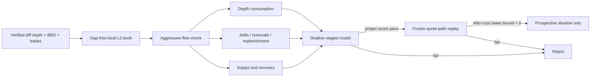

# Round 73: Impact absorption and liquidity recovery

**Status:** capture contract v8 passed its 30-second telemetry diagnostic,
180-second capture gate, one-hour qualification, fresh-process audits, and
independent exact-wire feature replay. Bounded segmented-corpus implementation
and feature construction are authorized. An unbounded capture and every model,
profitability, AI, leverage, paper, testnet, or live claim remain closed.

## Why this is different

Round 36 found repeatable five-second directional information in static L1
imbalance, but its best gross move was only `0.4584 bps` and its best delayed
after-cost mean was `-11.5790 bps`. Round 58 rejected value-blind symmetric
touch making. Round 72 rejected all nine BTC/ETH/SOL spot-flow components.

Round 73 therefore does not add another threshold or larger network to those
inputs. It asks a different, event-conditioned question: after an aggressive
flow shock, does the **way the multi-level book is consumed and replenished**
distinguish absorption/reversion from toxic continuation after realistic delay
and costs?

## Data truth

- BTCUSDT, ETHUSDT, and SOLUSDT USD-M perpetuals only.
- Official Binance `depth@100ms`, `bookTicker`, `aggTrade`, `markPrice@1s`,
  `forceOrder`, depth snapshot, exchange metadata, clock, and open interest.
- Every sequence gap, queue overflow, crossed book, product mismatch, or stale
  state invalidates the affected segment. Reconnect means resnapshot and cool
  down; missing events are never filled in.
- The liquidation feed is a throttled snapshot. No message means "not observed",
  not zero liquidations. Public L2 also omits hidden/RPI liquidity and cannot
  identify market makers, whales, spoofing, or manipulation.
- Diff-depth quantity decreases are displayed removals, not observed
  cancellations. Aggregate trades and removals remain separate when their
  attribution is ambiguous; the software never invents an order-lifecycle fact.
- The single evidence store is `data/microstructure.duckdb`. Contract-v2 run
  `5d89804a8f404d9b80b3a3ce2d796561` passed one uninterrupted hour with
  3,988,592 exact-wire messages and an independent full replay audit. It
  authorizes feature-pipeline diagnostics only; the one-hour corpus is far
  below the seven-day viability and thirty-day promotion gates. See
  `round-073-capture-qualification-2026-07-22.json`.
- The v2 indexed row layout was measured before any long capture. Contract v3
  removed redundant per-message strings and primary-key indexes without
  weakening exact-wire replay, but probe `feb1289d71884a23818be1b7f1de3b3e`
  exposed a terminal latency-query defect and is permanently development-only.
  Contract v4 restores provider event time to the compact link and adds an
  absolute DuckDB-plus-WAL cap. Live probes `7ffd4edbd2654b5997704c988802580d`
  and `ec114dd2c28d4641b0158f4bd0b32c72` passed fresh-process replay. They
  authorized one v4 one-hour qualification attempt. Run
  `ec6d54470ef04b0baddc73fd0e27fd5b` then captured 3,181,236 messages and
  passed both in-process and fresh-process replay with zero audit errors. Its
  measured process write transfer was about 56,293.5 MiB for 629.5 MiB of
  physical database growth. That metric is not an SSD-wear measurement, but it
  rejects the observed checkpoint policy for multi-day use. Feature-pipeline
  diagnostics are authorized; long capture and model evaluation remain closed.
  See `round-073-v4-capture-qualification-2026-07-22.json`.
- Exact-wire feature-source replay then reconstructed 104,570 depth updates,
  104,484 synchronized top-20 states, and 7,432,729 individual price-level
  changes. Every event-level quote-flow sum and every stored top-20 state
  reconciled with zero mismatches or nonfinite values. Level bands use the
  synchronized pre-event book, so future state cannot change a feature's band.
  The reported additions and removals are gross displayed-book churn, not
  executions, accessible fill capacity, or performance. Grid features, shocks,
  targets, and models remain unconstructed. See
  `round-073-v4-feature-source-diagnostic-2026-07-22.json`.
- Contracts v5-v7 isolated terminal I/O telemetry and rejected a larger
  checkpoint threshold after live probes still exceeded the frozen process-I/O
  limit. Contract v8 instead routes new frames and typed streams to fresh
  versioned tables inside the same database while preserving v1-v7 audit
  support. One-hour run `f3e92ba29e1e4d3188c3f309f5c160a2` captured
  1,294,128 real messages in 847 frames with zero reconnects, zero physical
  database growth, 21.68% peak queue use, and 3,514.6 process-I/O bytes per
  message against the frozen 4,096 limit. Its fresh-process audit passed every
  frame. Independent replay reconciled all 104,305 depth-band rows and
  reconstructed 4,459,493 level changes without future data. Storage headroom
  is only 14.2%, so the evidence authorizes a bounded rotating corpus pipeline
  and feature construction, not an unbounded seven-day run or model evaluation.
  See `round-073-v8-capture-qualification-2026-07-22.json`.
- The first immutable corpus manifest catalogs that same qualified run after a
  second exact-wire replay and a post-write frame-chain audit. It contributes
  3,608.934 seconds to the 2026-07-22 UTC statistical partition. No complete
  day exists, so target construction and model evaluation remain closed. See
  `round-073-first-corpus-manifest-2026-07-22.json`.
- `round-073-rotation-runner-contract-v1.json` freezes a bounded collector
  before its first run. It admits at most 168 one-hour segments per invocation,
  uses one DuckDB writer lease, journals each terminal supervisor result,
  recovers qualified unindexed v8 runs before capture, and defers exact replay
  until capture stops. Unit and parity tests pass; live runner validation is
  still pending, so multi-segment collection is not yet authorized.

Native crypto spot and perpetual instruments trade continuously and have no
formal daily close. UTC days are statistical blocks only. Bitcoin, ether, or
other exchange-traded products are separate listed instruments: any later ETF
context must use that product's actual venue calendar, including holidays,
early closes, halts, auctions, and verified extended-hours sessions. An ETF
close must never be imputed as a Binance close.

## Gates

The staged comparison is prevalence/zero payoff, linear L1+tape, shallow L1+tape,
L2 state, then L2 impact absorption. Model capacity and rows stay identical.
Impact absorption must beat both L2 state and the frozen L1+tape control on held
out log loss, Brier score, MSE, calibration, dependence-aware uncertainty, and a
one-second stress-delay check.

The first seven complete days are only a bounded viability screen. Promotion
requires at least 30 complete prospective days with the final seven sealed.
Each symbol passes or fails independently; unsupported symbols are disabled.
Portfolio research requires at least two independent symbol passes.

Only the same frozen predictions may enter an unlevered quote-path replay. Entry
and exit walk the synchronized visible book for `$100`, `$1,000`, and `$5,000`
notionals and apply at least `12 bps` of round-trip fees and adverse charge. A
positive point estimate is insufficient: the blocked lower confidence bound of
net expectancy and profit factor must clear zero and one, with at least 100 test
trades and bounded tail risk. The result is still not a fill claim.

## Model and AI boundary

A fixed shallow LightGBM is the primary challenger. A TCN/TLOB-style temporal
model can be separately preregistered only after the shallow feature layer passes
on 30 days for at least two symbols. Reinforcement learning, language-model
forecasting, AI vetoes, and leverage are closed in this round. This prevents
capacity from hiding a failed financial mechanism.

## Primary sources

- [Binance USD-M Futures API](https://developers.binance.com/en/docs/products/derivatives-trading-usds-futures/Introduction)
- [The Price Impact of Order Book Events](https://arxiv.org/abs/1011.6402)
- [Multi-Level Order-Flow Imbalance](https://arxiv.org/abs/1907.06230)
- [Order Flows and LOB Resiliency](https://arxiv.org/abs/1708.02715)
- [Deep Limit Order Book Forecasting / LOBFrame](https://arxiv.org/abs/2403.09267)
- [TLOB](https://arxiv.org/abs/2502.15757)
- [State-dependent L2 liquidity transitions](https://arxiv.org/abs/2607.09230)
- [CFTC disruptive-practices guidance](https://www.cftc.gov/LawRegulation/FederalRegister/FinalRules/2013-12365.html)

These sources motivate the experiment. None establishes an edge for this
repository.
