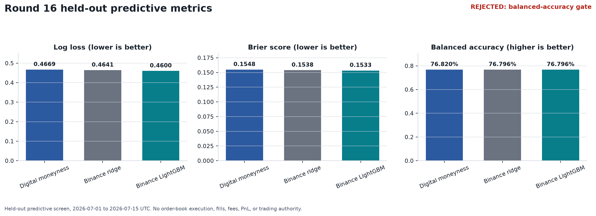
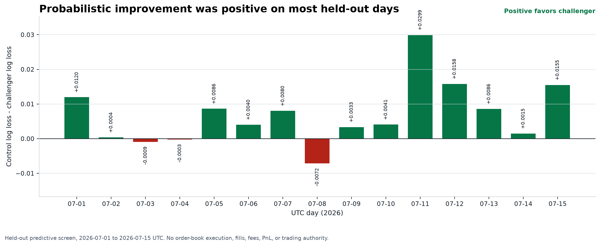
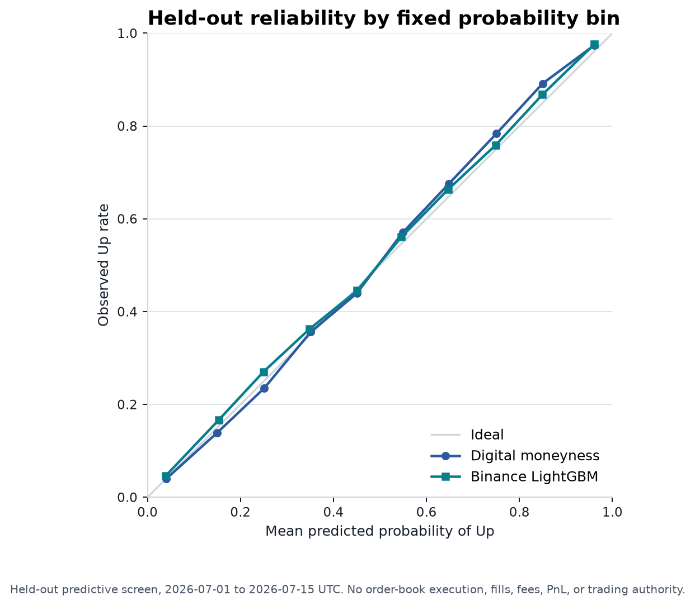

# Round 16 held-out evaluation

**Status: rejected.** The preregistered challenger improved held-out log loss
and Brier score, but failed the requirement that balanced accuracy must not be
lower than the control. It is not authorized for prospective, paper, or live
trading.

This was a predictive screen of 1,440 complete BTC 15-minute Polymarket
conditions and 20,160 decision rows from 2026-07-01 through 2026-07-15 UTC.
It did not simulate order-book execution, fills, fees, PnL, or profitability.

| Held-out metric | Digital-moneyness control | Binance-feature challenger |
| --- | ---: | ---: |
| Log loss | 0.466911 | **0.460026** |
| Brier score | 0.154822 | **0.153326** |
| Balanced accuracy | **0.768204** | 0.767956 |
| Calibration slope | 1.097884 | **1.022191** |
| Expected calibration error | 0.016646 | **0.013198** |

The challenger missed the balanced-accuracy gate by 0.000248. Its relative
log-loss improvement was 1.475%, with a preregistered 10,000-repetition
whole-UTC-day paired bootstrap interval of 0.002676 to 0.011542 in absolute
log loss. Passing those probabilistic checks does not override the failed
gate.

## Reproducible evidence

Regenerate the tables, audits, and charts from the frozen local database with
`uv run --extra reporting python tools/render_round16_evaluation.py`.

- [Evaluation result](round16-evaluation.json)
- [Frozen pretest](round16-pretest.json)
- [Shadow pins](round16-shadow-pins.json)
- [Candidate metrics](round16-candidate-metrics.csv)
- [Daily log loss](round16-daily-logloss.csv)
- [Calibration bins](round16-calibration-bins.csv)
- [Terminal-resolution audit](round16-resolution-audit.json)
- [Hash manifest](round16-report-manifest.json)

The Polymarket mechanism is independent. Public Binance BTC spot and perpetual
market data are used only as an optional exogenous predictor in this candidate.
The subsystem does not use Binance credentials, balances, positions, order
authority, or execution.
