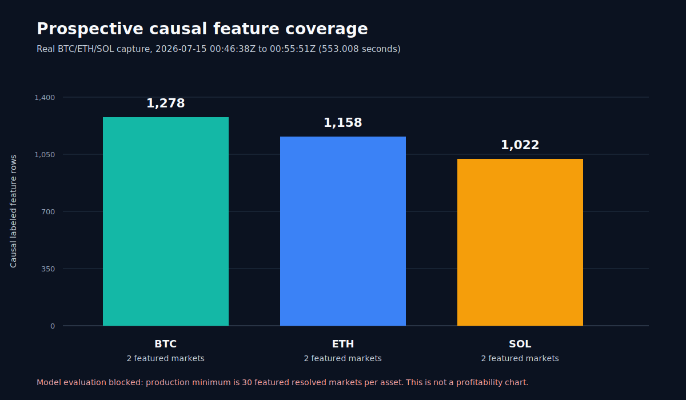

# Polymarket research round 3

One real 553.008-second BTC/ETH/SOL capture now passes immutable recording,
strict level-2 replay, dual-source official resolution, causal feature
materialization, and deterministic rebuild. It produced 3,458 labeled rows from
two in-window resolved markets per asset.

Round 3 adds the implemented market-anchored probability model, purged
BTC/ETH/SOL time-group split, exact fee/depth/latency execution diagnostic, and
label-free multibillion-parameter AI veto ablation. The long prospective run is
still collecting the required 30+ markets per asset, so there is no model or
profitability result yet.

The current 11-case AMD-host risk benchmark selected `qwen3:8b` (`0.983`, 11/11,
2.91 s mean). `qwen3.5:9b` and `fin-r1:8b` remain rejected challengers. This is
risk-review evidence only, not market-edge evidence.

Source data: [round report](../round-002-prospective-pipeline-evidence.json) and
[market rows](../round-002-market-rows.csv). Model contract:
[round 3](../round-003-market-anchored-model-contract.md). AI evidence:
[selected](ai-risk-selected.json) and
[rejected challengers](ai-risk-challengers-rejected.json).
