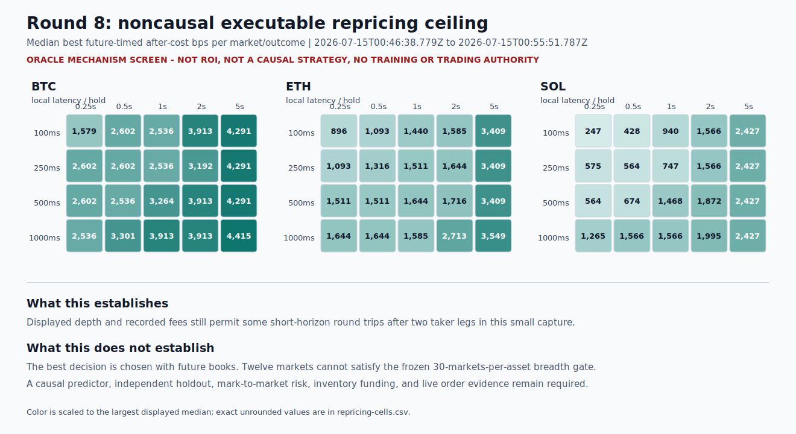

# Polymarket research status

Round 8 remains the latest completed numeric evidence. Its gap-free
`2026-07-15T00:46:38.779Z` to `2026-07-15T00:55:51.787Z` capture covers 12
BTC/ETH/SOL five-minute markets and 612,522 reconstructed books. It found
171,400 complete two-taker oracle paths; 360 of 480 market/outcome/grid rows had
a positive best future-timed path after displayed depth and both fee legs.

This is a **noncausal mechanism ceiling**, not ROI or a trading strategy. The
primary gate has only three complete markets per asset versus 30 required.

Round 9 is implemented but unfitted. Its frozen
[action](../round-009-causal-action-value-contract.json),
[ridge](../round-009-ridge-implementation-contract.json), and
[MLP](../round-009-causal-mlp-challenger-contract.json) hashes are
`c8988fd548cff295800b977d6e6c92c39e9f2867b6c6e4b5f7e3d0b2b96f9800`,
`4b192e7f30af3e3d6e7dfb1b2b3342518e23de6d750b6b1cfd2334d87f2f5a12`,
and `a5d87f65036e4a6c71835ce549668d81767b2ba16bd227ea2319c24b0880f7a2`.
A post-contract capture must pass integrity, continuity, BTC/ETH/SOL
synchronized-group breadth, and immutable official-resolution checks before
the ridge may be fitted once. The MLP may run only if the ridge passes its
preregistered development gate. Its report-v2 implementation also requires
strictly positive validation stress-utility uplift over ridge and keeps the
untouched neural test closed unless it contains at least 30 synchronized time
groups. No Round 9 model score, AI edge, profitability, drawdown claim, paper
authority, or trading authority exists.

The former v6 local-AI selection is revoked because its prompt leaked expected
actions through case IDs. Label-free v7 inference rejected all four priority
8B/9B models, and v7 itself is historical-only because its response parser was
too permissive. V8 requires exact typed JSON and is frozen before the one-shot
Qwen3 14B candidate. No AI model is selected; `ai-risk-models-rejected.json`
is negative governance evidence only and grants no AI or trading authority.

Capture attempts `eae374e2662c440fb93970d5710937b1`,
`3a67757c7f174df4b62f2722ea9211cb`, and
`b8a270da20fe4116a01a4626607e42da` are permanently development-only and cannot
confirm a model. Storage v3 preserves 1,024-message integrity chunks and
8,192-message atomic commits while removing incremental hot-table indexes.
Terminal reads now stream one relational query, and clean audited v3 source
feeds can replay directly from hash-verified raw chunks. The hash-bound
[writer](../storage-v3-long-tail-benchmark-2026-07-16.json) and
[reader](../storage-v3-reader-benchmark-2026-07-16.json) benchmarks state their
real-payload scope and limitations. Bounded action batches now reconstruct one
full-resolution CLOB replay and derive the exact 250 ms feature view from it,
removing the second condition scan without changing feature or action identity.
Capture
`79ac19539d384352b865c21cb0c43627` is still running; it grants no Round 9 model
or AI evidence until terminal integrity, continuity, and resolution gates pass.

The host [DirectML preflight](../round-009-directml-preflight.json) completed a
real MLP forward/backward parameter update on `privateuseone:0` with no CPU
fallback. The complete ensemble fit now also rejects explicit accelerator
requests that resolve to CPU, captures fallback warnings for every epoch, and
requires Torch checkpoint probabilities to replay through the persisted
canonical model within the frozen numerical tolerance. These are implementation
controls, not model-quality, market-speed, or profitability evidence.

The `polymarket-ridge` command claims its pipeline in DuckDB before test
evaluation. A completed claim reloads the signed report without refitting; an
interrupted or failed claim remains fail-closed so a retry cannot silently
reopen the untouched test. `polymarket-mlp` uses the same database-backed claim
before any nonlinear test access.

Inspect the [full signed report](../round-008-executable-repricing-ceiling-report.json),
[exact chart data](tables/repricing-cells.csv),
[primary market rows](tables/repricing-primary-markets.csv), and
[integrity manifest](publication-integrity.json).
