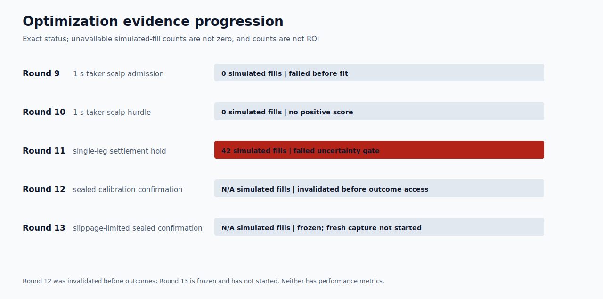

# Polymarket model status

## Current boundary

Round 13 failed before outcome access. Its one-use BTC/ETH/SOL five-minute
capture stopped at `1921.322` seconds
of the required `86400` seconds,
with `1281245` persisted source
messages and `4` stream gaps. It never
reached the frozen evaluation boundary, so every return, drawdown, fill, and
model-comparison field is unavailable, not zero.

Round 12 is not performance evidence. Its recorder captured
`142494` messages, but the evaluator
and publication chain had not been preregistered. It was invalidated before
outcome access; every return, drawdown, and fill field is therefore unavailable,
not zero.

Round 11 remains the latest scored result. Its simulated after-cost utility was
`+22.44105` quote on 42 development conditions, but
maximum drawdown was
`12.36399` and the 95% moving-block-bootstrap lower mean-group
utility was `-1.38152`. It failed uncertainty
and raw-market-prior gates. No profitability, ROI, acceptable-drawdown, paper,
AI-uplift, or trading claim exists.

## Evidence

- [Round 13 frozen contract](../round-013-sealed-confirmation-contract.json)
- [Round 13 invalidation](../round-013-invalidated-capture-evidence.json)
- [Round 12 invalidation](../round-012-invalidated-capture-evidence.json)
- [Round 11 contract](../round-011-single-leg-directional-value-contract.json)
- [Round 11 report](../round-011-single-leg-directional-value-report.json)
- [Round 11 model artifact](../round-011-single-leg-directional-value-artifact.json)
- [Optimization data](tables/optimization-progress.csv)
- [Publication integrity](publication-integrity.json)

Regenerate these exact tables, charts, and hashes with
`python tools/publish_polymarket_round11.py`. Round 13 cannot acquire paper or
live authority. Any successor requires a new prospective contract and untouched
capture, followed by separate proof of authenticated order lifecycle, balance
ownership, settlement delay, and redemption overhead.
