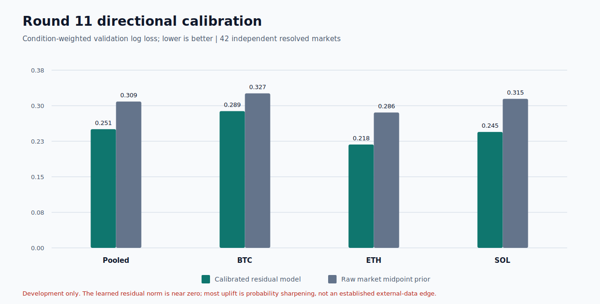
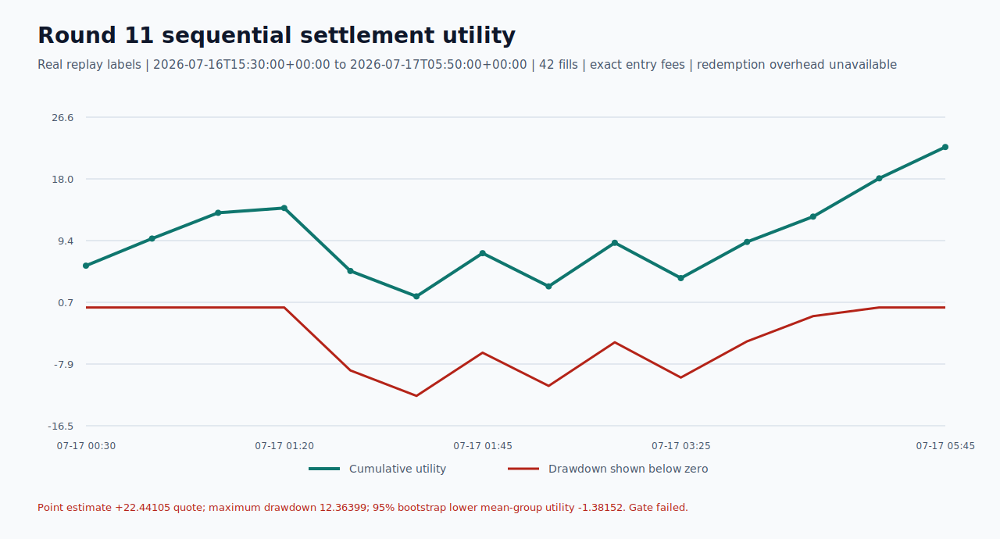
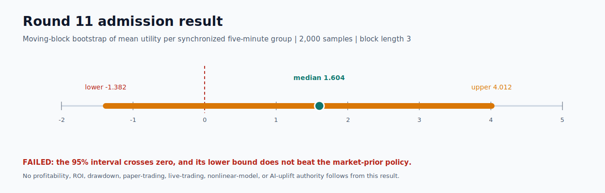

# Polymarket model status








## Latest result

Round 11 tested a fundamentally different action: one minimum-size FOK buy,
held to official resolution. It used the real Round 9 BTC/ETH/SOL capture,
exact replayed entry costs and fees, chronological groups, and one total unit of
training weight per resolved market.

The best development candidate filled all 42 validation markets, won 32, and
returned `+22.44105` quote before redemption overhead. Maximum drawdown was
`12.36399`. The 95% moving-block-bootstrap interval for mean utility per
synchronized market group was `[-1.38152, 4.01152]`, so the lower bound was not
positive and did not beat the market-prior policy. **Round 11 failed.** It does
not establish profitability, ROI, acceptable drawdown, paper authority, or
trading authority.

The probability model improved validation log loss from `0.30933` to `0.25090`,
but the fitted external-feature residual had an L2 norm of only `0.00117`.
Nearly all uplift came from sharpening Polymarket's own midpoint probability;
an independent CEX/flow edge has not been established. A nonlinear model or
LLM would be unjustified on only 96 independent training markets and was not
run.

Round 10 is also complete and rejected. Its one-second taker entry/taker exit
mechanism had no positive after-cost transparent score, so it selected zero
actions. Round 9 remains the immutable pre-fit unknown-state failure.

## Exact evidence

- [Round 11 contract](../round-011-single-leg-directional-value-contract.json)
- [Round 11 report](../round-011-single-leg-directional-value-report.json)
- [Round 11 model artifact](../round-011-single-leg-directional-value-artifact.json)
- [Round 10 report](../round-010-development-hurdle-report.json)
- [Publication integrity](publication-integrity.json)
- [Direction metrics](tables/round11-direction-validation.csv)
- [All policy candidates](tables/round11-policy-candidates.csv)
- [Selected condition path](tables/round11-selected-conditions.csv)
- [Equity and drawdown](tables/round11-equity.csv)
- [Execution heads](tables/round11-execution-validation.csv)
- [Optimization progression](tables/optimization-progress.csv)

Regenerate the latest tables and SVGs with:

```powershell
.\.venv311\Scripts\python.exe tools\publish_polymarket_round11.py
```

The publisher verifies all canonical contract, report, and artifact hashes and
reconstructs total utility and drawdown from condition-level rows. Graphs are
generated only from the committed CSV/JSON evidence.

## Next boundary

The next round must freeze a calibration-only control, broader conservative
probability thresholds, correlated group exposure limits, and uncertainty-aware
abstention before reading fresh outcomes. It needs materially more independent
five-minute markets. Public replay may test predictive and displayed-book
economics, but bot-owned inventory authority additionally requires the
authenticated user channel, exact `CONFIRMED` lifecycle, balance
reconciliation, and measured redemption overhead.

Current primary sources:

- <https://docs.polymarket.com/market-data/websocket/user-channel>
- <https://docs.polymarket.com/trading/fees>
- <https://docs.polymarket.com/v2-migration>
- <https://arxiv.org/abs/2606.31675>
- <https://arxiv.org/abs/2606.16852>
- <https://arxiv.org/abs/2605.00864>
