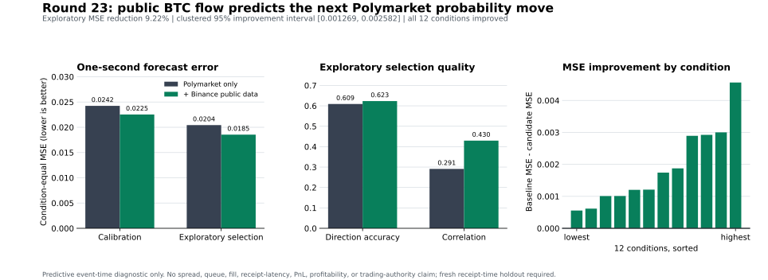
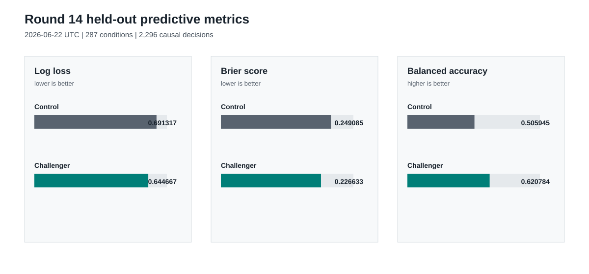
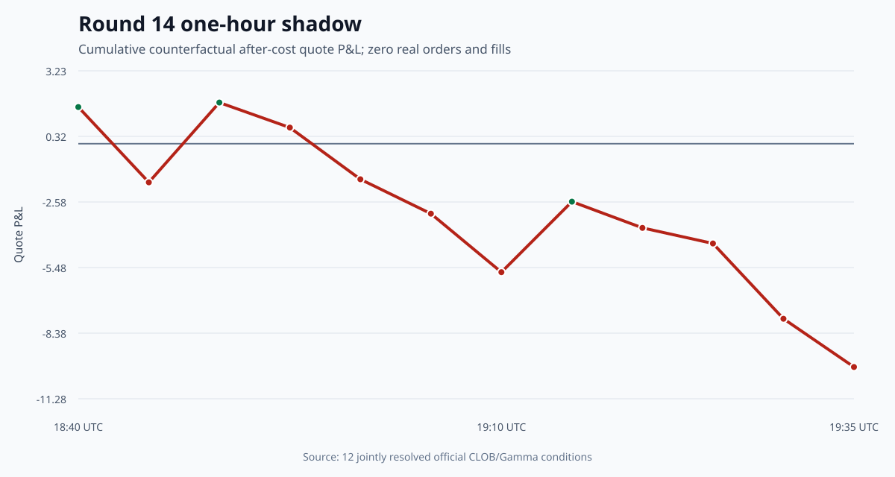

# Polymarket model status

> **Beta research software. No paper or live trading authority exists.**

On 2026-08-10, a credential-free production read probe validated CLOB protocol
V2, two exact BTC five-minute markets using the required Chainlink 30-second
TWAP source, matching Gamma/CLOB identities and fees, and all four token books.
The [machine-readable probe](public-clob-live-probe-2026-08-10.json) submitted
no order, accessed no wallet, and proves neither predictive edge,
profitability, nor live readiness.

Round 23 is the last evaluated mechanism. Public BTCUSDT spot and USD-M trades
reduced condition-equal one-second MSE by `9.22%` on an exploratory 12-condition
selection block (`0.018542` versus `0.020426`). That block was already consumed
and used archive event times rather than measured client receipt times, so the
[result](../round-023-lead-lag-results-v1.json) is neither an economic edge nor
a promotion result.

Round 20 failed after Polymarket changed the BTC five-minute resolution source
from the legacy Chainlink point stream to the `btc-5m-twap-30` contract. Its
failed source lineage is closed and will not be pooled into a successor.

Round 25 v1 was retired before its first eligible receipt. Its generic
Chainlink point-price RTDS wire did not match the current market's exact
`crypto_prices_twap_thirty` direct-feed contract, so its capture,
materializer, terminal design, and Round 24 pairing are inadmissible for the
current source regime.

Round 25 v2 is the source-correct successor. Before its 2026-08-11 00:00 UTC
start, a credential-free live qualification observed two exact E18 BTC/USD
30-second TWAP updates and two consecutive protocol-v2 Gamma/CLOB markets. The
clean source commit is `0e2f5c043ed0a0309d0e420b90b667565841d019`; the capture
design, campaign plan, and wire qualification hashes are bound in the
[TWAP-native model design](../round-025-twap-native-model-design-v1.json).
No v2 campaign database, target, model, AI comparison, economic result, or
profitability result existed when that target-blind design was frozen.

The v2 feature engine consumes only exact E18 TWAP observations received by the
decision time. It rejects missing exact openings, stale or future data, stream
gaps, conflicting duplicate timestamps, and broken 30-second grids. It exposes
path and transport features but no structural probability. Comparing exact
event-boundary TWAP values is only a frozen settlement hypothesis until it is
matched against official resolutions; nearest-tick, Binance, and independently
reconstructed TWAP substitutions are prohibited. No v2 terminal materializer
or model is claimed complete before that verification and the prospective
corpus gates pass.

The frozen predictive ledger combines 37 TWAP features with 111 causal CLOB
features at the same 250 ms decision receipt. Its six finite families are the
market-prior control, phase-isotonic control, regularized logistic residual,
two shallow LightGBM residuals, and a compact causal multitask TCN residual.
Development uses only the v2 plan's chronological train, calibration, and
selection intervals with one condition purged on each side of each boundary
and minimum condition counts of `2000/400/400`. Sixteen target-blind,
phase-balanced endpoints give every condition total weight one. Labels may
come only from official Polymarket winning-token evidence after terminal source
semantics are verified.

The [control-fit contract](../round-025-control-fit-contract-v1.json) freezes
quarter-phase weighted isotonic calibration and the bounded L2-logistic
residual before capture starts. The control fitter is implemented but no
control model has been fitted: every public fit path rejects fewer than
`2000/400` train/calibration conditions, and no prediction grants trading
authority.

The [LightGBM fit contract](../round-025-lightgbm-fit-contract-v1.json) fixes
both shallow tree candidates, condition-bounded leaves, calibration-only early
stopping, capability-tested CPU/OpenCL/CUDA resolution, serialized-model
identity, and the same bounded prior-residual output. The LightGBM operator is
implemented but no Round 25 tree has been fitted.

The [sequence contract](../round-025-sequence-materialization-contract-v1.json)
uses 64 condition-local 250 ms rows, resets after gaps, zero-pads with a valid
history mask, and excludes unavailable +1s/+5s auxiliary targets from loss.
Its sequence materializer is implemented but no sequence corpus has been
materialized.

The [TCN fit contract](../round-025-tcn-fit-contract-v1.json) freezes a compact
14,371-parameter causal residual network, exact three-seed ensemble, bounded
16-condition batches, calibration-only early stopping, and minimum `2000/400`
train/calibration conditions. The lazy fitter, artifact verifier, and reusable
target-free inference runtime are implemented. A bounded
[AMD DirectML host probe](../round-025-tcn-directml-host-probe-2026-08-10.json)
completed one real forward/backward update and byte-identical state reload on
an RX 9070 XT. That is runtime mechanics evidence only: no seed model or
ensemble has been fitted, and no predictive, economic, profitability, AI, or
trading claim follows.

The [predictive evaluation contract](../round-025-predictive-evaluation-contract-v1.json)
freezes the 10 paired challenger/score hypotheses, one-hour circular condition
blocks, 10,000 shared bootstrap paths, and studentized Romano-Wolf stepdown.
The evaluator is implemented behind a durable one-use boundary: all six model
outputs must be frozen in a target-free panel before selection targets can be
opened, access is restart-recoverable, and repeated access or event-chain
tampering fails closed. ECE, balanced accuracy, and ROC AUC are descriptive;
only simultaneous log-loss and Brier improvement can nominate a candidate.
No real prediction panel, target access, evaluation, or nomination exists.

The v2 plan has no test role. The
[candidate amendment](../round-025-twap-native-candidate-selection-amendment-v2.json)
therefore requires a separate prospective campaign after model selection.
Qwen3.5-9B and Fin-R1-8B failed the frozen 10-second per-entry runtime boundary
and cannot re-enter it. The current [AI risk contract](../round-025-ai-risk-advisory-contract-v6.json)
limits exact-digest Qwen3 4B to one of seven entry-only risk ceilings; trusted
code derives veto, size, cooldown, and audit semantics. AI cannot create or
enlarge a trade, change side, override deterministic safety, or affect exits.

A bounded [AMD host probe](../round-025-ai-risk-advisory-host-probe-v7-2026-08-10.json)
returned a valid constrained action in `1.8152` seconds with the exact model
fully resident on the RX 9070 XT and unloaded it afterward. The probe used one
target-free numerical fixture, no market outcome, no credential, and no order.
It proves runtime mechanics only, not useful judgment. The final target-free
[reachable safety battery](../round-025-ai-risk-scenario-host-probe-v3-2026-08-10.json)
retained 11 valid responses but its reporter incorrectly marked every check
false after expecting the obsolete 10-row ledger. A frozen
[no-inference correction](../round-025-ai-risk-scenario-host-probe-v3-correction-2026-08-10.json)
verified every original packet, advisory, telemetry hash, and unload state.
Benign and most isolated soft hazards returned `allow`; elevated portfolio risk
and the combined soft crisis returned `veto`. Maximum latency was `2.0685`
seconds. This is constrained safety-behavior evidence only, not economic value.

Fin-R1 8B was also evaluated once as a slower 60-second regime supervisor. A
pre-inference [inventory/reporting failure](../round-025-fin-r1-regime-supervisor-infrastructure-failure-v1-2026-08-10.json)
was corrected without changing the prompt, scenarios, model, or digest. The
superseding [seven-case host probe](../round-025-fin-r1-regime-supervisor-host-probe-v2-2026-08-10.json)
then produced seven valid, fully GPU-resident responses in `2.6296` seconds on
average, but returned `normal` for every case, including the combined crisis.
The [rejection](../round-025-fin-r1-regime-supervisor-rejection-v1-2026-08-10.json)
bars prompt tuning, economic evaluation, and execution integration for this
exact role. Finance QA benchmarks did not translate into useful regime-risk
discrimination.

The strongest installed prior general-risk candidate, Qwen3 8B, then ran the
same packet ledger, prompt, protocol, and gates. Its
[host probe](../round-025-qwen3-8b-regime-supervisor-host-probe-v1-2026-08-10.json)
also returned seven valid `normal` actions, including the crisis packet, at
`2.6730` seconds average latency. The resulting
[mechanism rejection](../round-025-qwen3-8b-regime-supervisor-rejection-v1-2026-08-10.json)
closes further model cycling on this slow regime-supervisor design. The fast
Qwen3 4B entry reviewer is unchanged; its economic value still requires the
prospective matched uplift experiment.

The [AI uplift contract](../round-025-ai-uplift-evaluation-contract-v2.json)
and evaluator require a new chronological population after selection with at
least 500 conditions and 50 actual interventions. The control and AI paths must
share the selected prediction, pre-AI decision, and execution/cost/latency
scenario. Ten thousand paired circular block resamples must show positive
after-cost return uplift without worse expected shortfall or maximum drawdown.
A pass is only a development nomination. No model training, candidate
selection, AI uplift, edge, profitability, paper authority, or live authority
exists yet.

The research-only [four-arm supervisor uplift contract](../round-025-fin-r1-regime-supervisor-uplift-contract-v1.json)
and clustered evaluator compare ML-only, fast Qwen, slow Fin-R1, and their
minimum-risk hierarchy using 10,000 bootstrap paths over supervisor windows.
They establish experiment mechanics only. Because Fin-R1 failed its frozen
behavior gate, this economic experiment is closed for that candidate.

The core capture uses no Binance input, credentials, account, wallet, model, or
execution authority. Round 21 remains a separate credential-free public
Binance predictor capture with no Polymarket execution or safety dependency.
Round 23 remains the latest graph and evaluated mechanism; profitability,
paper authority, and live authority are all false.

Round 14's subsequent one-hour, after-cost BTC five-minute shadow **failed**:
12 events produced `-9.87720` quote net PnL, `0.455725` profit factor, and
`11.69847` maximum drawdown. This rejects the model for paper or live
promotion. The canonical
[economic evaluation](../evidence/round-014-btc-5m-shadow-hour-evaluation-v1.json)
overrides the earlier predictive-only result below.

The plotted values are preserved in the
[exact event-outcome table](shadow/event-outcomes.csv).

Round 14 tested a frozen BTC five-minute direction model on all 287 eligible
conditions from 2026-06-22 UTC. The shallow Binance-flow LightGBM challenger
recorded log loss `0.644667` versus
`0.691317` for the best control, a
`6.75%` relative skill.
Balanced accuracy was `0.6208` and the
paired 95% block-bootstrap improvement interval was
`[0.03544,
0.05865]`.

This is **predictive evidence only**. Polymarket spread, queue position, fills,
latency, fees, settlement, redemption, inventory risk, and PnL were not tested,
so it is not a profitability or execution claim.

Round 25 v2 independently captures the current Polymarket TWAP-source regime.
Round 21 captures only optional public Binance predictor receipts in another
worktree and database. Neither capture is model-eligible before its current
source contract and terminal audit pass. A predictor outage can only block
signal-dependent new entries; Polymarket recovery, reconciliation, risk
reduction, Stop, and exits remain independent.

The finite development ledger contains three regularized logistic
residuals, two shallow LightGBM residuals, and one compact causal TCN residual.
Model design v6 adds one target-free basis feature:
`logit(Polymarket market prior) - logit(Chainlink structural probability)`.
Because the residual models use the structural log odds as their offset, a
unit coefficient can represent the executable market prior exactly instead of
approximating that disagreement in probability space. This is a preregistered
representation change, not evidence of predictive uplift or profitability.
Before the full six-candidate fit, `polymarket-round21-ablate-basis` now runs a
bounded paired screen: three regularized logistic residuals without the basis
and the same three with it. Regularization selection uses the first half of
`tune_calibration`, Platt calibration uses the second half, and the untouched
`tune_selection` role supplies paired block-bootstrap intervals. The basis is
retained only when the lower 95% improvement bound is strictly positive for
both condition-equal log loss and Brier score; rejection is final for model
design v6. The command is available through both CLI and generated Windows
workflow contracts, but cannot run until the terminal capture and corpus exist.
No real ablation result exists yet.
Both `polymarket-round21-fit-core` and
`polymarket-round21-fit-matched` require that accepted result as an explicit
input. Validation binds its self-hash, design, publication manifest, terminal
transport, development targets, row ranges, and condition counts before any
full fit; the core fit additionally requires exact dataset hashes. A rejected,
malformed, mismatched, or missing result blocks fitting.
The TCN consumes 16 causal 250 ms rows, resets at every condition or cadence
gap, uses equal condition weight, and is capped at `12 * feature_width + 649`
parameters. It is a bounded challenger, not an edge claim; adding larger
sequence or foundation models is prohibited in this round. TCN training
assigns every condition exactly `1/16` total weight in its shuffled batch.
The final partial batch therefore has proportionally lower total weight instead
of over-weighting its fewer conditions. Causal history boundaries are computed
once and reused across all mini-batches. A bit-identical one-million-row host
benchmark reduced that boundary pass from 0.185285 seconds to 0.007757 seconds
(`23.89x`); this is implementation-throughput evidence, not model performance.

The terminal program
evaluates one development-selected candidate against five probability controls
and all 81 after-cost profile/scenario ledgers. The local
candidate selector compares each candidate's ordered, condition-equal log loss
directly with the best candidate. It uses a Bartlett Newey-West standard error
and circular block-bootstrap intervals with the target-blind block rule
`min(n, max(2, ceil(sqrt(n))))`; consecutive five-minute conditions are not
treated as independent. This reduces false-promotion risk but is not a
performance improvement or edge result. The local
AI comparison is finite: exactly `qwen3.5:9b`, `fin-r1:8b`, and `fino1:8b` use the
same matched development population and deterministic baseline. The pretest
manifest binds the repository, selected layer, terminal captures, model,
economic matrix, test population, and any nominated AI identity. Test access is
then consumed once in a synchronous SQLite state machine; completion, failure,
or interruption cannot reopen it. The shared CLI/Windows
`polymarket-round21-ai-development` workflow implements this terminal path only
when the operator supplies `--acknowledge-one-use-test-access` together with new
store, pretest, claim, and sealed-result paths. The test dataset and target
hashes bind the consumed claim, access, and frozen population. Any nominated AI
is rerun on those exact sealed cases, and its delayed permissions are rewalked
through the same receipt population before comparison with the deterministic
baseline. Its report is canonically rehashed and its exact local model digest
is verified before holdout access, then checked again before inference. No
claim has been opened and no test data has been scored. The unpublished v4
sealed bundle also requires the economic matrix and predictive verdict to bind
the same access-derived dataset and target-manifest hashes; a valid matrix from
another population cannot be substituted. All 81 ledgers must also carry the
same ordered condition/outcome cohort, and its condition/event hash must equal
the predictive population. Completion stores the full validated bundle in the
durable v2 one-use ledger. The shared CLI/Windows
`polymarket-round21-recover-sealed` command can export it after an output-device
failure without reopening test access or rerunning inference.

Historical AI timing is not presented as a measured past host receipt. Every
historical case embeds a canonical virtual event-time schedule, exact causal
market-evidence hash, and explicit false flags for observed historical dispatch
and provider load. Current local queue and inference latency is measured and
shifted onto that schedule before the 81 economic scenarios are evaluated.
Prospective cases remain a distinct schema requiring exact host receipt times.
Case preparation indexes selected probability rows once rather than scanning
the full panel once per condition. The v4 timing contract is explicitly bound
to the current AI-veto design and is included in the one-use repository seal.

A bounded [AMD DirectML training probe](../round-021-directml-training-host-probe-2026-08-03.json)
fit all six `core` candidates in memory. LightGBM resolved to the RX 9070 XT
through OpenCL and the TCN resolved to the same GPU through DirectML, with no
fallback. The fixture was synthetic and the worktree was dirty, so this is only
host integration evidence, not predictive, economic, or reproducibility proof.

A second bounded [TCN v5 DirectML probe](../round-021-directml-tcn-v5-host-probe-2026-08-03.json)
verified the target-blind epoch-rotating endpoint schedule, training-seed
provenance, serialization, and payload validation on the same AMD GPU. It used
32 synthetic conditions and two epochs, wrote no market dataset, and grants no
predictive, profitability, paper, or live authority. The schedule exposes more
within-contract states across epochs without increasing the eight
condition-equal training endpoints per condition per epoch; early stopping
retains a fixed midpoint-stratified panel.

A fresh [probability-basis v6 DirectML probe](../round-021-directml-probability-basis-v6-host-probe-2026-08-03.json)
constructed the new four-column core matrix, verified the exact log-odds
disagreement column, and trained and validated the TCN on the RX 9070 XT through
DirectML with no fallback. It used 32 synthetic conditions, 64 rows per
condition, and two epochs. It used no financial data and supplies no predictive,
economic, profitability, paper, or live-trading evidence.

Matched v2 target-free host probes exercised
[Qwen3.5 9B](../round-021-qwen3.5-9b-target-free-candidate-host-probe-2026-08-03.json),
[Fin-R1 8B](../round-021-fin-r1-8b-target-free-host-probe-2026-08-03.json), and
[Fino1 8B](../round-021-fino1-8b-target-free-host-probe-2026-08-03.json) on the
same frozen numeric packet. Qwen and Fin-R1 produced valid vetoes in 8.322 and
7.940 seconds with zero provider failures and full AMD-GPU residency. Fino1
repeated a schema-valid approval despite `0.005` after-fee edge being below the
hard `0.02` minimum; the shared boundary rejected it as an invalid response,
converted it to a fail-closed veto, and granted no permission. The earlier
[schema-only attempt](../round-021-fino1-8b-target-free-host-probe-attempt1-invalid-approval-2026-08-03.json)
is retained as audit evidence. These are compatibility findings, not model or
financial results. Full development must still evaluate every frozen candidate
on the same economic population, bind exact digests, and unload each model under
the [official lifecycle contract](https://docs.ollama.com/faq) before the next.

The target-free prospective path is implemented but cannot activate without an
accepted sealed result. It converts at most 16 contiguous 250 ms causal rows
into the same inference panel used offline, resets on a condition or cadence
gap, and records exact model, batch, row, latency, and abstention evidence. Its
in-memory coordinator serializes redundant Polymarket CLOB and Chainlink input;
any Polymarket source gap interlocks new entries for that market. Optional
Binance state is discarded and rewarmed independently after a disconnect. It
never opens a database and imports no wallet, order, ledger, or execution
boundary. The credential-free public session now drives two redundant CLOB
channels and one RTDS Chainlink channel. Its strict wire classifier preserves
sequence continuity across the empty opening frame and subscription-history
snapshot observed on the current RTDS service, while excluding both controls
from features. On 2026-08-02, a bounded 15-second live-host transport probe
processed 19,147 frames (19,131 CLOB, 14 live Chainlink updates, two controls)
with zero gaps and queue high-watermark two. A separate three-second probe
through the real union and feature coordinator processed 2,106 frames into 243
union events and three live Chainlink prices, with zero gaps or core
interlocks. Neither probe used credentials, an account, Binance, persistence,
model scoring, or trading authority. These are runtime observations, not
predictive, economic, paper, or live-trading evidence. No prospective
prediction or qualification result exists yet.

Repeated inference no longer reconstructs model state at every 250 ms row.
The scorer validates and compiles immutable feature transforms, LightGBM
boosters, and TCN weights once, then reuses them under a lock. A bounded CPU
fixture with 80 rows and six candidates measured 3.682 ms mean reused
prediction versus 10.355 ms for load-plus-predict, with exact prediction-hash
parity. This is runtime evidence only. The public session also rolls to each
new exact BTC five-minute condition with a fresh feed and coordinator, retries
Gamma discovery while scores remain blocked, and treats feed-processing exit
as a critical failure. A 2026-08-02 three-second live-host session probe made
three successful discoveries and processed 1,309 frames with zero gaps and a
queue high-watermark of two. It used no credentials, account, Binance,
persistence, model scoring, or authority.

The promoted Round 21 decision adapter is also implemented but cannot activate
without a separately verified live promotion. It consumes a Polymarket-only,
hash-bound portfolio rebuilt from exact parent lots and fee-verified cash-flow
evidence. At each consumed 250 ms timestamp it emits at most one initial entry,
exact-parent reduction, or complementary lock. Entries use the selected
outcome's lower probability bound. Reductions use the outcome's upper bound and
must retain positive executable after-fee edge. Locks have priority only when
the original average cost plus the fresh complementary cost leaves positive
guaranteed profit; the execution coordinator independently proves that event
maximum loss cannot rise. Realized event loss remains in the ledger after a
flat exit and cannot be reset by re-entry. Books older than 500 ms, excessive
directional depth participation, insufficient event time, weak edge, active or
unknown transitions, and evidence mismatches fail closed. The adapter owns no
wallet, order, balance, reconciliation, Stop, settlement, or Binance state;
submission remains inside the promotion-gated Polymarket coordinator.

Restart-safe composition is now implemented. The sealed evaluation is exported
as one strict nested bundle containing the predictive verdict, all 81 economic
ledgers, and the selected result. Runtime loading verifies the promotion's exact
model-file and evaluation-file SHA-256 values before reconstructing either
object, then requires the model's internal artifact identity to match the
accepted sealed result. `polymarket-live --action autonomous` selects this
Round 21 stack only for a five-minute promotion; Round 16 pins are required only
for a fifteen-minute promotion. This is wired code, not live qualification: no
accepted Round 21 result, prospective record, authenticated lifecycle
qualification, or live-authority promotion exists.

The independent live boundary now enforces a strict lifecycle-qualification
capability at the actual opening-submission call. Its canonical report must
prove an authenticated user stream, exact bot-owned order identity, and a
confirmed fill-and-parent-close path, followed by a forced reconnect
followed by authoritative reconciliation, unchanged foreign state, and a flat
final account. It binds the source commit, bot, horizon, wallet, and credential
fingerprint, stores no secret material, and grants no authority by itself. The
verifier and generated CLI/Windows controls are implemented. A valid
cancellation-only report remains diagnostic and cannot unlock opening; no real
fill-and-close report exists because this host has not submitted a Polymarket
order.

The separate no-order shadow path is now restart-auditable without weakening
that boundary. It loads exact expected model and sealed-evaluation file hashes,
starts the same rolling public session, and writes target-free scores to a
dedicated SQLite ledger. Each run pre-binds the model, sealed result, and
feature layer. Canonical prediction bytes are bounded, zlib-compressed,
byte-hashed, and SHA-256 chained under immutable update/delete triggers.
Duplicate condition/timestamp writes are idempotent only when their payload is
identical; chronology regression, divergent duplicates, post-terminal writes,
decompression bombs, and semantic tampering fail closed. Full replay audit is
post-terminal only, avoiding a long reader lock against the active 250 ms
writer. Completion, interruption, and failure remain collection states, not
model, profitability, paper, promotion, or live authority. No shadow run or
prospective prediction has been produced. The generated CLI/Windows contract
exposes only `run` and `audit` for this path as
`polymarket-round21-shadow`; it accepts no credential or promotion option.

The optional Binance predictor is a separate credential-free in-memory
sidecar. It connects only when the sealed model layer requires spot or
spot-plus-USD-M features, streams public BTCUSDT `bookTicker` and trade events,
using the [official WebSocket stream contract](https://developers.binance.com/docs/binance-spot-api-docs/web-socket-streams),
and has no Binance account or execution API. A disconnect clears and rewarms
only optional features. On 2026-08-02, a five-second live-host probe processed
50 spot and 116 USD-M records with zero gaps or reconnects and queue
high-watermark one. A preceding probe exposed the current USD-M `bookTicker`
`ps`/`st` schema extension; the strict parser was updated and regression-tested
before the successful rerun. The rolling session now retains the exact active
identity until its event boundary instead of polling Gamma every second. A
post-change five-second integrated probe made one discovery and processed 2,013
Polymarket frames plus 44 spot-sidecar records, with zero gaps and queue
high-watermarks two and one. The authenticated supervisor uses the same
event-boundary refresh rule while still synchronizing current, next, and owned
user-stream subscriptions on every decision cycle. This is transport evidence
only.

Terminal opening now starts with a separate transport manifest. It fails before
the scheduled campaign end, preserves every interrupted or failed segment and
its coverage hole, and admits only hash-valid complete/degraded runs for later
exact receipt replay. Transport coverage is not condition admission or model
eligibility; redundant-union reconstruction remains mandatory.

The target-blind core materializer now reconstructs each segment's redundant
CLOB union during that same exact receipt pass. It applies per-condition lane,
joint-gap, book, Chainlink open/close, reconnect, role, and causal-availability
gates across all 1,200 five-minute decisions. This is implemented mechanics,
not a completed corpus or model result.

Its publication sink is also implemented but has not run: one same-volume
directory rename publishes separate development and sealed-test DuckDB files,
canonical admission ledgers, and condition-sized Zstandard level-3 binary64
feature chunks bound to the terminal receipt audit. Failed audits remove the
entire staging directory. The pretest v4 seal accepts this validated publication
rather than caller-supplied digests. A sealed-test audit requires its exact claim
and access hash in the durable one-use ledger's consumed state.

The shared CLI and generated Windows workflow now expose the missing terminal
operator boundary. `polymarket-round21-terminal` refuses access before the
scheduled campaign end and atomically writes the hash-bound transport manifest;
`polymarket-round21-corpus` then performs the exact receipt audit and publication.
Neither command opens outcomes or grants trading authority.

Model fitting no longer needs a private storage shortcut: the corpus API exposes
one-pass, hash-audited snapshot readers. Development rows are readable normally;
sealed-test rows require the exact consumed one-use claim and access hash.
`polymarket-round21-fit-core` now assembles official CLOB/Gamma consensus targets
and fits only the frozen core development baseline; its hash-bound artifact records
`trained_layers=["core"]`. The independent
`polymarket-round21-sidecar-terminal` command excludes interrupted sidecar
segments and opens no payloads or outcomes. After both terminal manifests exist,
`polymarket-round21-fit-matched` performs one WAL-free exact-receipt replay,
invalidates optional state at every recorded gap, reconnect, and segment end, and
fits all three layers on the same Polymarket decisions, outcomes, and frozen
development roles. `polymarket-round21-evaluate-development` hash-checks the
result against those exact panels, reconstructs exact top-20 books during one
terminal receipt audit, and advances all 81 fee/latency/depth/adverse-tick/risk
ledgers without materializing a month of books. Optional layers use the exact
matched core population and compare already-streamed matrices, so the receipt
scan is not duplicated. This is development evidence across train and tune roles,
not the untouched seven-day test. Sealed-test access, profitability claims, and
every trading authority remain false.

The AI comparison can consume already-streamed matrices. Its convenience path
advances deterministic and delayed-veto matrices from one condition stream,
sharing only the validated causal book lookup. Cash, inventory, cooldown, risk,
permission, and execution state remain separate. Binance supplies optional
public predictor data only; no Binance account or execution path exists in the
Polymarket comparison.

An optional Binance feature layer cannot pass development because it is
independently profitable. Its selected economic matrix must pass every ledger,
and all 81 matched deltas against the Polymarket-only core must also pass. A
rehashed result that marks a rejected optional comparison as passed is invalid.

`polymarket-round21-ai-development` binds the complete finite AI experiment.
Its first exact source pass builds baseline economics and one historical case
per selected development condition. It then benchmarks the three digest-pinned
local models through a separate resumable response cache. One second source
pass advances all three 81-ledger AI matrices together and applies the frozen
candidate selector. The artifact preserves every case, response, comparison,
and rejection. By default it opens no sealed target. Only the explicit one-use
acknowledgement path may open that target; neither path grants paper or live
trading authority. The terminal path freezes the pretest before writing
development output,
consumes the sealed holdout once, reruns only the nominated AI on the exact
sealed cases, and writes a strict restart-loadable result bundle. A no-edge
verdict is a valid terminal outcome and grants no authority.

The economic engine no longer retains every 250 ms abstention object in every
ledger. It hash-binds the full decision path and retains first/last audit points
plus non-abstain transitions. A flat-inventory condition is collapsed only after
proving from the exact source-bound envelopes and books that neither outcome can
meet the raw minimum edge before costs; any possible edge runs the full stateful
simulator. On this host, the controlled 100-decision/81-ledger no-action case
improved from 9,681 to 588,099 ledger-decisions/second. Its metrics, utility, and
executed-action count match the slow materialized reference. These are software
throughput checks, not profitability results.

Economic replay validation now recomputes condition chronology, cash
continuity, gross and net P&L, daily aggregates, realized drawdown, and every
derivable metric from the retained condition evidence. Settled cash is also
carried into the next conservative equity peak, so a profitable condition
cannot make the following condition's drawdown appear artificially smaller.
The deterministic daily bootstrap is cached only by its exact Decimal series
and identity; caching changes no statistic or evidence hash.

The multi-action risk ledger now carries condition-start cash and pre-condition
drawdown through every 250 ms decision. Its event downside is current cash plus
the guaranteed paired payout, not just open-lot cost basis. This prevents a
loss-making reduction followed by a flat re-entry from resetting the event cap.
Every candidate is bounded at zero and full fill, so a paired reduction or other
transition that increases worst-case downside is rejected when it would breach
the event, daily-loss, or drawdown limit. Risk-reducing locks and reductions
remain available during a gate.

The live ownership ledger now applies the same core invariant at execution:
event downside is reconstructed after restart from exact confirmed BUY cost,
SELL proceeds, redemption payout, remaining parent cost basis, and paired
payout. Targeted reductions can consume only one confirmed unreserved parent.
Complement locks use only unpaired bot inventory and must remain both
guaranteed-profitable after fees and non-increasing in maximum event loss.
Live entry also requires an explicit dedicated-wallet capital basis. A
restart-derived, hash-bound snapshot uses exact parent cost basis, fee-inclusive
SELL proceeds, and verified redemption payout to rebuild daily realized P&L,
settled drawdown, consecutive losing conditions, cooldown, and remaining risk
headroom. The proposal binds that snapshot and the maximum permitted inventory
downside; both are refreshed before submission and the final executable quote
cannot exceed them. This gate cannot block reductions, locks, or Stop.
The affected Round 16, Round 21, autonomous, and live execution checkpoint
passes 674 tests. This is implementation evidence only; no account was
connected, no order was submitted, and no profitability or authority claim was
opened.

The external [OpenMarket study](https://arxiv.org/abs/2607.26245) is a negative
benchmark, not training evidence. Its synchronized archive contains more than
727 million deduplicated rows and reports a median 347 ms Polymarket response
after large Binance moves on the collector clock, but its walk-forward model
still underperformed the same-time Polymarket mid prior and lost after stated
fees and slippage. Round 21 therefore requires strict
improvement over every frozen control, at least 1,800 resolved conditions over
seven calendar days, all 81 economic gates, and explicit optional/AI ablations.
Passing those gates still grants neither paper nor live authority.

Two other 2026 studies are research controls, not claimed edge. A
[75-million-snapshot Polymarket study](https://arxiv.org/abs/2605.00864) found
executable single-market anomalies rare, short-lived, and commonly constrained
by shallow depth. A
[Binance-option/Polymarket threshold study](https://arxiv.org/abs/2606.19517)
found longer-horizon cross-venue wedges, but its hourly threshold contracts do
not establish a five-minute directional signal. These findings support the
existing no-forced-activity rule, exact displayed-depth sizing, and matched
after-cost controls; they do not justify a larger model or more trades by
themselves.

The compact TCN uses the repo's device-neutral training boundary. A live-host
probe completed forward, backward, exact-weight reload, and inference on an AMD
RX 9070 XT through DirectML without an unsupported-operator fallback. DirectML
is not assumed: CUDA, ROCm, XPU, MPS, and CPU remain valid runtime paths. This is
runtime capability evidence only, not model-performance evidence.

Round 21 model design v8 retains v7's target-free, condition-equal
feature-support gate and corrects the causal rolling-window contract. Endpoint
returns and realized variation now start from the latest receipt available at
the window boundary. A genuine move is therefore retained when only one new
tick arrives inside a short window; no future tick, exchange timestamp, target,
or outcome is used. The feature policy and complete downstream design chain
were superseded, preventing predecessor rows from being mixed with corrected
rows. This is a feature-integrity correction, not evidence of predictive edge
or profitability.

Model design v9 adds target-free receipt-timing state needed to test the
cross-venue lead-lag hypothesis without inferring event order from venue source
clocks. It records separate Up/Down Polymarket book ages, Binance spot and
USD-M BBO ages, and signed spot-minus-USD-M BBO receipt skew from the local
collector clock. Future receipts remain rejected. The candidate program,
training schedule, controls, execution matrix, risk policy, AI candidates, and
gates are unchanged. No capture target or outcome was used, and no edge or
profitability follows from the representation change.

Round 16 is a separate, preregistered BTC fifteen-minute comparison. Its
historical/live one-second feature transform is bit-identical, but no model
result exists yet. Before held-out access, its pretest artifact must freeze
train-only feature-support bounds and label-blind tune-only settlement-anomaly
thresholds. A future prospective scorer can activate only from caller-pinned
artifacts that pass every predictive gate; it has no execution authority.

The resumable workflow is intentionally phase-separated:
`python tools/run_polymarket_round16_screen.py status`, then `identities`,
`features`, `development-targets`, and `fit`. The one-use `test-targets` phase
requires `--acknowledge-one-use-test-access`; only then may `evaluate` and
`export` run. No command grants trading authority.

## Audit

- [Evaluation artifact](round-014-evaluation.json)
- [Sealed pretest artifact](round-014-pretest.json)
- [Candidate metrics](tables/round14-candidates.csv)
- [Every held-out decision](tables/round14-decisions.csv)
- [UTC condition series](tables/round14-conditions.csv)
- [Decision-offset metrics](tables/round14-decision-offsets.csv)
- [Cross-round progression](tables/optimization-progress.csv)
- [AI risk-model rejection record](ai-risk-models-rejected.json)
- [Round 21 causal-feature contract](../round-021-causal-feature-policy-v3.json)
- [Round 21 core corpus-materialization contract](../round-021-core-corpus-materialization-design-v3.json)
- [Round 21 execution stress contract](../round-021-executable-action-policy-v3.json)
- [Round 21 matched-model contract](../round-021-matched-model-design-v9.json)
- [Round 21 probability-basis ablation](../round-021-probability-basis-ablation-design-v1.json)
- [Round 21 probability-envelope contract](../round-021-probability-envelope-design-v6.json)
- [Round 21 multi-action policy](../round-021-multi-action-policy-design-v8.json)
- [Round 21 economic-replay contract](../round-021-economic-replay-design-v6.json)
- [Round 21 matched-comparison contract](../round-021-matched-economic-comparison-design-v6.json)
- [Round 21 AI veto contract](../round-021-ai-veto-design-v7.json)
- [Round 21 AI candidate-selection contract](../round-021-ai-candidate-selection-design-v7.json)
- [Round 21 historical AI timing contract](../round-021-ai-historical-schedule-design-v7.json)
- [Round 21 terminal sealed-evaluation contract](../round-021-terminal-sealed-evaluation-design-v7.json)
- [Round 21 terminal transport-manifest contract](../round-021-terminal-transport-manifest-design-v1.json)
- [Publication integrity](publication-integrity.json)
- [Round 25 AI risk contract](../round-025-ai-risk-advisory-contract-v6.json)
- [Round 25 AI host mechanics](../round-025-ai-risk-advisory-host-probe-v7-2026-08-10.json)
- [Round 25 AI safety behavior](../round-025-ai-risk-scenario-host-probe-v3-correction-2026-08-10.json)
- [Round 25 AI uplift contract](../round-025-ai-uplift-evaluation-contract-v2.json)
- [Round 25 Fin-R1 supervisor rejection](../round-025-fin-r1-regime-supervisor-rejection-v1-2026-08-10.json)
- [Round 25 slow LLM supervisor mechanism rejection](../round-025-qwen3-8b-regime-supervisor-rejection-v1-2026-08-10.json)

Regenerate Round 14 tables and charts from the closed local evidence database
with `python tools/publish_polymarket_round14_historical.py`. After an
intentional current-status documentation change, refresh the host-neutral
integrity manifest with `python tools/update_polymarket_latest_manifest.py`.
