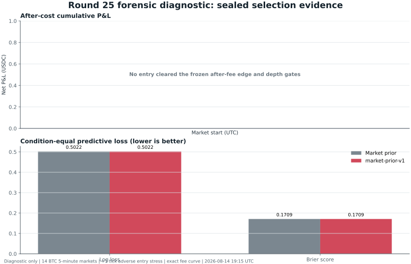

# Round 25 v2 forensic diagnostic

This sealed diagnostic **did not find a model edge or establish profitability**.

| Evidence | Result |
|---|---:|
| Source capture | BTC 5-minute markets, 12 August 2026 |
| Target-blind scan | 111 conditions; 72 admitted; 39 rejected |
| Train / calibration / purge / selection | 42 / 12 / 4 / 14 conditions |
| Sealed selection interval | 2026-08-12 13:25 to 15:20 UTC |
| Selected candidate | Market prior control |
| Selection log loss / Brier score | 0.502194 / 0.170923 |
| Balanced accuracy / ROC AUC | 0.714286 / 0.822186 |
| Closed trades / abstention rate | 0 / 100% |
| Net P&L / maximum drawdown | 0.000 / 0.000 USDC |
| Predictive / economic gate | Failed / failed |

The logistic residual and phase-isotonic candidates both lost to the market prior on the calibration partition. The frozen execution policy then found no selection entry with more than one cent of expected edge per share after the captured fee schedule, minimum depth, and a one-tick adverse-entry stress.

This is a small forensic salvage cohort, not a backtest or live-trading qualification. The capture records that taker order delay was enabled but contains no measured submission-to-match latency distribution, so it cannot support a real-market profitability claim.

Source evidence: [result](round25-selection-result.json), [metrics](round25-selection-metrics.csv), [trade ledger](round25-selection-trades.csv), and [figure manifest](round25-selection-figure-manifest.json).
