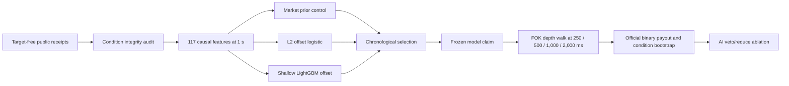

# Round 27 Stage 1 model design

Status: **frozen before Stage 1 capture and outcome access**. No market edge or
profitability is claimed.

| Live-host check | Result |
| --- | ---: |
| Real source-smoke spot trades | 2,961 |
| Real source-smoke futures trades | 1,014 |
| Real source-smoke TWAP60 ticks | 577 |
| Compact trade storage | 131,175 bytes |
| Real audited condition feature rows | 173 |
| Fixed execution delays | 250 / 500 / 1,000 / 2,000 ms |
| Maximum entry cost | 10 USDC per condition |
| Focused tests | 21 passed |

The executable control is Polymarket's market probability. Learned models must
beat it on condition-weighted log loss and Brier score with paired confidence
bounds, then remain profitable after observed fees, spread, depth, and latency.
The economic replay selects at most one target-blind positive-after-cost FOK
candidate per condition, walks captured ask depth and fee schedules, and settles
only from official outcomes. Missing, stale, one-sided, reconnected, or shallow
books receive no fill credit. The AI layer may only veto or reduce a
mechanically valid action.

The sealed role stays inaccessible until the exact selected model payload, its
source-bound economic report, and a persisted passing economic claim all
revalidate. A matching model name alone is insufficient.

The canonical numeric design is
[`round-027-stage1-model-contract-v1.json`](../../round-027-stage1-model-contract-v1.json).
The live feature smoke accessed no outcome labels and generated no financial
performance graph. Selection and sealed graphs will be generated only from
their canonical numeric reports.
