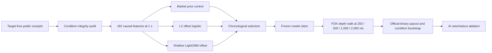

# Round 27 Stage 1 model design

Status: **frozen experiment; Stage 1-A capture active; no Stage 1 feature or
outcome access**. No market edge or profitability is claimed.

| Live-host check | Result |
| --- | ---: |
| Real source-smoke spot trades | 2,961 |
| Real source-smoke futures trades | 1,014 |
| Real source-smoke TWAP60 ticks | 577 |
| Compact trade storage | 131,175 bytes |
| Pre-revision audited condition feature rows | 173 |
| Current 20-minute-context feature smoke | Pending first eligible Stage 1 state |
| Long-context minimum receipt coverage | 99.5% |
| Long-context maximum receipt gap | 5 seconds |
| Fixed execution delays | 250 / 500 / 1,000 / 2,000 ms |
| Maximum entry cost | 10 USDC per condition |
| Maximum replay batch | 32 conditions |
| Feature store | One DuckDB, canonical zstd condition chunks |
| Target store | Separate role-gated DuckDB with dual-source receipts |
| Focused Round 27 tests | 115 passed |
| Corrected LightGBM host backend | AMD OpenCL (`opencl:auto`) |
| Qwen3.5-9B cold / warm structured inference | 5.13 s / 0.52 s |
| Qwen3.5-9B AMD GPU residency | 5.42 / 5.42 GB (100%) |
| Qwen3.5-9B host runtime | Qualified for later matched ablation only |
| ODA-Fin-SFT-8B cold / warm structured inference | 7.94 s / 0.44 s |
| ODA-Fin-SFT-8B AMD GPU residency | 6.61 / 6.61 GB (100%) |
| ODA-Fin-SFT-8B host runtime | Qualified for later matched ablation only |
| AI promotion / edge / profitability | No / no / no |

The executable control is Polymarket's market probability. Learned models must
beat it on condition-weighted log loss and Brier score with paired confidence
bounds, then remain profitable after observed fees, spread, depth, and latency.
The economic replay selects at most one target-blind positive-after-cost FOK
candidate per condition, walks captured ask depth and fee schedules, and settles
only from official outcomes. Missing, stale, one-sided, reconnected, or shallow
books receive no fill credit. The AI layer may only veto or reduce a
mechanically valid action.

The cumulative
[active-tick amendment](../../round-027-active-tick-execution-correction-amendment-v3.json)
also binds Polymarket's dynamic tick-size mechanics into baseline and matched
AI replay. Limits are quantized on the decision-book lattice and rejected if
they no longer conform to the execution-book lattice. No prompt, model,
threshold, or authority changed.

The immutable base contract accidentally required 100 executed trades from
each 90-condition evaluation role even though candidate selection permits at
most one trade per condition. The pre-capture
[population amendment](../../round-027-economic-population-amendment-v1.json)
corrects both evidence gates to 60. This is a minimum sample-size requirement,
not a quota: no risk gate may be weakened and fewer than 60 fills means
insufficient evidence, not permission to manufacture activity or claim edge.

A second review before any Stage 1 feature or outcome access found that the
LightGBM candidate was documented as a market-prior residual but trained as a
standalone classifier. The frozen
[offset correction amendment](../../round-027-lightgbm-offset-correction-amendment-v1.json)
now requires the row-specific market logit as LightGBM `init_score` and restores
it around the persisted raw tree margin during inference. It binds the old and
corrected source hashes and a new model schema. A live AMD OpenCL synthetic
check and the 107-test domain checkpoint validate mechanics only; neither is
market-edge evidence.

The [walk-forward amendment](../../round-027-embargoed-walk-forward-correction-amendment-v4.json)
removes future-to-past contamination from L2 penalty selection. Five expanding
condition-level validation blocks now train only on earlier conditions and
apply the frozen campaign's ten-minute pre-validation embargo. Candidate
families, model payloads, economics, AI authority, and promotion thresholds did
not change. This is a validation correction, not evidence of edge.

The [dependent-bootstrap amendment](../../round-027-dependent-bootstrap-correction-amendment-v5.json)
orders conditions by market start and replaces IID confidence intervals with
stationary-bootstrap sensitivity at 5-minute, 20-minute, and 1-hour expected
block lengths. Promotion uses the widest 95% interval across those horizons.
The same method governs prediction, after-cost economics, and matched AI uplift;
the economic report schema is now v3. A positive mean that exists only in one
cluster is therefore rejected rather than reported as an edge.

The [AI host receipt](../../round-027-ai-host-qualification-v1-2026-08-15.json)
binds both candidates to exact Ollama, upstream, and quantized-artifact hashes,
and verifies strict structured output with `think=false`, one-model-at-a-time
full RX 9070 XT residency, and observed unload after each probe. This is a
compatibility result, not an intelligence or performance result. Neither
candidate can be promoted unless the later target-free matched ablation
improves after-cost selection results.
The ODA Q6 artifact is a third-party quantization pinned by repository revision
and file SHA-256; this receipt does not claim an independently reproduced
conversion from the official upstream weights.

The [matched AI ablation contract](../../round-027-ai-matched-ablation-contract-v1.json)
freezes byte-identical target-free cases for both models. It charges measured
inference time on top of each 250/500/1,000/2,000 ms execution delay, treats a
minimum-size `reduce` as abstention, disqualifies any timeout or malformed
response, and requires positive paired after-cost bootstrap bounds with no
worse drawdown at every delay. Development may nominate one candidate or none;
sealed evaluation remains one-use and no result grants order authority.
The implementation uses two separate commands. The first receives only the
feature store, public source database, and frozen model claim; it persists the
case panel and both measured inference reports. The second process receives
those immutable receipts plus the target store and baseline economic report.
This prevents the local models and their prompt builder from receiving an
outcome, resolution, or P&L path, including on restart.
If development nominates a candidate, the sealed path repeats that separation:
one target-free process freezes sealed cases and measured responses, then a
different process performs the one-use outcome join. No nomination produces a
self-hashed skip receipt and no sealed AI invocation.

The current feature contract includes 5, 10, and 20-minute spot and futures
context. Decisions without at least 99.5% of the 20-minute receipt span, or with
a receipt gap over five seconds, are excluded. The 173-row result above only
qualified the prior shorter-context revision; it is not evidence for this
revision.

Each audited condition batch is loaded once, evaluated across all four delays,
and released. A role with more than 32 conditions cannot use the all-resident
path.

Target-free rows persist transactionally in a single campaign database. The
store has no outcome column, rejects diagnostic subsets and duplicate condition
ownership, and independently replays every row and manifest on audit.

Official outcomes use a different append-only database. Each chronological
role persists its target-access claim before any outcome request and finalizes
only when CLOB and Gamma agree for every admitted condition. The sealed role
cannot open without the exact selected model, passing economic claim, and the
claim-bound economic report.

The sealed role stays inaccessible until the exact selected model payload, its
source-bound economic report, and a persisted passing economic claim all
revalidate. A matching model name alone is insufficient.
Both learned-model families are restart-safe: the selection claim contains the
complete L2 parameters or complete LightGBM model text plus its hash, and the
runtime reconstructs only an exact schema- and feature-bound payload.

The development operator reads only finalized train, calibration, and selection
targets. It persists the model claim before replaying Stage 1-B books, processes
at most 32 conditions at a time, and writes an idempotent after-cost claim. A
restart revalidates existing artifacts instead of retraining or duplicating the
replay.

The one-use sealed operator reconstructs that same model, recomputes the sealed
prediction result on every resume, and accepts an existing economic report only
when its model, feature rows, probabilities, configuration, source audit, and
official target evidence hashes all match. Its terminal result changes no model
or threshold and requires both prediction and after-cost gates.

The canonical numeric design is
[`round-027-stage1-model-contract-v1.json`](../../round-027-stage1-model-contract-v1.json).
The [supplemental hypothesis preregistration](../../round-027-supplemental-hypothesis-preregistration-v1.json)
treats the supplied Reddit post only as untrusted hypothesis input. Public-book
data cannot establish maker queue position, private fills, or rebate allocation,
so it cannot support a maker-profitability claim.
The prior live feature smoke accessed no outcome labels and generated no
financial performance graph. This revision requires a new live feature smoke.
Selection and sealed graphs will be generated only from their canonical numeric
reports.
