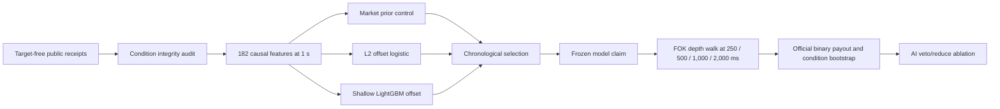

# Round 27 Stage 1 model design

Status: **frozen before Stage 1 capture and outcome access**. No market edge or
profitability is claimed.

| Live-host check | Result |
| --- | ---: |
| Real source-smoke spot trades | 2,961 |
| Real source-smoke futures trades | 1,014 |
| Real source-smoke TWAP60 ticks | 577 |
| Compact trade storage | 131,175 bytes |
| Pre-revision audited condition feature rows | 173 |
| Current 20-minute-context feature smoke | Pending first eligible Stage 1 state |
| Long-context minimum receipt coverage | 99.5% |
| Long-context maximum receipt gap | 5 seconds |
| Fixed execution delays | 250 / 500 / 1,000 / 2,000 ms |
| Maximum entry cost | 10 USDC per condition |
| Maximum replay batch | 32 conditions |
| Feature store | One DuckDB, canonical zstd condition chunks |
| Target store | Separate role-gated DuckDB with dual-source receipts |
| Focused tests | 38 passed |

The executable control is Polymarket's market probability. Learned models must
beat it on condition-weighted log loss and Brier score with paired confidence
bounds, then remain profitable after observed fees, spread, depth, and latency.
The economic replay selects at most one target-blind positive-after-cost FOK
candidate per condition, walks captured ask depth and fee schedules, and settles
only from official outcomes. Missing, stale, one-sided, reconnected, or shallow
books receive no fill credit. The AI layer may only veto or reduce a
mechanically valid action.

The current feature contract includes 5, 10, and 20-minute spot and futures
context. Decisions without at least 99.5% of the 20-minute receipt span, or with
a receipt gap over five seconds, are excluded. The 173-row result above only
qualified the prior shorter-context revision; it is not evidence for this
revision.

Each audited condition batch is loaded once, evaluated across all four delays,
and released. A role with more than 32 conditions cannot use the all-resident
path.

Target-free rows persist transactionally in a single campaign database. The
store has no outcome column, rejects diagnostic subsets and duplicate condition
ownership, and independently replays every row and manifest on audit.

Official outcomes use a different append-only database. Each chronological
role persists its target-access claim before any outcome request and finalizes
only when CLOB and Gamma agree for every admitted condition. The sealed role
cannot open without the exact selected model, passing economic claim, and the
claim-bound economic report.

The sealed role stays inaccessible until the exact selected model payload, its
source-bound economic report, and a persisted passing economic claim all
revalidate. A matching model name alone is insufficient.
Both learned-model families are restart-safe: the selection claim contains the
complete L2 parameters or complete LightGBM model text plus its hash, and the
runtime reconstructs only an exact schema- and feature-bound payload.

The development operator reads only finalized train, calibration, and selection
targets. It persists the model claim before replaying Stage 1-B books, processes
at most 32 conditions at a time, and writes an idempotent after-cost claim. A
restart revalidates existing artifacts instead of retraining or duplicating the
replay.

The one-use sealed operator reconstructs that same model, recomputes the sealed
prediction result on every resume, and accepts an existing economic report only
when its model, feature rows, probabilities, configuration, source audit, and
official target evidence hashes all match. Its terminal result changes no model
or threshold and requires both prediction and after-cost gates.

The canonical numeric design is
[`round-027-stage1-model-contract-v1.json`](../../round-027-stage1-model-contract-v1.json).
The [supplemental hypothesis preregistration](../../round-027-supplemental-hypothesis-preregistration-v1.json)
treats the supplied Reddit post only as untrusted hypothesis input. Public-book
data cannot establish maker queue position, private fills, or rebate allocation,
so it cannot support a maker-profitability claim.
The prior live feature smoke accessed no outcome labels and generated no
financial performance graph. This revision requires a new live feature smoke.
Selection and sealed graphs will be generated only from their canonical numeric
reports.
