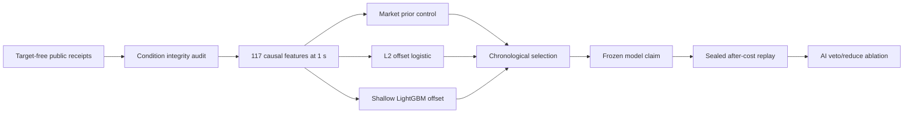

# Round 27 Stage 1 model design

Status: **frozen before Stage 1 capture and outcome access**. No market edge or
profitability is claimed.

| Live-host check | Result |
| --- | ---: |
| Real source-smoke spot trades | 2,961 |
| Real source-smoke futures trades | 1,014 |
| Real source-smoke TWAP60 ticks | 577 |
| Compact trade storage | 131,175 bytes |
| Real audited condition feature rows | 173 |
| Focused tests | 14 passed |

The executable control is Polymarket's market probability. Learned models must
beat it on condition-weighted log loss and Brier score with paired confidence
bounds, then remain profitable after observed fees, spread, depth, and latency.
The AI layer may only veto or reduce a mechanically valid action.

The canonical numeric design is
[`round-027-stage1-model-contract-v1.json`](../../round-027-stage1-model-contract-v1.json).
The live feature smoke accessed no outcome labels and generated no financial
performance graph. Selection and sealed graphs will be generated only from
their canonical numeric reports.
