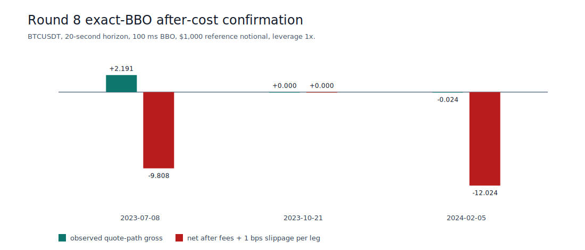
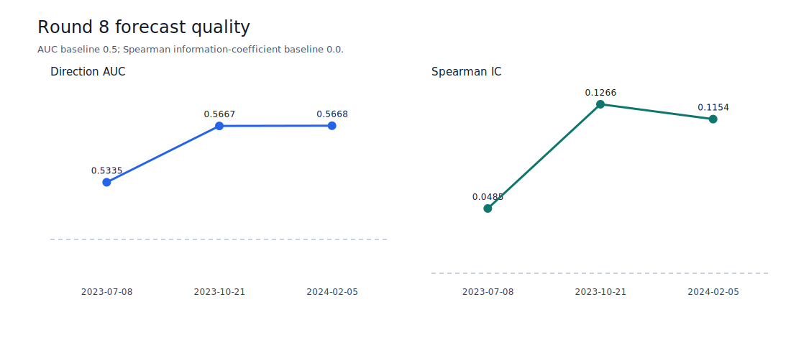
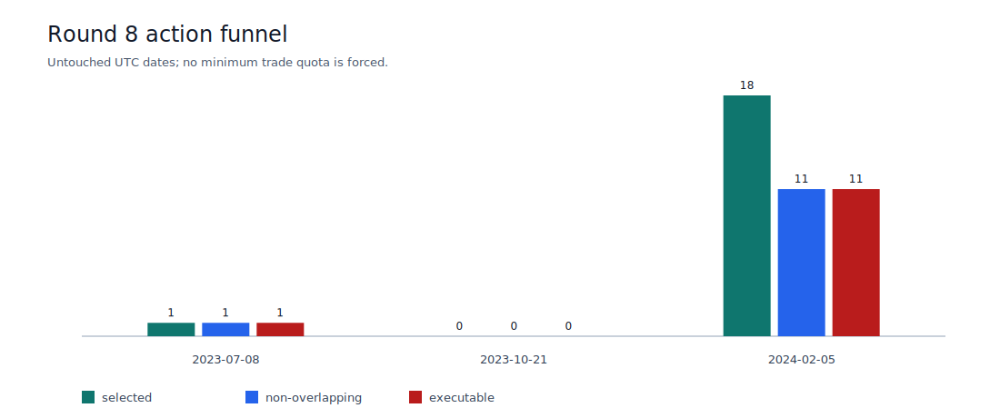
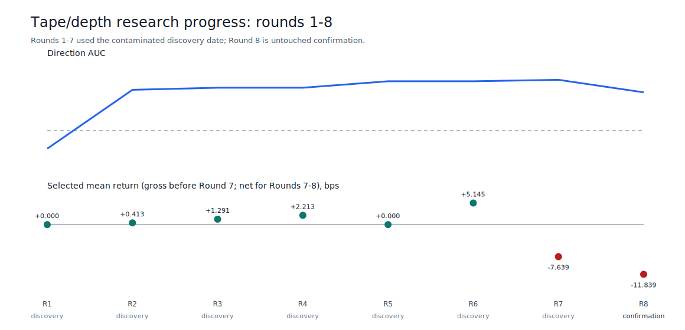

# Tape/Depth Round 8 Evidence

Status: **rejected**. This is real, checksummed Binance USD-M research evidence,
not a profitability or execution claim.

- Untouched UTC dates: 2023-07-08, 2023-10-21, 2024-02-05
- Executable trades: 12
- Weighted mean net return: -11.839347 bps
- Positive net rate: 0.00%
- Quote-path rejections: 0
- Liquidations: 0
- Design SHA-256: `03d0391d1001eb184c3dc5a500124b605141596f619286c217f1ab5a6b36ca94`
- Confirmation SHA-256: `18bffa88a885703e3e88113f436c43903309160d57f0fb4a2fcad79d8e6ae6f8`

The fixed candidate failed five precommitted gates: forecast_candidate_periods, positive_mean_net_periods, combined_executable_rows, combined_mean_net_return_bps, combined_positive_net_rate.
It must not be promoted or traded. These three dates are consumed confirmation
evidence and cannot be reused for model selection.

## Charts

The source tables are [periods.csv](periods.csv), [trades.csv](trades.csv), and
[progress.csv](progress.csv). Independent fixed-horizon trades do not form a
portfolio equity curve, so this evidence intentionally reports no ROI or
drawdown. Regenerate with `python tools/publish_tape_depth_confirmation.py` and
the arguments recorded in `report.json`.
