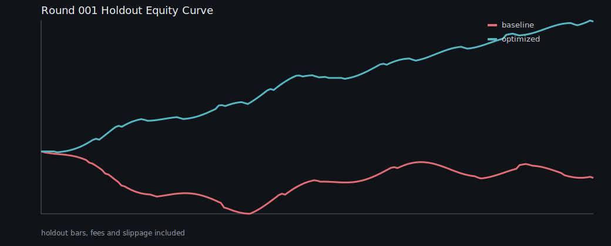
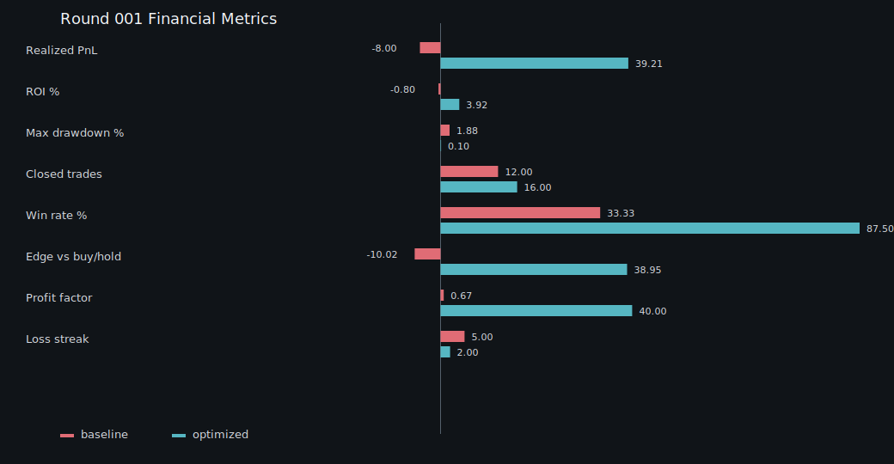

# Optimization Round 001 - Market-Quality Regime Features

Date: 2026-07-04

This round validates the new `v5-regime-quality` advanced feature block and risk-aware model promotion.
The benchmark is a deterministic multi-regime futures simulation with fees and slippage enabled. It is a reproducible engineering benchmark, not a live-profit claim.

## Changes Tested

- Added market-quality regime features for trend efficiency, downside pressure, autocorrelation, volatility-of-volatility, volume pressure, ATR, and volume z-score.
- Required local/ensemble/hybrid model refinements to be risk non-degrading before promotion.
- Added autonomous hard loss budgets and post-network-interruption recovery gates.

## Holdout Results

| Candidate | Realized PnL | ROI | Max DD | Trades | Win rate | Edge vs hold | Profit factor | Loss streak |
| --- | ---: | ---: | ---: | ---: | ---: | ---: | ---: | ---: |
| baseline | -8.00 | -0.80% | 1.88% | 12 | 33.3% | -10.02 | 0.67 | 5 |
| optimized | 39.21 | 3.92% | 0.10% | 16 | 87.5% | 38.95 | 56.55 | 2 |

PnL delta: `+47.21`. Max drawdown delta: `-1.78%`.

## Acceptance Notes

- The optimized candidate was profitable on the holdout while the baseline lost money under the same fees, slippage, risk, and threshold-calibration workflow.
- Drawdown improved materially in the deterministic holdout.
- This does not bypass model-lab promotion, temporal robustness, selection-risk, liquidity, reconciliation, or testnet gates.

Artifacts:

- `round-001-results.json`
- `round-001-equity.svg`
- `round-001-metrics.svg`
