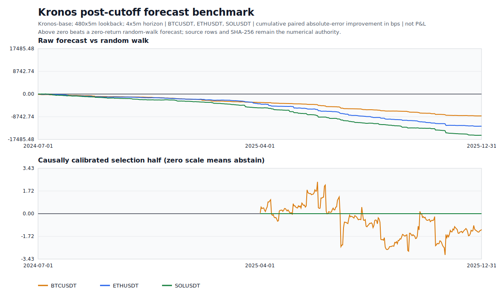

# Round 005 - Financial Foundation Forecast Gate

Date: 2026-07-10

Status: **rejected; no trading authority**

## Question

Does a hash-pinned Kronos-base forecast add stable post-pretraining predictive
value over a zero-return random-walk forecast for BTCUSDT, ETHUSDT, and SOLUSDT?
This round tests forecast quality only. It is not an execution backtest and does
not report ROI, P&L, leverage, drawdown, or fill quality.

## Evidence Contract

- Model: Kronos-base, 102,310,592 parameters; tokenizer 3,958,042 parameters.
- Runtime: AMD-compatible DirectML, supervised process isolation, no in-process
  device retry, maximum one fresh-worker replay per failed batch.
- Source: checksum-verified Binance USD-M one-minute archives only.
- Coverage: 792,960 exact one-minute rows per symbol from 2024-06-29 through
  2025-12-31, including the causal lookback required by the first decision.
- Decisions: 512 deterministic timestamps per symbol, 1,536 observations total,
  from 2024-07-01 through 2025-12-31.
- Context: 480 five-minute bars (40 hours).
- Forecast: four five-minute bars (20 minutes), one seeded sample.
- Model-pretraining boundary: observations begin after 2024-06-30.
- Terminal evidence: 2026 onward remained sealed and unqueried.
- Calibration: zero-intercept nonnegative OLS scale fitted separately per symbol
  on the earlier half; all acceptance metrics use the later half.
- Uncertainty: 2,000 UTC-day block-bootstrap resamples of paired MAE uplift.

## Result

| Metric | Result |
|---|---:|
| Raw model MAE | 0.0042225031 |
| Raw random-walk MAE | 0.0018330693 |
| Raw MAE improvement | -130.3515% |
| Raw information coefficient | -0.053405 |
| Raw rank information coefficient | 0.018676 |
| Raw direction accuracy | 51.987% |
| Calibrated later-half model MAE | 0.0016923834 |
| Calibrated later-half random-walk MAE | 0.0016922277 |
| Calibrated information coefficient | -0.026064 |
| Paired uplift 95% interval | [-0.0000019992, 0.0000014356] |
| Positive uplift probability | 42.35% |
| Eligible symbols | 0 of 3 |

Earlier-half fitted amplitude scales were `0.0077307482` for BTCUSDT and zero
for ETHUSDT and SOLUSDT. Zero means abstention. The small BTC scale did not
survive the later-half random-walk comparison. The gate therefore rejected the
candidate for both explicit reasons recorded in the report:

- no symbol passed causal amplitude calibration;
- the day-block confidence interval was not strictly positive.

The plotted quantity is cumulative paired absolute-error improvement in basis
points. It is **not P&L**. `observations.csv`, not the SVG, is the numerical
authority.

## Runtime Finding

The host run completed 512 batches in 116.982 seconds and started 27 verified
workers: one initial worker, 25 planned rotations, and one replacement after a
real DirectML fault. The replacement reproduced the failed batch from the same
seed. Exact same-worker seeded repeatability passed, and no in-process retry was
used. This recovery evidence supports the worker architecture only; it cannot
rescue the rejected forecast.

## Artifacts

- [Readable result](../ai/foundation/latest/README.md)
- [Machine-readable report](../ai/foundation/latest/report.json)
- [Raw observation table](../ai/foundation/latest/observations.csv)
- [Deterministic chart](../ai/foundation/latest/benchmark.svg)
- [SHA-256 manifest](../ai/foundation/latest/manifest.json)

Promoted LF-normalized observation CSV SHA-256:
`4a2257fb4524e48cbbc98ed1eb17a67e5149ff11d8cd4d8923171ca7004a4044`.
The report also preserves the original Windows runtime CSV SHA-256
`0aa9fe6ce2a4cba09d32605688818e541178810de9759911c0fd6ab41b745a2e`;
normalization changed line endings only, not fields or numerical values.

## Decision

Do not connect Kronos forecasts to position sizing, entry, exit, leverage, or
risk overrides. Do not spend another long run on the same OHLC-only hypothesis.
A future round requires a materially different, causally justified feature or
adaptation hypothesis and must beat the random-walk gate before any after-cost
shadow evaluation is considered. The priority returns to adaptive, routed
book/tape microstructure research where the data resolution matches the
intraday execution problem.
